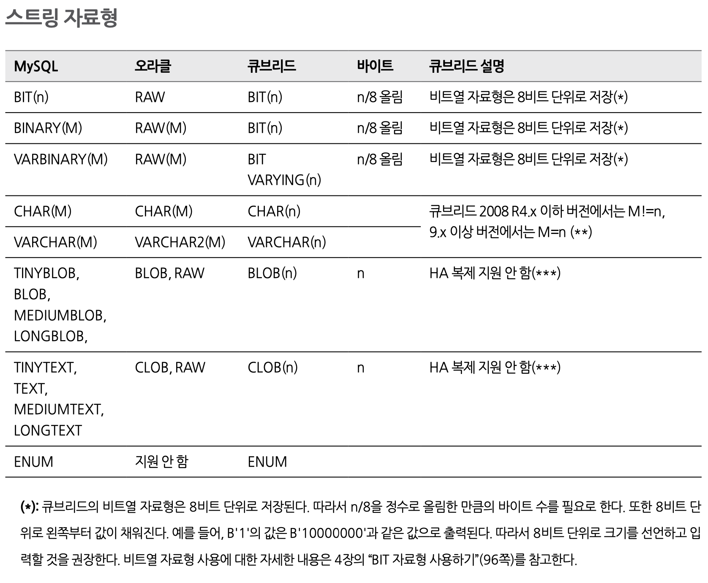
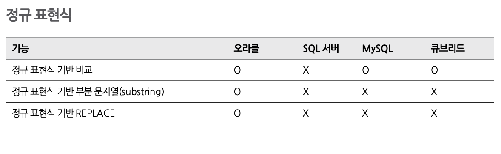
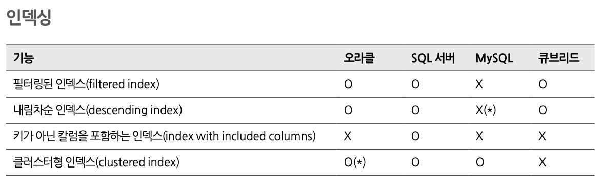
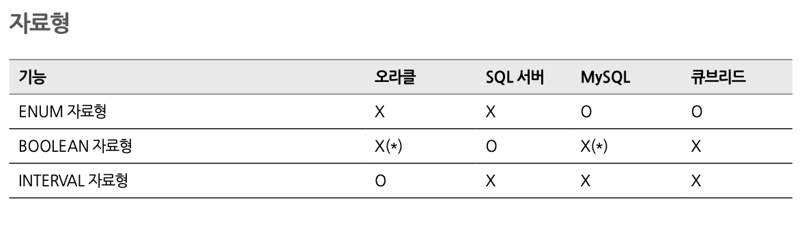
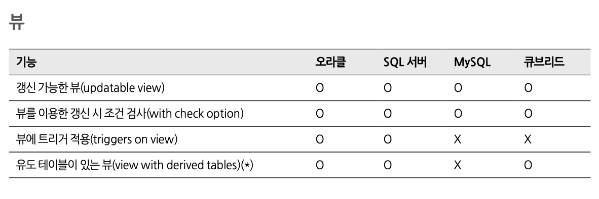

# 05. sql 큐브리드 스터티

## 큐브리드 SQL

### 1. 테이블 정의문

- **CREATE TABLE**
    - 테이블을 생성한다.
    - 테이블 칼럼의 초기값을 SHARED 또는 DEFAULT 값을 통해 정의할 수 있다. (ALTER TABLE 문에서 변경 가능)
        - SHARED : 칼럼 값은 모든 행에서 동일하다. 따라서 SHARED 속성은 UNIQUE 제약 조건과 동시에 정의할 수 없다. 초기에 설정한 값과 다른 새로운 값을 INSERT 하면, 해당 칼럼 값은 모든 행에서 새로운 값으로 갱신된다.
        - DEFAULT : 새로운 행을 삽입할 때 칼럼 값을 지정하지 않으면 DEFAULT 속성으로 설정한 값이 저장된다.
    - DEFAULT 속성값으로 허용되는 의사 칼럼(pseudocolumn)과 함수는 다음과 같다 :
    
    
    - 칼럼값에 자동으로 일련번호를 부여하려면 AUTO_INCREMENT 속성을 사용한다.
    - 칼럼의 제약 조건 종류는 NOT NULL, UNIQUE, PRIMARY KEY, FOREIGN KEY가 있다.
    
        NOT NULL	반드시 NULL이 아닌 값을 가져야 함
        UNIQUE	정의된 칼럼이 고유한 값을 갖도록 함
        PRIMARY KEY	기본키로 정의된 칼럼 값은 각 행에서 고유하게 식별됨
        FOREIGH KEY	참조 관계에 있는 다른 테이블의 기본키를 참조    
        
    <aside>
    💡 테이블에서 key란 각 행을 고유하게 식별할 수 있는 하나 이상의 칼럼들의 집합을 말한다. candidate key(후보키)는 테이블 내의 각 행을 고유하게 식별하는 칼럼들의 집합을 의미하며, 사용자는 이러한 candidate key 중 하나를 primary key(기본키)로 정의할 수 있다.
    
    </aside>
    
    <aside>
    💡 테이블에서 key란 각 행을 고유하게 식별할 수 있는 하나 이상의 칼럼들의 집합을 말한다. candidate key(후보키)는 테이블 내의 각 행을 고유하게 식별하는 칼럼들의 집합을 의미하며, 사용자는 이러한 candidate key 중 하나를 primary key(기본키)로 정의할 수 있다.
    
    </aside>
    
- **CREATE TABLE LIKE**
    - 이미 존재하는 테이블과 동일한 스키마의 테이블을 생성한다.
    - 데이터는 빈 상태로 생성된다.
- **CREATE TABLE AS SELECT**
    - SELECT 결과 데이터를 가진 테이블을 새로 생성한다.
- **ALTER TABLE**
    - 테이블의 칼럼, 제약 조건, 인덱스를 추가하거나 변경 또는 삭제한다.
    - ADD COLUMN
        - 새로운 칼럼을 추가한다.
        - FIRST 또는 AFTER 키워드를 사용하여 추가할 칼럼의 위치를 지정할 수 있다.
    - ADD CONSTRAINT
        - 새로운 제약 조건을 추가한다.
    - ADD INDEX
        - 특정 칼럼에 대해 인덱스 속성을 추가로 정의한다.
    - ALTER COLUMN ... SET DEFAULT
        - 기본값이 없는 칼럼에 기본값을 지정하거나 기존의 기본값을 변경할 수 있다.
    - AUTO_INCREMENT
        - 기존에 정의한 자동 증가값의 초기값을 변경한다.
        - 단, 테이블 내에 AUTO_INCREMENT 칼럼이 한 개만 정의되어 있어야 한다.
    - CHANGE
        - 칼럼의 이름, 타입, 크기 및 속성을 변경한다.
        - 기존 칼럼의 이름과 새 칼럼의 이름이 같으면 타입, 크기 및 속성만 변경한다.
    - MODIFY
        - 칼럼의 타입, 크기 및 속성을 변경할 수 있으며, 칼럼의 이름은 변경할 수 없다.
    - RENAME COLUMN
        - 칼럼의 이름을 변경한다.
    - DROP COLUMN
        - 테이블에 존재하는 칼럼을 삭제한다.
    - DROP CONSTRAINT
        - 테이블에 이미 정의된 UNIQUE, PRIMARY KEY, FOREIGN KEY 제약 조건을 삭제한다.
    - DROP INDEX
        - 인덱스를 삭제한다.
        - DROP CONSTRAINT 로도 삭제할 수 있다.
    - DROP PRIMARY KEY
        - 테이블에 정의된 기본키 제약 조건을 삭제한다.
    - DROP FOREIGN KEY
        - 테이블에 정의된 외래키 제약 조건을 삭제한다.
- **DROP TABLE**
    - 테이블을 제거한다.
- **RENAME TABLE**
    - 테이블의 이름을 변경한다.

### 2. 인덱스 정의문

- **CREATE INDEX**
    - 인덱스를 생성한다.
- **ALTER INDEX**
    - 인덱스의 이름을 변경하거나 인덱스를 재생성한다.
    - REBUILD
        - 이미 생성된 것과 같은 구조의 인덱스를 재생성한다.
- **DROP INDEX**
    - 인덱스를 제거한다.
    - 고유 인덱스는 DROP CONSTRAINT로도 삭제할 수 있다.

### 3. 뷰 정의문

뷰는 물리적으로 존재하지 않는 가상의 테이블이며, 기존의 테이블이나 뷰에 대한 질의문을 이용하여 뷰를 생성할 수 있다.

- **CREATE VIEW**
    - 뷰를 생성한다.
    - CREATE 뒤에 OR REPLACE 키워드가 명시되면, 기존의 뷰와 이름이 중복되더라도 에러를 출력하지 않고 기존의 뷰를 새로운 뷰로 대체한다.
    - 갱신 가능한 뷰를 생성하려면 다음 조건을 만족해야 한다.
        - FROM 절은 갱신 가능한 테이블이나 뷰만 포함한다.
        - JOIN 구문을 포함하지 않는다.
        - DISTINCT, UNIQUE 구문을 포함하지 않는다.
        - GROUP BY ... HAVING 구문을 포함하지 않는다.
        - SUM(), AVG()와 같은 집계 함수를 포함하지 않는다.
        - UNION 구문을 포함하지 않는다.
        - UNION ALL을 사용해 갱신 가능한 부분 질의로만 질의를 구성한 경우에는 갱신이 가능하다.
        - 단, 테이블은 UNION ALL을 구성하는 부분 질의 중 어느 한 질의에만 존재해야 하며, UNION ALL 구문으로 생성된 뷰에 레코드를 삽입하는 경우 레코드가 입력될 테이블은 시스템이 결정한다.
- **ALTER VIEW**
    - 뷰를 갱신한다.
    - ADD QUERY
        - 뷰의 질의 명세부에 질의를 추가한다.
    - AS SELECT
        - 가상 테이블에 정의된 SELECT 질의를 변경한다.
    - CHANGE QUERY
        - 뷰 질의 명세부에 정의된 질의를 변경한다.
    - DROP QUERY
        - 뷰 질의 명세부에 정의된 질의를 삭제한다.
    - COMMENT
        - 뷰와 칼럼들, 어트리뷰트들의 커멘트를 변경한다.
- **DROP VIEW**
    - 뷰를 제거한다.
- **RENAME VIEW**
    - 뷰의 이름을 변경한다.

### 4. 시리얼 정의문

- **CREATE SERIAL**
    - 고유한 순번을 반환하는 시리얼을 생성한다.
    - 시리얼 번호는 테이블과 독립적으로 생성된다.
- **ALTER SERIAL**
    - 시리얼의 증가량, 시작값, 최댓값을 변경하거나 제거한다.
- **DROP SERIAL**
    - 시리얼을 제거한다.

### 5. 사용자 권한

큐브리드는 기본적으로 DBA와 PUBLIC이라는 두 종류의 사용자를 제공한다.

- **CREATE USER**
    - 사용자를 생성한다.
- **ALTER USER**
    - 사용자의 암호를 변경한다.
- **DROP USER**
    - 사용자를 삭제한다.
- **CREATE USER ... GROUPS**
    - 사용자 그룹을 생성한다.
- **CREATE USER ... MEMBERS**
    - 사용자를 생성하고 해당 사용자를 명시한 그룹에 포함시킨다.
- **GRANT operation TO user**
    - 특정 사용자에게 특정 연산(INSERT, UPDATE, DELETE 등) 권한을 부여한다.

### 6. 데이터 조작문

- **SELECT**
    - 지정된 테이블에서 원하는 칼럼을 조회한다.
    - FROM
        - 데이터를 조회하고자 하는 테이블을 지정한다.
    - WHERE
        - 조회하려는 데이터의 조건을 명시한다.
    - ORDER BY
        - 오름차순(ASC) 또는 내림차순(DESC)으로 정렬한다.
        - 옵션을 명시하지 않으면 오름차순으로 정렬한다.
    - LIMIT
        - 출력할 레코드의 개수를 제한한다.
    - JOIN
        - 두 개 이상의 테이블 또는 뷰에 대해 행을 결합한다.
        - 내부 조인(inner join), 왼쪽 외부 조인(left outer join), 오른쪽 외부 조인(right outer join)을 지원한다.
        - 완전 외부 조인(full outer join)은 지원하지 않는다.
    - VALUES
        - 표현식에 명시된 행 값들을 출력한다.
        - UNION ALL 질의를 간단히 표현하는 방법이다.
        - INSERT 문과 함께 사용하면 하나의 INSERT 문으로 여러 개의 행을 입력할 수 있다.
    - FOR UPDATE
        - UPDATE 문, DELETE 문에서 사용할 행에 대해 미리 잠금(lock)을 설정한다.
    - START WITH ... CONNECT BY
        - 계층 질의를 수행한다.
- **INSERT**
    - 데이터베이스에 존재하는 테이블에 새로운 레코드를 삽입한다.
    - INSERT ... SELECT
        - SELECT 결과를 대상 테이블에 삽입한다.
    - ON DUPLICATE KEY UPDATE
        - 삽입(INSERT)을 수행하되 고유 키 위반(unique key violation)이면 고유 키 조건의 행에 대해 갱신(UPDATE)을 수행한다.
        - 즉, UNIQUE 인덱스 또는 PRIMARY KEY 제약 조건이 설정된 칼럼에 중복된 값이 삽입되는 상황에서 에러를 출력하지 않고 새로운 값으로 갱신한다.
        - 사용자가 ON DUPLICATE KEY UPDATE 문을 수행할 수 있게 GRANT 문으로 사용자 권한을 부여하려면 INSERT 권한뿐만 아니라 UPDATE 권한도 부여해야 한다.
- **MERGE**
    - 하나 이상의 원본으로부터 하나의 테이블 또는 뷰에 삽입 또는 갱신을 수행한다.
    - 또한 삭제 조건도 추가할 수 있다.
    - 사용자가 MERGE 문을 수행할 수 있게 GRANT 문으로 사용자 권한을 부여하려면 INSERT 권한, UPDATE 권한, 그리고 DELETE 권한을 부여해야 한다.
- **UPDATE**
    - 대상 테이블 또는 뷰에 저장된 레코드의 칼럼 값을 새로운 값으로 업데이트한다.
    - LIMIT
        - 갱신할 레코드 개수를 한정한다.
    - ORDER BY
        - 명시한 순서에 따라 갱신을 수행한다.
        - 트리거의 실행 순서나 잠금 순서를 유지하고자 할 때 유용하다.
    - JOIN
        - 여러 개의 테이블을 조인한 후 갱신을 수행한다.
- **REPLACE**
    - INSERT 와 비슷하지만, 고유 키 위반이면(PRIMARY KEY 또는 UNIQUE 제약 조건이 정의된 칼럼에 중복된 값을 삽입) 에러 출력 없이 기존 레코드를 삭제한 후 새로운 레코드를 삽입한다.
    - REPLACE 문을 수행하려면 INSERT 권한과 DELETE 권한이 모두 필요하다.
- **DELETE**
    - 테이블 내에 레코드를 삭제한다.
    - WHERE과 결합하여 삭제 조건을 명시할 수 있다.
    - LIMIT
        - 삭제할 행의 개수를 제한한다.
    - JOIN
        - 여러 개의 테이블을 조인한 후 삭제를 수행한다.
- **TRUNCATE**
    - 명시된 테이블의 모든 레코드를 삭제한다.
    - 내부적으로 테이블에 정의된 모든 인덱스와 제약 조건을 먼저 삭제한 후 레코드를 삭제하므로 WHERE 조건이 없은 DELETE 문을 수행하는 것보다 빠르다.
    - 하지만 DELETE 문과는 구분되므로 ON DELETE 트리거가 활성화되지 않는다.
    - AUTO_INCREMENT 칼럼을 초기화해 데이터가 다시 입력되면 시작값부터 생성한다.

### 7. 자료형

큐브리드는 기본적인 문자 자료형, 숫자 자료형, 날짜/시간 자료형을 지원하며, 추가로 BLOB, CLOB 자료형을 지원한다.

- **7-1. 숫자 자료형**
        
    <aside>
    💡 큐브리드는 수치형 데이터 타입에 대해 UNSIGNED 타입을 지원하지 않는다.
    
    </aside>
    
    
    

    
- **7-2. 스트링 자료형**
    
    큐브리드는 두 가지 비트열을 지원한다.
    
    - 고정길이 비트열 : BIT(n)
        - n은 최대 비트의 개수를 나타낸다.
        - n이 생략되면 길이는 1로 지정된다.
    - 가변길이 비트열 : BIT VARYING(n)
        - n은 최대 비트의 개수를 나타낸다.
        - n이 생략되면 최대 길이인 1,073,741,823으로 지정된다.
    
    큐브리드는 두 종류의 문자열 타입을 지원한다.
    
    - 고정길이 문자열 : CHAR(n)
        - n은 문자의 개수를 나타낸다.
        - n이 생략되면 기본값인 1로 지정된다.
    - 가변길이 문자열 : VARCHAR(n)
        - n은 문자의 개수를 나타낸다.
        - n이 생략되면 길이는 최대인 1,073,741,823으로 지정된다.
    - 가변길이 문자열 : STRING
        - VARCHAR를 최대 길이로 지정한 것과 같다.
    
    큐브리드는 두 가지 LOB 타입을 지원한다.
    
    - Binary Large Object(BLOB)
        - 바이너리 데이터를 DB 외부에 저장하기 위한 타입이다.
        - 데이터의 최대 길이는 외부 저장소에서 생성 가능한 파일 크기이다.
    - Character Large Object(CLOB)
        - 문자열 데이터를 DB 외부에 저장하기 위한 타입이다.
        - 데이터의 최대 길이는 외부 저장소에서 생성 가능한 파일 크기이다.
    
    큐브리드는 ENUM 데이터 타입을 지원한다.
    
    - ENUM 타입은 열거형 문자열 상수들의 중복 없는 순서 집합으로 구성되어 있는 타입이다.
    
    <aside>
    💡 External LOB(Large Object) 타입은 텍스트 또는 이미지 등 크기가 큰 객체를 처리하기 위한 데이터 타입이다.
    
    </aside>
    
        
    

    
- **7-3. 날짜 자료형**

    

    

### 8. 식별자 비교

- 큐브리드와 MySQL의 식별자(identifier) 특징을 비교하면 다음과 같다.
    
  
    

    
    

    

---

## SQL기능비교

- **질의문**
    
    

    
    - 윈도우 함수
        - 윈도우 함수는 각 그룹의 누적, 이동, 중앙 집계를 계산하는 함수이며, 각 그룹에 대해 여러 개의 행을 반환 한다는 점이 집계 함수(aggregate function)와 다르다. OVER 절을 사용하는 윈도우 함수는 SQL:2003표준으로 제정됐고 SQL:2008 표준에서 확장됐다.
        - 큐브리드에서는 분석 함수라고 불리는 함수 중 누적, 이동, 중앙 집계를 계산하는 일부가 윈도우 함수에 속한다.(10.0 부터 지원)
        - 책내용참고
    - 공통테이블식
        - 공통 테이블 식(이하 CTE)은 질의 결과가 한 번 이상 사용되는 경우 질의 결과를 부질의(subquery) 형태로 임시 저장해 일반 테이블처럼 여러 곳에서 참조할 수 있게 하는 기능으로, SQL:1999 표준이다.
        - 큐브리드는 지원하지 않는다.
    - 계층적 질의
        - 계층적 질의는 테이블에 포함된 행 간에 수직적 계층 관계가 성립되는 데이터에 대해 각 행을 출력하는 질의이며 SQL 표준은 아니다
    - PIVOT 연산자
        - PIVOT 연산자는 특정 열의 값을 같은 값끼리 그룹화하고 각 그룹을 열로 변환해 출력한다. SQL:2003 표준이다.
    - GROUP BY ... ROLLUP
        - GROUP BY ... ROLLUP은 그룹화된 전체 칼럼 외에 각 칼럼을 기준으로 집계 결과 행을 추가로 출력하는 기능으로, SQL:1999 표준이다. 큐브리드는 이를 지원한다.
    - 시간 지원 데이터베이스
        - 시간 지원 데이터베이스는 유효 시간(valid time)과 트랜잭션 시간(transaction time)을 메타데이터로 내장한 데이터베이스로, SQL:2011 표준이다.
        - 큐브리드는 지원하지 않는다.
    - 병렬질의처리
        - 병렬질의처리기능은처리속도를높이기위해질의문하나를처리하는데필요한작업을여러개의서버
        프로세스에 나눠 처리하는 기능이다.
        - 큐브리드는 지원하지 않는다.
    - 문자열 집계
        - 문자열 집계는 그룹화되는 칼럼을 기준으로 여러 개의 행으로 표현되는 다른 칼럼의 값들이 하나의 행에 표현되도록 문자열을 합치는 기능
        - GROUP_CONCAT
- **정규 표현식**
    
    

    
    - 정규 표현식 기반 비교 (큐브리드 o)
    - 정규 표현식 기반 부분 문자열 (cubrid x)
    - 정규 표현식 기반 REPLACE (cubrid x)
- **제약 조건**
    
    

    
    - 지연된 제약 조건 (큐브리드는 지원하지않는다)
    - CHECK제약조건 (큐브리드는 지원)
        - CHECK 제약 조건은 DDL(data definition language)에 제약 조건을 포함해 놓으면 DML(data
        manipulation language) 질의 수행 시 제약 조건을 검사하는 기능으로 ANSI SQL-92 표준이다.
        MySQL과 큐브리드는 파싱을 허용하되 실제로 기능이 동작하지는 않는다.
        - 참고로 큐브리드에서 뷰를 생성하는 경우 WITH CHECK OPTION을 사용해 데이터 입력을 제한할 수있다.
- **인덱싱**
    
    

    
    - 필터링된 인덱스
        - 필터링된 인덱스는 인덱스 생성 시 조건을 명시해 한정적인 데이터만을 인덱스 대상으로 삼는 것을 말한다. 부분 인덱스(partial index)라고도 한다.
    - 내림차순 인덱스
        - 내림차순 인덱스는 내림차순으로 정렬해 생성한 인덱스를 말한다. 특정 칼럼에 대해 내림차순으로 정렬할때 내림차순 인덱스가 적용될 수 있다.
    - 키가 아닌 칼럼을 포함하는 인덱스 (큐브리드는 지원하지 않는다)
        - 키가 아닌 칼럼을 포함하는 인덱스란 키가 아닌 칼럼(non-key column)이지만 검색 결과에 항상 포함되는 칼럼이 단말 노드(leaf node)에 포함돼 있는 인덱스다.
    - 클러스터형 인덱스
        - 
- **DML (데이터 조작 언어(영어: Data Manipulation Language, DML))**
    
    

    
    - 다중행INSERT문
        - 다중 행 INSERT 문은 여러 개의 행을 하나의 질의문으로 처리하는 구문으로, ANSI SQL-92 표준이다.큐브리드는 이를 지원한다.
    - MERGE 문
        - MERGE 문은 하나 이상의 원본에서 행을 선택해 하나의 테이블 또는 뷰에 갱신하거나 삽입하는 데 사용되는 구문으로, SQL:2003 표준이다
- **자료형**
    
    

    
    - ENUM 자료형
    - BOOLEAN 자료형
    - INTERVAL 자료형
- **DDL**
    
    Data Definition Language: create, alter, drop tables.
    
    
    
    
    
    - 트랜잭션 지원 DDL
        - DDL 문이 트랜잭션에 묶여서 수행될 수 있는가? 커밋이 완료되어야만 테이블의 처리가 가능하다는 것. 큐브리드는 지원한다.
    - 계산되는 칼럼
        - 칼럼 속성을 계산식으로 사용하는 칼럼. 큐브리드에서 지원하지 않는다.
    - 칼럼 기본값으로 함수 사용
        - 칼럼의 default 를 함수를 사용해서 지정할 수 있느냐. 큐브리드에서 지원하지 않지만 일부 함수가 가능하다. [https://www.cubrid.org/manual/ko/11.0/sql/schema/table_stmt.html#shared-default](https://www.cubrid.org/manual/ko/11.0/sql/schema/table_stmt.html#shared-default)
    - SEQUENCE
        - 자동 증가하는 일련번호 객체를 의미한다. 큐브리드는 serial이라는 이름으로 지원한다.
    - 자동증가칼럼
        - 특정 column을 null로 설정한 경우 (즉, 따로 지정하지 않았을 때) column의 값을 자동으로 부여하는 기능이다. AUTO_INTREMENT라는 이름으로 제공하고 있다.
    - SYNONYM
        - 다른 데이터베이스, 스키마에 있는 테이블을 사용할 때 많이 쓰는데, 길이를 줄인 형태의 테이블의 별칭이다. 원본 이름이 바뀌어도 변경되지 않는다는 장점이 있다. 큐브리드는 지원하지 않는다.
    - 무정지 인덱스 생성
        - 데이터베이스 운영 중 인덱스를 생성할 수 있는 기능이다. 큐브리드는 10.0부터 인덱스 생성 도중 SELECT연산은 허용한다.
    - 분할
        - 정렬했을 때 특정 키를 기준으로 테이블을 분할 생성하는 기능이다. 큐브리드는 지원한다.
    - cascading DROP
        - 테이블을 제거했을 때 참고하고 있는 테이블을 모두 삭제하는 기능. (foreign key references ~)
    - DDL 트리거
        - DDL(create, alter, drop 등) 발생마다 실행되는 트리거로, 로그 기록에 사용될 수 있다. 큐브리드는 지원하지 않는다.
    - TRUNCATE 트리거
        - TRUNCATE문이 실행될 때마다의 트리거로, 큐브리드는 지원하지 않는다.
    
- **프로그래밍**
    
    
    
    - 저장 프로시저
        - 저장 프로시저를 JVM를 통해 제한적으로 지원한다. 자바에 익숙한 사용자에게는 구현이 편리한 장점이 있지만 성능상의 이점은 없다.
    - 테이블 함수
        - 테이블 함수는 여러 개의 행을 반환하는 함수로, 테이블처럼 FROM절에서 사용할 수 있다. 큐브리드는 지원하지 않는다.
    - 사용자 정의 집계
        - GROUP BY와 함께 사용하는 집계 함수에는 AVG(평균), COUNT(개수), MAX(최대값), MIN(최소값), SUM(합계)가 있다. 이런 집계 함수를 사용자화해 사용하는 것을 사용자 정의 집계 함수라고 한다. 큐브리드는 지원하지 않는다.
    - 문장 수준 트리거와 행 수준 트리거
        - 문장 수준 (; 기준)으로 실행되는 트리거를 문장 수준 트리거, 하나의 행에 대하여 연산이 수행될 때마다 실행되는 트리거를 행 수준 트리거라고 한다. 큐브리드는 이를 지원하고 있다.
    - 내장된 스케줄러
        - 스케줄링이 필요한 작업을 데이터베이스에서 직접 수행하는 기능으로, 큐브리드는 이를 지원하지 않는다.
- **뷰**
    
    DB에 저장된 테이블로부터 생성되어 데이터베이스 상에 존재하지 않지만 테이블처럼 사용 가능한 가상 테이블이다.
    
    
    
    - 갱신 가능한 뷰
        - 뷰에서 UPDATE 문을 수행할 수 있게 하는 기능. 큐브리드에서는 여러가지 제약이 있지만([https://www.cubrid.org/manual/ko/11.0/sql/schema/view_stmt.html#view](https://www.cubrid.org/manual/ko/11.0/sql/schema/view_stmt.html#view)) 지원하고 있다.
    - 뷰를 이용한 갱신 시 조건 검사
        - 뷰를 생성할 때 WITH CHECK OPTION을 사용할 수 있다. 뷰에 업데이트를 적용할 때 조건에 맞지 않으면 갱신되지 않는다.
    - 뷰에 트리거 적용
        - 큐브리드에서 지원하지 않는다.
    - 유도 테이블이 있는 뷰
        - 유도 테이블이란 테이블에서 SELECT 연산을 해서 만든 결과를 말한다. 큐브리드에서는 뷰에서 유도테이블을 사용할 수 있다.
    
- **조인**
    
    
    
    - 완전 외부 조인
        
        완전 외부 조인은 하나, 또는 여러 개의 열을 기준으로 두 테이블을 통합하여 양 테이블의 모든 열을 포함하는 조인이다. 큐브리드에서는 지원하지 않는다.
        
        큐브리드에서 지원하는 조인은 왼쪽 외부 조인, 오른쪽 외부 조인, 교차 조인만을 지원한다.
        
        왼쪽 외부 조인은 해당 테이블의 열을 모두 가져오는 조인이며, 오른쪽 외부 조인은 대상 테이블의 열을 모두 가져오는 조인이다. 교차조인은 두 테이블의 대응되는 모든 관계를 가져오는 조인이다.
        
    - Lateral join
        - 앞서 FROM절에 나타난 테이블의 alias를 그 다음 테이블 선언에서 사용 가능하게 하는 기능이다. 큐브리드에서는 이를 지원하지 않는다.
    - join ... using
        - 이름이 동일한 칼럼을 기준으로 하는 조인이다. 큐브리드에서는 이를 지원하지 않는다.
- **연산**
    
    
    
    - union, intersect(intersection), except(difference)
        - 셋 모두 SQL-92 표준이며 큐브리드에서는 이를 지원한다. union은 두 테이블의 합집합을 구하는 연산이다. intersect는 교집합이며, except는 차집합이다.
        - [https://www.cubrid.org/manual/ko/11.0/sql/function/stmt_set_op.html?highlight=intersect](https://www.cubrid.org/manual/ko/11.0/sql/function/stmt_set_op.html?highlight=intersect)
    - order by NULLs LAST
        - 어떤 열을 기준으로 정렬할 때 NULL은 기본적으로 첫번째 순위가 된다. 이를 마지막 순위로 변경하는 옵션이며, 큐브리드에서는 이를 지원하고 있다.

