# 06. 트랜잭션과 잠금

트랜잭션
  + 의미
  + 특징
  + 필요성
  + Operation
  + 동시성 제어

 

격리 수준과 일관성
  + 의미
  + Read Phenomena
  + 격리 수준

 

잠금 관리
  + 레코드 잠금 관리
  + 스키마 잠금 관리
  + 키 잠금 관리
  + 호환성
  + cubrid lockdb $DB-NAME
  + cubrid tranlist & cubrid killtran -i $TRAN-ID
  + Deadlock

 

궁금한 점
  + U_LOCK
  + SIX_LOCK
  + 키 잠금과 SELECT
  + 키 잠금의 대상
  + Lock Escalation 1
  + Lock Escalation 2
  + Num blocked-holders
  + Slow Query

 

## 1) 트랜잭션 (Transaction)

### 1. 의미 (Meaning)
##### 트랜잭션이란 업무적으로 의미가 있는 최소 작업 단위이자, 데이터베이스 운용에서 장애 발생 시 데이터를 복구하는 단위로 이용된다. 데이터베이스의 연산들은 SQL로 구성되기 때문에 트랜잭션은 작업 수행에 필요한 SQL들의 모임이라고 볼 수 있다.

 

##### 트랜잭션은 의미 상 하나의 단위로 취급되므로, 트랜잭션을 이루는 SQL을 모두 수행할 수 있는 것이 아니라면 하나도 처리되지 않도록 만들어 항상 데이터베이스의 일관성을 유지할 수 있어야 한다. 즉, 트랜잭션은 All or Nothing의 성격을 갖는다.

 

### 2. 특징 (Features)
* #### Atomicity

  ##### 하나의 트랜잭션은 하나의 원자적 수행이다. 트랜잭션은 완전히 수행하거나 전혀 수행되지 않은 상태로 회복되야 한다.

* #### Consistency

  ##### 트랜잭션을 실행하면 데이터베이스를 하나의 일관된 상태에서 또 다른 일관된 상태로 바뀐다. 일관성은 프로그래머나 무결성 제약 조건을 시행하는 DBMS에서 처리된다.

* #### Isolation

  ##### 하나의 트랜잭션은 완료될 때까지 자신이 갱신한 값을 다른 트랜잭션들이 보게 해서는 안된다. 고립성이 시행되므로 임시 갱신 문제를 해결하며 트랜잭션들의 연쇄 복귀는 불필요하다. 고립성은 갱신에 따른 손실이 없어야 하며 오손 판독 (Dirty Read)이 없고 반복 읽기 (Repeatable)성질을 갖는다.

* #### Durability

  ##### 단 하나의 트랜잭션이 데이터베이스를 변경시키고 그 변경이 완료되면 결과는 이후의 어떠한 고장에도 손실되지 않아야 한다. 지속성을 보장하는 것은 회복 기법의 책임이다.

 

### 3. 필요성 (Necessity)
##### 트랜잭션은 데이터의 쓰기 일관성을 보장한다. 여러 트랜잭션이 동시에 몰리더라도 그 결과는 기대값과 일치하도록 보장된다. 트랜잭션은 DBMS의 가장 중요한 기능 중 하나라고 볼 수 있다.

 

### 4. Operation
##### 트랜잭션을 이용할 때는 평소처럼 SQL을 수행했다고 해서 데이터베이스에 즉각적으로 반영이 되지 않는다. 트랜잭션을 이루는 SQL의 반영 시점은 SQL의 수행 시점이 아니라 트랜잭션 단위가 완료되는 시점을 기준으로 한다. 트랜잭션에는 이와 관련된 Commit과 Rollback이라는 2개의 연산이 있다.

 

#### Commit
##### 트랜잭션으로 묶은 연산들을 모두 반영한다.

    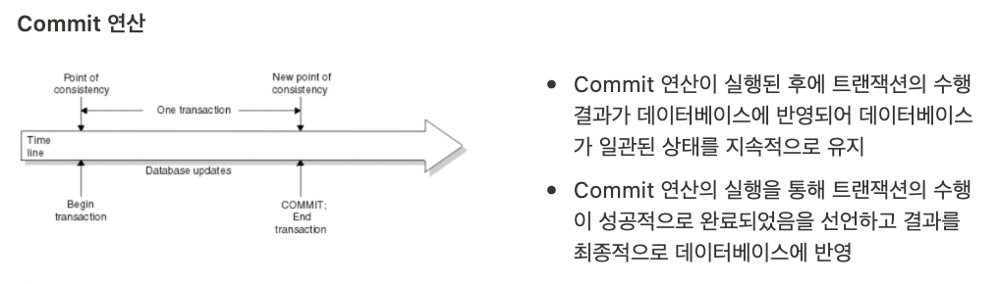

 

#### Rollback
##### 트랜잭션으로 묶은 연산들을 취소하여 가장 최근 Commit 시점으로 되돌린다.

    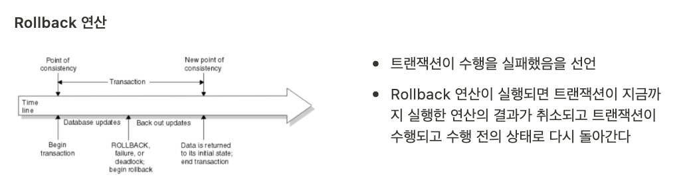

###### 두 작업 모두 사용자가 직접 명시하면서 처리될 수 있다. Commit은 `autocommit`을 켜두면 시스템에 의해 자동적으로 발생할 수 있으며, Rollback 역시 트랜잭션의 일부 연산에서 오류가 발생했을 때 시스템에 의해 자동으로 발생할 수 있다.

 

### 5. 동시성 제어 (Concurrency Control)
##### 동시성은 서로 다른 작업들을 동시간 대에 처리할 수 있는 성질을 의미한다. (Simultaneous와는 달리 Concurrent는 의미 상 진정한 동시성과는 차이가 있다.)

 

##### 그리고 동시성 제어라는 말은 트랜잭션들의 동시성을 보장하기 위해 연산들을 적절히 관리하는 것을 의미하는데, 트랜잭션들 간 공유되지 않는 데이터를 이용하는 연산들은 동시에 진행하고, 그렇지 않은 연산들은 LOCK과 같은 자원을 먼저 획득한 트랜잭션이 진행할 수 있도록 이뤄진다. 공유되고 있는 데이터들의 연산들을 격리 수준에 따른 방법으로 순차적인 진행을 하지 않도록 만든다면 더 높은 동시성을 제공할 수 있게 된다. (트랜잭션은 데이터의 쓰기 일관성은 보장되어야 하므로, 이 부분은 읽기 연산들에게 해당된다. 격리 수준 자체도 읽기 연산에만 해당된다는 점을 유의한다.)

 

##### 읽기 연산에 대해 이와 같은 조정이 가능한 이유는 데이터의 직접적인 조작에 영향을 끼치진 연산이 쓰기 작업이기 때문이다. 즉, 동시성의 높낮이는 데이터의 읽기 일관성을 어느 수준으로 두는지에 따라 제어될 수 있다.

 

##### 읽기 작업의 동시성을 높인다는 말은 곧 한 트랜잭션의 읽기 혹은 쓰기 연산 도중에 다른 트랜잭션의 읽기 연산이 개입할 수 있다는 말을 의미하므로, 일관성을 일부 희생하게 된다. 즉, 데이터의 읽기 일관성과 트랜잭션의 동시성은 서로 상충관계에 있다고 볼 수 있으며, 제공하려는 서비스가 어느 수준의 읽기 일관성을 유지해야 하는지에 따라 트랜잭션의 동시성을 더 높일 수 있는지 아닌지가 결정된다.

    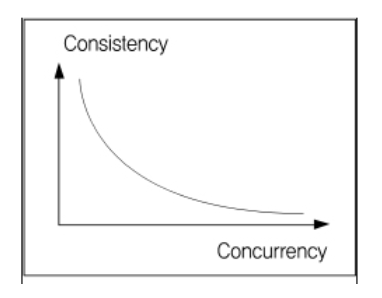

 

##### 동시성 제어에는 2가지 방법이 있다. 첫 째는 비관적 동시성 제어 (Pessimistic Concurrency Control)이고, 둘 째는 낙관적 동시성 제어 (Optimistic Concurrency Control)이다.

 

##### 전자는 사용자들이 같은 데이터를 동시에 수정할 것이라고 가정한 제어 방식이고, 이에 따라 데이터를 읽는 시점에 LOCK을 걸어서 조회 혹은 갱신이 완료될 때까지 유지하게 된다.

 

##### 후자는 사용자들이 같은 데이터를 동시에 수정하지 않을 것이라고 가정한 제어 방식이고, 이에 따라 데이터를 읽는 시점에 LOCK을 걸지는 않지만 값을 수정하려는 시점에 해당 값이 다른 사용자에 의해 변경되었는지 검사하게 된다.

 

##### 어느 제어 방식을 목표로 하는지에 따라 격리 수준을 달리 정하여 운용할 수 있어야 한다. 단, 동시성을 제공하면서 제어를 하지 않는 경우에는 Lost Update, Dirty Read, Inconsistency, Cascading Rollback / Unrecoverability 등의 문제가 발생할 수 있다.

 

## 2) 격리 수준과 일관성

### 1. 의미 (Meaning)
##### 트랜잭션의 격리 수준이라 함은 데이터의 읽기 일관성을 어느 수준까지 보장할지를 결정 짓는 척도이며, 격리 수준에 따라 트랜잭션의 동시성이 높아질 수도 낮아질 수도 있다.

 

##### 예를 들어 격리 수준을 낮추면, 데이터의 읽기 일관성은 낮아지고 동시성은 높아진다. 반대로 격리수준이 높아지면, 데이터의 읽기 일관성은 높아지지만 동시성은 낮아진다.

 

### 2. Read Phenomena
##### 데이터의 읽기 일관성의 수준에 따라 발생하는 현상들은 다음과 같다.

 

#### Dirty Read
##### (1) 읽기 작업을 하는 트랜잭션1이 쓰기 작업을 하는 트랜잭션2가 작업한 중간 데이터를 읽기 때문에 발생
##### (2) 작업 중인 트랜잭션2가 작업을 Rollback한 경우 트랜잭션1은 무효가 된 데이터를 읽게 되고 잘못된 결과 도출

    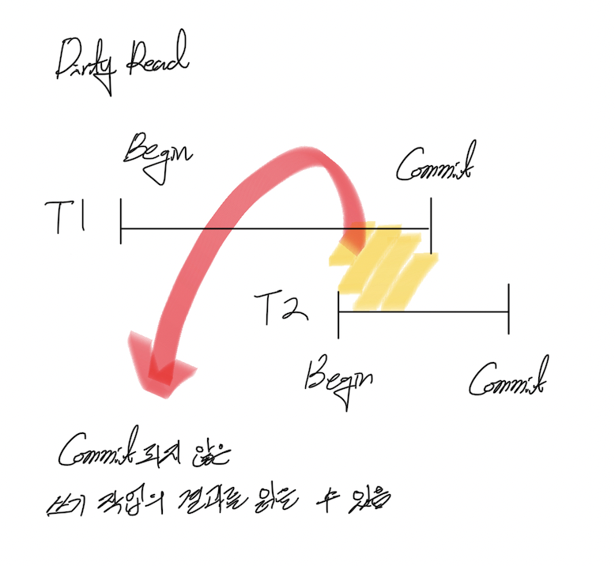

 

#### Non-Repeatable Read
##### (1) 트랜잭션1이 데이터를 읽고 트랜잭션2가 데이터를 쓰고(Update) 트랜잭션1이 다시 한번 데이터를 읽을 때 생기는 문제
##### (2) 트랜잭션1이 읽기 작업을 다시 한 번 반복할 경우 이전의 결과와 다른 결과가 나오는 현상

    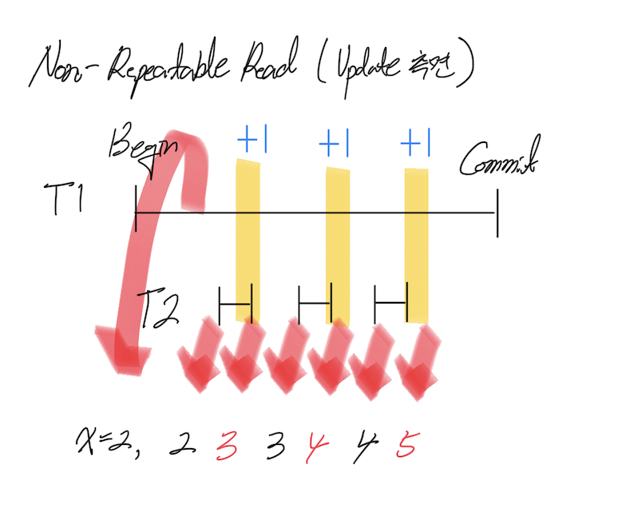

 

#### Phantom Read
##### (1) 트랜잭션1이 데이터를 읽고 트랜잭션2가 데이터를 쓰고(Insert) 트랜잭션1이 다시 한번 데이터를 읽을 때 생기는 문제
##### (2) 트랜잭션1이 읽기 작업을 다시 한번 반복할 경우 이전에 없던 데이터(Phantom Data)가 나타나는 현상

    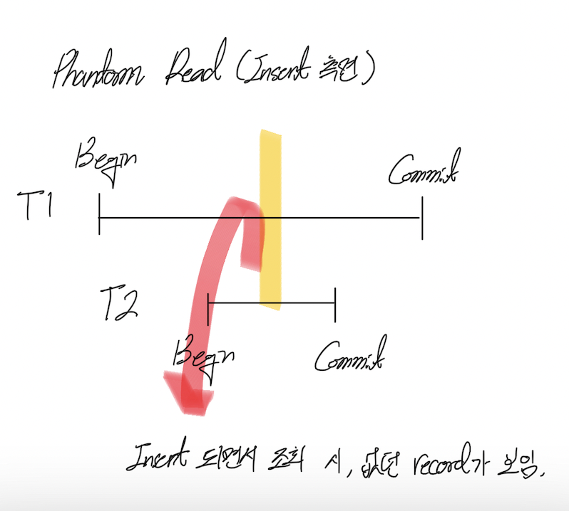

 

### 3. 격리 수준
##### Read Phenomena를 어디까지 허용하는지에 따라 격리 수준이 4개로 나뉜다. Cubrid에서 지원하는 격리 수준은 총 6개이지만, 그 중에서 주로 사용되는 격리 수준은 4개이다. 나머지 2개는 다른 DBMS에서는 존재하지 않는 개념이다.

 

#### READ UNCOMMITED (3)

| 현상 | 허용 여부 |
| :---: | :---: |
| Dirty Read | O |
| Non-Repeatable Read | O |
| Phantom Read | O |

#### READ COMMITED (4)

| 현상 | 허용 여부 |
| :---: | :---: |
| Dirty Read | X |
| Non-Repeatable Read | O |
| Phantom Read | O |

#### READ REPEATABLE (5)

| 현상 | 허용 여부 |
| :---: | :---: |
| Dirty Read | X |
| Non-Repeatable Read | X |
| Phantom Read | O |

#### SERIALIZABLE (6)

| 현상 | 허용 여부 |
| :---: | :---: |
| Dirty Read | X |
| Non-Repeatable Read | X |
| Phantom Read | X |

 

##### 각 격리 수준에 주어진 괄호의 숫자는 Cubrid에서의 넘버링을 의미한다. 따라서 격리 수준을 설정할 때 위 넘버링을 이용한다. SQL을 이용하여 설정하려는 경우엔 아래와 같이 작성하면 된다. 아래 구문은 격리 수준을 4인 READ COMMITED로 설정한다.

> SET TRANSACTION ISOLATION LEVEL 4

 

##### 혹은 Cubrid 설정 자체를 바꾸고 싶다면, `cubrid.conf`의 `isolation_level`을 설정하면 된다. 다시 한 번 상기하자면, 격리 수준에서 설정되는 것은 트랜잭션이 운용하는 데이터의 읽기 일관성이다. 데이터의 쓰기 일관성과는 무관하다는 것에 유의해야 한다.

 

## 3) 잠금 관리

##### Cubrid에서는 격리 수준에 따른 동시성들을 지원하기 위해 다양한 LOCK을 제공한다. LOCK의 대상에는 테이블, 인덱스, 레코드 등이 있으며, 대상에 따라 LOCK의 종류가 달라진다.

 

### 1. 레코드 잠금 관리
###### ** 레코드 잠금은 스키마 잠금에 영향을 끼치는 관계에 있다. **

 

#### S_LOCK과 X_LOCK

##### S_LOCK은 트랜잭션이 레코드를 대상으로 읽기 연산을 수행하기 전에 획득하는 LOCK이다. 또한 S_LOCK은 특이하게도 동시 획득이 가능한 LOCK이다. 예를 들어 트랜잭션1이 먼저 S_LOCK을 획득하면 트랜잭션2 와 트랜잭션3도 S_LOCK을 획득하여 읽기 연산은 할 수 있지만, 어떠한 트랜잭션도 S_LOCK이 걸려있는 레코드에 대해 쓰기 연산은 수행할 수 없게 된다.

 

##### X_LOCK은 레코드를 대상으로 트랜잭션의 쓰기 연산 수행을 위해 획득하는 LOCK이며, 단 하나의 트랜잭션만 획득할 수 있다. 쓰기 작업이 완료되더라도 트랜잭션의 Commit 전까지는 X_LOCK을 해제하지 않는다.

 

    

##### 위 그림과 같이 S_LOCK과 X_LOCK의 관계를 간단히 나타낼 수 있으며, 다음과 같은 사실들을 알 수 있다.

    (1) 여러 트랜잭션들은 동시에 S_LOCK을 취득하여, 레코드를 동시에 읽어내는 것은 가능하다.
    (2) X_LOCK은 쓰기 연산을 수행하려는 레코드에 대해 단 하나의 트랜잭션만 취득할 수 있다. 따라서 S_LOCK이 걸려서 트랜잭션이 읽고 있는 레코드에게 X_LOCK 취득은 불가능하고, 마찬가지로 X_LOCK이 걸려서 트랜잭션이 쓰고 있는 레코드에게 X_LOCK 취득 역시 불가능하다.

 

#### U_LOCK

##### Cubrid의 U_LOCK은 Update, Delete의 SQL에서 사용되며, 두 종류의 질의문에서 WHERE에 해당되는 레코드를 작업하는 동안 다른 트랜잭션에서 해당 레코드를 읽지 못하도록 만들기 위해 이용되는 LOCK이다. U_LOCK은 S_LOCK을 취득한 상태에서 얻을 수 있으며, U_LOCK으로 잠긴 레코드는 다른 트랜잭션에서 S_LOCK 취득이 불가능하다.

 

##### 예를 들어 트랜잭션1이 U_LOCK을 취득햇다면, 후에 이어지는 트랜잭션2에서는 S_LOCK 취득이 불가능하다. 다만 반대로, 트랜잭션이1이 S_LOCK을 먼저 획득한 상태이고 그 이후에 트랜잭션이2가 U_LOCK을 얻는 것은 가능하다. 이 때 트랜잭션2가 쓰기 작업을 수행하기 위해선 추가적으로 X_LOCK을 얻어야 하는데 어차피 트랜잭션1의 S_LOCK이 해제되고 나서야 X_LOCK을 얻을 수 있으므로, U_LOCK 획득 이전에 선행적으로 취득된 S_LOCK에 대해선 크게 걱정할 필요가 없다. (S_LCOK과 X_LOCK은 공존할 수 없으므로)

 

#### 잠금 획득 순서

##### READ UNCOMMITED

  * ###### SELECT   : None
  * ###### UPDATE   : X_LOCK
  * ###### INSERT   : X_LOCK
  * ###### DELETE   : X_LOCK

##### READ COMMITED

  * ###### SELECT   : S_LOCK (획득 후 연산이 끝나면 바로 해제)
  * ###### UPDATE   : S_LOCK --> U_LOCK --> X_LOCK
  * ###### INSERT   : X_LOCK
  * ###### DELETE   : S_LOCK --> U_LOCK --> X_LOCK

##### READ REPEATABLE & SERIALIZABLE

  * ###### SELECT   : S_LOCK (트랜잭션의 커밋 전까지 해제하지 않음)
  * ###### UPDATE   : S_LOCK --> U_LOCK --> X_LOCK
  * ###### INSERT   : X_LOCK
  * ###### DELETE   : S_LOCK --> U_LOCK --> X_LOCK

 

### 2. 스키마 잠금 관리
###### ** 스키마 잠금은 레코드 잠금에 영향을 끼치는 관계에 있다. **

 

##### 스키마 잠금이란 테이블을 대상으로 하는 LOCK을 의미한다. 이는 레코드와 관련 있는 의도 잠금 (Intent Lock)과 DDL 조작 시 사용되는 스키마 잠금 (Schema Lock) 두 종류로 나뉘며, 편의 상 두 잠금 모두 테이블과 관련이 있기 때문에 스키마 잠금으로 분류하였다.

 

#### (1) SCH-S & SCH-M

##### Cubrid에서는 DDL (CREATE, ALTER, DROP 등 ...) 작업에 대해서 스키마 잠금을 획득하도록 되어 있다. 스키마 잠금에는 크게 SCH-S (스키마 안정 장금), SCH-M (스키마 수정 잠금)으로 나뉜다.

 

##### SCH-S
###### Broker의 Query Compile 동안 획득 되며, 다른 트랜잭션이 스키마를 수정하는 것을 방지한다.
##### SCH-M
###### DDL을 수행하는 동안 획득되며, 다른 트랜잭션이 해당 스키마에 접근하는 것을 방지한다.

 

#### (2) Intent Lock

##### Cubrid에서는 레코드에 대한 작업 수행 시, 레코드 보다 상위 계층인 테이블에 대해서도 잠금을 획득한다. 이를 통해 상위 계층에 대한 변경을 방지한다. 예를 들어, 특정 레코드에 X_LOCK을 획득하면 해당 레코드의 상위 계층의 테이블에서도 Intent Lock을 획득하여 테이블을 변견하지 못하도록 만든다. Intetn Lock에는 IS_LOCK (의도 공유 잠금), IX_LOCK (의도 배타 잠금), SIX_LOCK (공유 의도 배타 잠금)으로 총 3가지가 있다.

 

##### IS_LOCK (의도 공유 잠금)
###### 레코드에 S_LOCK이 걸리면 해당 레코드의 테이블에 IS_LOCK이 걸린다.

| <h5>연산<h5/> | <h5>허용 여부<h5/> |
| :---: | :---: |
| <h5>스키마 변경<h5/> | <h5>X<h5/> |
| <h5>모든 행 갱신<h5/> | <h5>X<h5/> |
| <h5>일부 행 갱신<h5/> | <h5>O<h5/> |
| <h5>모든 행 조회<h5/> | <h5>O<h5/> |
| <h5>일부 행 조회<h5/> | <h5>O<h5/> |

 

##### IX_LOCK (의도 배타 잠금)
###### 레코드에 X_LOCK이 걸리면 해당 레코드의 테이블에 IX_LOCK이 걸린다.

| <h5>연산<h5/> | <h5>허용 여부<h5/> |
| :---: | :---: |
| <h5>스키마 변경<h5/> | <h5>X<h5/> |
| <h5>모든 행 갱신<h5/> | <h5>X<h5/> |
| <h5>일부 행 갱신<h5/> | <h5>O<h5/> |
| <h5>모든 행 조회<h5/> | <h5>X<h5/> |
| <h5>일부 행 조회<h5/> | <h5>O<h5/> |

 

##### SIX_LOCK (공유 의도 배타 잠금)

| <h5>연산<h5/> | <h5>허용 여부<h5/> |
| :---: | :---: |
| <h5>스키마 변경<h5/> | <h5>X<h5/> |
| <h5>모든 행 갱신<h5/> | <h5>X<h5/> |
| <h5>일부 행 갱신<h5/> | <h5>X<h5/> |
| <h5>모든 행 조회<h5/> | <h5>X<h5/> |
| <h5>일부 행 조회<h5/> | <h5>O<h5/> |

 

### 3. 키 잠금 관리
###### ** 키 잠금은 레코드 잠금 및 스키마 잠금과는 무관하다. **

 

##### 키 잠금에서의 키는 인덱스를 의미하며, 키 잠금 자체는 인덱스를 대상으로 하는 LOCK을 의미한다. 레코드와 비슷하게, 다음 키의 공유 잠금을 NS_LOCK, 다음 키의 배타 잠금을 NX_LOCK이라 한다.

 

##### 두 LOCK은 인덱스가 존재하는 레코드에 대해 쓰기 연산을 수행하려 할 때, 해당 연산이 영향을 주는 범위를 보호하기 위해 이용된다.

 

##### NS_LOCK은 INSERT에 이용되고, INSERT 연산에서 자신과 다음 인덱스 값에 대해 NS_LOCK을 획득한다. INSERT 직후에는 다음 인덱스 값의 NS_LOCK은 해제되고, 자신에게 해당되는 NS_LOCK만 유지한다.

 

##### NX_LOCK은 UPDATE 및 DELETE에 이용되고, 해당 연산에서 자신과 다음 인덱스 값에 대해서 NX_LOCK을 획득한다. NS_LOCK과 달리 연산 직후에도 두 영역에 대한 NX_LOCK은 유지된다.

 

#### ex) 책에 제시된 인덱스의 Phantom Read와 키 잠금 이해하기
> (1) CREATE TABLE tbl (id INT PRIMARY KEY);
>
> (2) INSERT INTO tbl VALUES (1), (2), (3), (20);
>
> (3.1) Tx1 --> DELETE FROM tbl WHERE id < 10;
>
> (3.2) Tx2 --> INSERT INTO tbl VALUES (8);
>
> (3.3) Tx2 --> Commit;
>
> (3.4) Tx1 --> SELECT  * FROM tbl WHERE id < 10;

 

##### Without Key Lock : 별도의 잠금이 없기 때문에 3.2에서의 INSERT와 3.3의 Commit으로 레코드가 추가되고, 3.4에서 레코드를 조회 했을 때는 분명 10 이하의 값을 모두 지웠지만 새로운 레코드가 나타난다.

 

##### With Key : 3.1에서 10의 다음 인덱스인 20에 대해서 NX_LOCK이 걸린다. 그리고 3.2에서 8 다음의 인덱스인 20에 대해서 NS_LOCK을 잡으려 한다. 20이라는 데이터는 이미 락이 걸린 상태이므로 트랜잭션2는 NS_LOCK을 얻기 위해 대기하고, 만일 트랜잭션1의 Commit으로 NX_LOCK이 풀리게 되면 트랜잭션2는 NS_LOCK을 취득하게 된다. 따라서 3.3의 수행이 3.4보다 늦게 이뤄지게 되므로 기존처럼 3.4에서 Phantom Read가 나타나진 않는다.

 

### 4. 호환성
##### 잠금들의 호환 관계는 다음과 같다. 호환성이란 Lock Holder가 특정 객체에 대해 획득한 LOCK과 Locker Request가 특정 객체에 대해 요구하는 LOCK을 중복하여 얻을 수 있다는 것이다.

    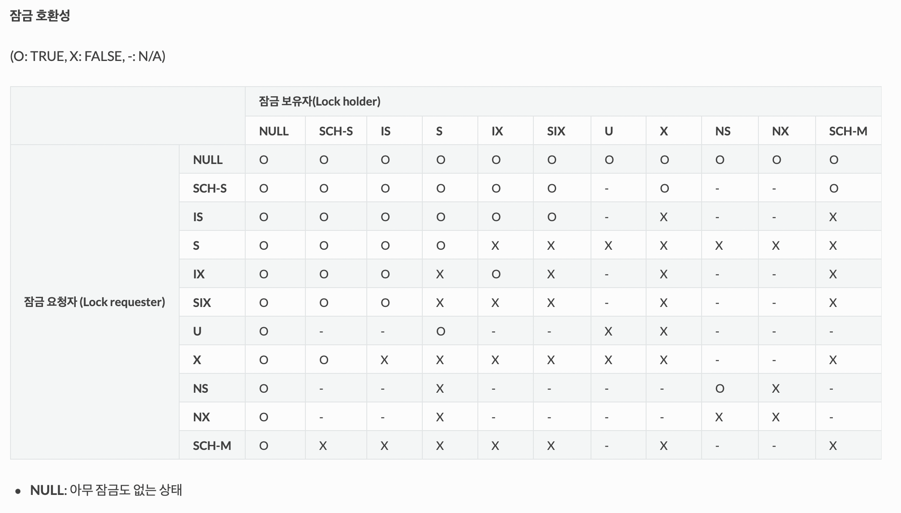

 

### 5. cubrid lockdb $DB-NAME
##### `cubrid lockdb $DB-NAME`을 이용하면 (1) 시스템 상의 LOCK 관련 설정 값, (2) 데이터베이스 서버에 접속 중인 클라이언트 정보, (3) LOCK 소유 상태 등을 볼 수 있다. 해당 명령어를 활용하는 예시가 167p - 171p까지 이어져 있으니, 각 LOCK의 의미가 파악되었다면 직접 트래킹 해보는 것을 권장한다.

 

#### (1) 시스템 상의 LOCK 관련 설정 값

    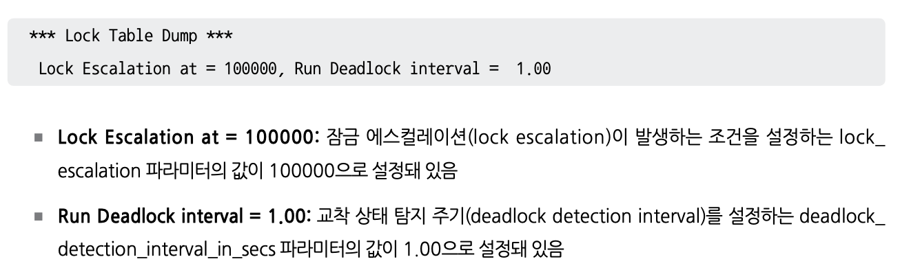

* ###### Lock Escalation이란 레코드 수준 잠금을 테이블 수준 잠금으로 대체하는 것을 말한다. 레코드 수준의 잠금은 키 잠금을 포함하는데, 해당 값이 Lock Escalation에 설정된 값을 초과하게 되면 테이블 수준 잠금으로 바뀐다. 이는 레코드 수준의 잠금이 많아지면 이를 관리하는데 부담이 커지고 성능을 저하시킬 수 있기 때문이다. 한 트랜잭션만 테이블을 이용할 수 있게 만들어서 잠금 관리의 부담을 줄이는 것이다. 이 때, 테이블 당 수행되는 트랜잭션은 하나가 되므로 동시성은 Lock Escalation이 설정되기 전보다 떨어지게 된다.
* ###### Run Deadlock Interval은 교착 상태 탐지 주기를 의미한다. 단위는 초이다.

 

#### (2) 데이터베이스 서버에 접속 중인 클라이언트 정보

    

* ###### Isolation : 트랜잭션의 격리 수준
* ###### State : 트랜잭션의 상태
* ###### Timeout_period : 잠금 대기 시간 설정 값 (cubrid.conf에서 lock_timeout으로 설정됨, 기본 값은 -1로 무한 대기)
* ###### 클라이언트는 유틸리티, csql 뿐만 아니라 CAS도 포함된다.

 

#### (3) 객체 잠금 상태

    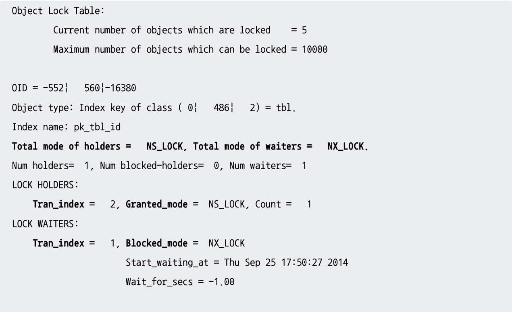

* ###### Current number of objects which are locked : 데이터베이스가 보유 중인  잠금 수
* ###### OID = x | y | z : 볼륨 번호 | 페이지 번호 | 슬롯 번호 (볼륨 번호가 음수로 주어지면 인덱스 번호를 의미)
* ###### Object type : Class (테이블), Index (인덱스), 레코드 (Instance)로 분류
* ###### Num holders : 객체의 잠금 보유 수
* ###### Num blocked-holders : 잠금을 보유하고 있지만 상위 객체에 의해 차단된 잠금 수
* ###### Num waiters : 잠금 대기 수
* ###### LOCK HOLDERS : 잠금 보유자
* ###### LOCK WAITERS : 잠금 대기자

 

### 6. cubrid tranlist & cubrid killtran -i $TRAN-ID
##### 두 명령어를 활용한 예시가 174p - 176에 느린 질의 탐지로 주어져 있으니 직접 트래킹 해보는 것을 권장한다.

 

#### (1) cubrid tranlist
##### `cubrid tranlist`는 DBA 권한을 갖고 있는 사용자만 이용할 수 있으며, 실행 중인 트랜잭션의 목록을 포함한 트랜잭션의 상세한 정보들을 확인할 수 있다.

 

    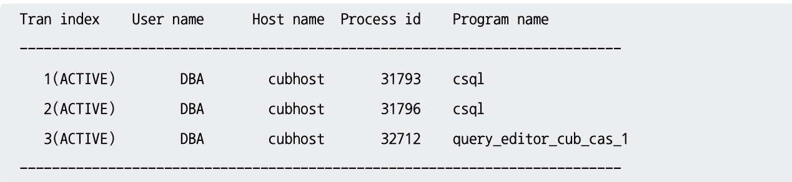

* ###### Tran index : 트랜잭션 아이디와 상태 (ACTIVE, RECOVERY, COMMITTED, COMMITTING, ABORTED, KILLED)
* ###### User name : 데이터베이스 사용자 이름
* ###### Host name : 호스트 이름
* ###### Process id : 트랜잭션을 실행 중인 프로세스 아이디
* ###### Program name : 트랜잭션을 실행 중인 프로세스의 이름

 

    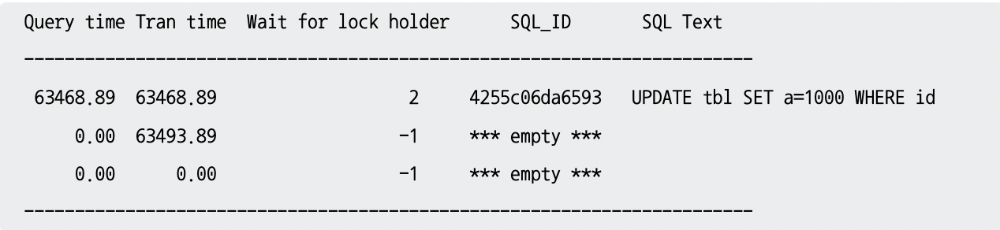

* ###### Query time : 수행 중인 Query의 총 수행 시간 (초 단위)
* ###### Tram time : 현재 트랜잭션의 총 수행 시간 (초 단위)
* ###### Wait for lock holder : LOCK을 보유하고 있는 트랜잭션의 아이디
* ###### SQL_ID : SQL Text에 대한 아이디로 `cubrid killtran`의 `--kill-sql-id` 옵션으로 이용
* ###### SQL Text : Query (최대 30자)

 

    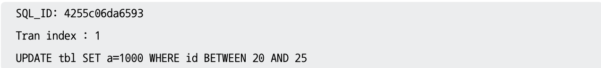

* ###### 다른 트랜잭션의 잠금을 대기하고 있는 트랜잭션의 번호와 해당 Query

 

#### (2) cubrid killtran -i $TRAN-ID
##### `cubrid tranlist`를 이용하여 파악된 잠금을 보유하고 있는 트랜잭션을 `cubrid killtran`을 이용하여 중지시킬 수 있다. 이를 통해 트랜잭션이 보유하고 있는 잠금을 해제시킬 수 있다. `-i` 옵션의 인자로 트랜잭션의 아이디를 이용하면 된다.

 

    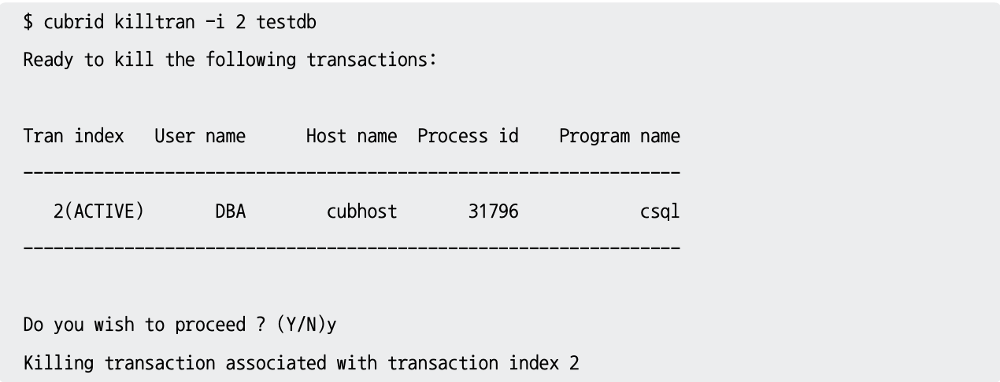

 

##### `cubrid tranlist`를 통해 파악된 잠금 대기 유발 트랜잭션이 여럿 있다면, `-i` 옵션 뒤에 여러 개의 트랜잭션 아이디를 기재하는 것도 가능하다. Query 수행에 너무 오래 걸리는 트랜잭션들도 `cubrid tranlist`로 파악할 수 있으니 이들도 중지 시킬 수 있다.

 

### 7. Deadlock
##### 데이터베이스에서의 Deadlock은 둘 이상의 트랜잭션이 서로 자신이 보유하고 있는 LOCK을 놓지 않으면서, 상대방의 LOCK을 원하는 구조가 순환적으로 이뤄질 때 발생한다. Deadlock은 다음과 같은 상태를 오래 유지하는 경우 발생할 가능성이 높아진다.

* ##### Query 수행이 느린 경우
* ##### Lock Waiting의 시간이 길어지는 경우
* ##### 한 테이블에 인덱스가 많아 키 잠금이 많아지는 경우 (177p - 179p)
* ##### 어플리케이션의 로직에 문제가 있는 경우 (LOCK의 Partial Order가 지켜지지 않은 경우)

 

##### 주어진 2개의 예시가 있는데, 이들의 순환 구조를 그림을 통해 이해할 수 있어야 한다. 실습을 통해 `$CUBRID/log/server`에 위치한 파일로 Deadlock이 발생했는지 확인할 수 있어야 한다.
* ##### 2개의 트랜잭션으로 발생하는 Deadlock (181p - 184p)
* ##### 3개의 트랜잭션으로 발생하는 Deadlock (184p - 189p)

###### (1) 간혹 Deadlock이 아님에도 Deadlock으로 기록이 남는 경우가 있다. 이는 시스템 상에서 동작하는 탐지 알고리즘의 한계이다.
###### (2) 주어진 예시를 살펴보면 데이터베이스 운용 시 Deadlock은 불가필 수 밖에 없다는 것을 알 수 있다. 이 때는 가장 최근에 실행된 트랜잭션을 롤백하고 (가장 적은 구문을 실행했을 가능성이 높으므로) 에러를 반환한다. 에러를 반환한 트랜잭션은 일정 시간 뒤에 (필요한 LOCK을 보유한 트랜잭션이 LOCK을 해제하는 시간을 감안하여) 재실행된다.
###### (3) Deadlock 발생이 불가피하더라도, 테이블의 구조, 인덱스의 구조, Query 형태의 변경 등으로 Deadlock 발생 가능성을 최대한 낮추는 노력이 필요하다.

 

## 4) 궁금한 점

##### 1. S_LOCK과 X_LOCK은 다른 디비에도 많은 것으로 확인했는데, 그렇다면 S_LOCK과 X_LOCK은 DB에선 일종의 공통된 LOCK이고, U_LOCK은 Cubrid만의 LOCK인가?

 

##### 2. SIX_LOCK의 정확한 역할 및 사용 시점

 

##### 3. 키 잠금 중 SELECT 관련 락은 없던데, 이는 왜 없는가?

 

##### 4. 키 잠금의 예시를 보면 인덱스가 적용된 데이터에 대해서 키 잠금이 이뤄지는 것처럼 나타나 있다. 인덱스 역시 일반 데이터들처럼 별도의 볼륨으로 유지되고 있는 것으로 알고 있는데, 키 잠금은 인덱스 볼륨을 대상으로 하는지 혹은 일반 볼륨을 대상으로 이뤄지는지 궁금함

 

##### 5. Lock Escalation으로 올라간 잠금 수준은 언제 떨어지고 어떻게 모니터링 되는가?

 

##### 6. Lock Escalation으로 잠금 수준이 올라가면 부하를 줄이기 위해 동시성을 희생하는 것으로 이해를 했는데, 그렇다면 이 때 계속해서 많은 트랜잭션이 들어오면 끝까지 잠금 수준의 회복이 안 되는가?

 

##### 7. Num blocked-holders에서 상위 객체란 무엇을 의미하고, 상위 객체에 의해 차단되는 상황이란 무엇인지 궁금함

 

##### 8. 실제 서비스에서 느린 질의가 탐지되는 경우도 있는가? 예로 어떤 것이 있는지 궁금함

