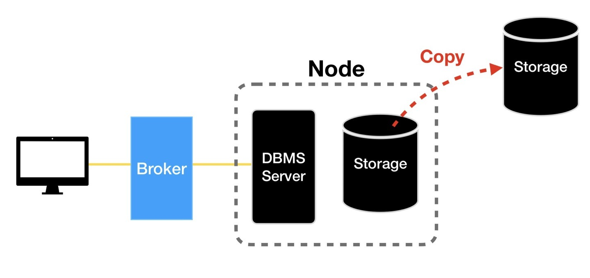
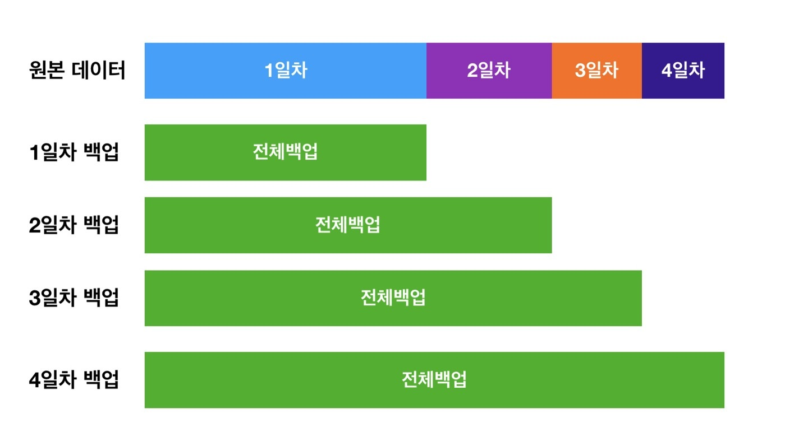
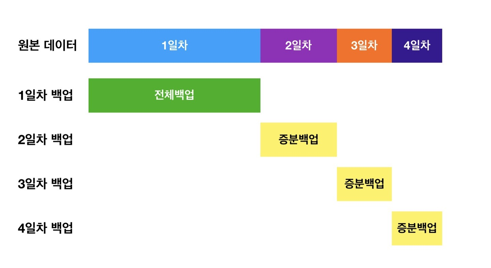
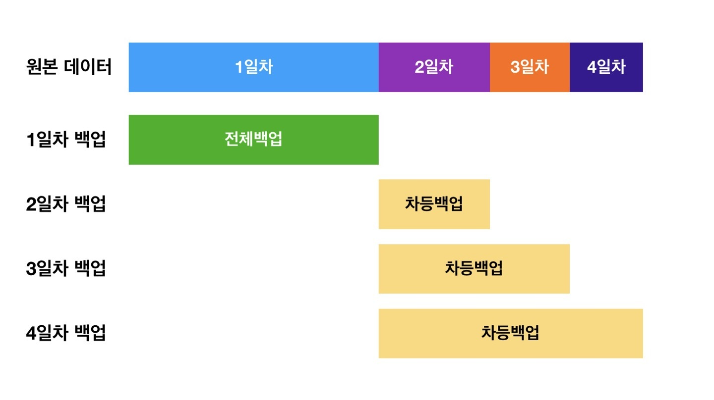
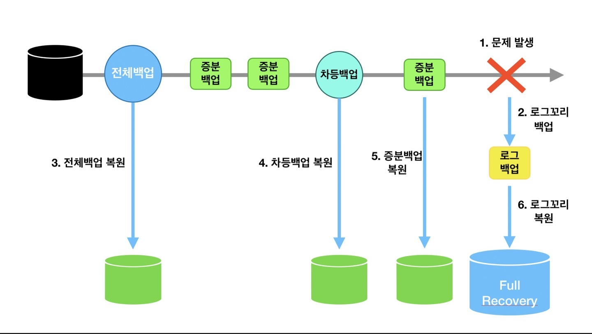
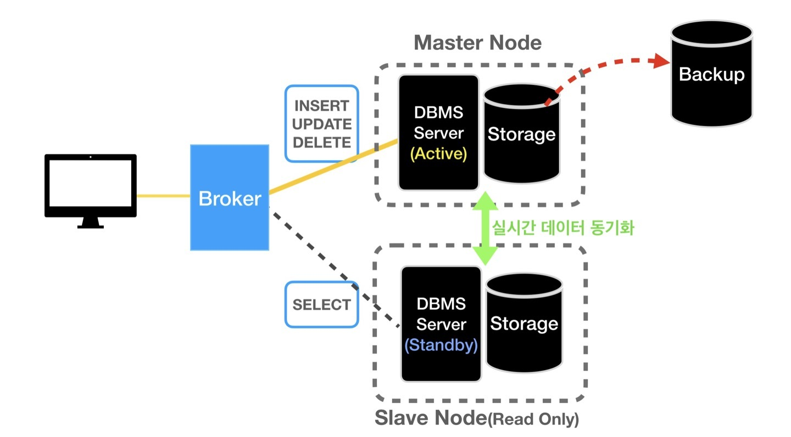

# 07. 백업과 복구
# 백업(Backup)

## 1. 백업이란?

 백업은 데이터 손상 시, 원본 데이터를 복원할 목적으로 원본 파일의 복사본을 제2의 또는 제3의 저장소에 저장하는 것이다.

 데이터는 소프트웨어 또는 하드웨어 오류, 인사 사고, 데이터 손상, 악의적인 공격, 실수로 인한 데이터 삭제 등으로 장애가 발생할 수 있다. 따라서 백업본을 통해 이전 시점의 데이터를 복원할 수 있어야 예기치 못한 상황에서 비즈니스를 신속하게 복구할 수 있게 된다.

 실시간으로 데이터를 복사하는 미러링(복제, HA), 데이터를 보관을 위해 다른 저장소에 저장하는 ‘아카이브’와 백업은 개념적으로 구분된다.


 ## 2. DB 백업의 고려사항

DB의 데이터를 일반적인 데이터처럼 단순히 백업하기에는 다음과 같은 유의사항이 존재한다.

- 데이터가 끊임없이 변화함.
- 원하는 수준의 복구가 가능해야함. 기업마다 목표로 하는 RTO, RPO가 있음.
    - **RTO(복구 시간 목표)**
        
        백업 스토리지로부터 파일을 복구하고 정상적인 운영 상태로 돌아가는 데 걸리는 최대 시간. 다르게 말하면, RTO는 기업이 감내할 수 있는 최대 다운타임 시간에 해당함. 기업의 RTO가 2시간이라면 2시간이 넘는 가동 중단을 견딜 수 없는 것이다.
        
    - **RPO(복구 시점 목표)**
        
        백업 스토리지로부터 복구하여 정상 운영 상태를 재개해야 하는 최대 파일 저장 기간. RPO에 따라 최소 백업 빈도가 결정된다. 예를 들어, 기업의 RPO가 5시간이라면 시스템은 최소 5시간마다 데이터를 백업해야 한다.
        

때문에, 각 서비스의 상황에 맞게 백업을 진행해야 한다.

## 3. 백업 데이터량

서비스 관리자는 백업을 어디에 얼마나 할 지 결정해야한다. **3 - 2 - 1원칙**은 과거부터 지금까지 통용되는 백업 위치에 대한 전략이다. 이 원칙에 따라 백업을 해두면 랜섬웨어 등 다양한 공격이나 재해에서 높은 안전성을 보장할 수 있다.

**3 : 기본 데이터1, 백업 데이터2, 총 3개의 데이터를 보관**

**2 : 2가지 이상의 미디어(저장 매체)로 데이터 저장**

**1 : 백업본 하나는 물리적으로 완전히 분리된 곳(off-site)에 보관**

**(안전을 위해 백업 종료 후 오프사이트 서버 off)**


이 원칙에 따라 백업을 해두면 랜섬웨어 등의 위협에서 안전하게 데이터를 유지할 수 있다.

## 4. 백업의 유형

### **1) 서비스 운영기준**

**콜드 백업(offline backup)**

서비스 운영 중단 후 백업 진행

- 장점
    - 시스템 리소스 활용에 제한이 없음
    - 백업 도중 변경되는 데이터가 없어 안전함
- 단점
    - 서버 접근이 불가함
    - 복구 시간이 오래걸림

**핫 백업(online backup)**

서버 운영하며 백업 수행, 대부분의 서비스에서 수행되는 백업 유형임.

- 장점
    - 서버가 끊기지 않고 계속 운영됨
- 단점
    - 스토리지 읽기 성능 부하로 서비스 운영에 지장이 갈 수 있음
    - 수시로 변경되는 데이터 백업 주의 필요

**웜백업(warm backup)**

시스템은 종료하지 않으나, 외부 사용자의 내부 시스템 접근을 막고 백업 수행

### **2) 백업량 기준**

**전체백업(Full backup)**



전체 데이터를 그대로 백업하는 방법이다. 초기 또는 첫 번째 백업으로 일반적으로 사용이 되고 그 다음으론 증분 또는 차등 백업이 사용된다. 여러 증분 또는 차등 백업 한 후, 다시 새로운 전체 백업을 시작하는 것이 일반적이다.

- 장점
    - 복원이 빠르고 파일의 전체 목록으로 쉽게 관리 할 수 있다.
- 단점
    - 각각의 파일의 전체백업이 매번 이루어질 때마다 오래 걸린다.
    - 증분백업과 차등백업과 비교해보아서 가장 많은 저장 공간을 차지한다.
    - 동일한 파일을 반복적으로 저장하는 비효율이 발생할 수 있다.

**증분백업(Incremental backup)**



이전 백업 이후 변경된 데이터만 백업하는 방식이다. 전체 백업을 수행하는 데 걸리는 시간과 저장 공간을 줄이기 위한 방법으로 도입되었다.

- 장점
    - 백업속도가 가장 빠르다.
    - 이미 있는 파일을 다시 저장하는 비효율이 없다. 이에 따라 저장 공간도 다른 백업에 비해 매우 적게 사용한다.
- 단점
    - 전체백업본 복구 후 순차적으로 증분 백업들을 복구해야 하므로 복구 시간이 길다.

**차등백업(Differential backups)**



차등 백업은 마지막 전체 백업 이후 변경된 모든 데이터를 백업하는 방식이다. 증분 백업과의 차이는 전체 백업 이후의 변경사항을 모두 백업한다는 것이다.

- 장점
    - 전체 백업에 비해 백업속도가 빠르다.
    - 마지막 전체 백업 이후에 변경된 파일만 각 차등 백업 실행에 복사되기 때문에 저장 한 후 공간 전체 백업을 보다 효율적으로 사용한다.
    - 전체 백업과 가장 마지막 차등백업본만 복구하면 되므로 복구속도가 빠르다.
- 단점
    - 백업속도나 저장 공간 효율은 증분 백업보다 좋지 않다.
    - 복원 속도가 전체 백업보다는 느리다.

***트랜잭션 로그 백업**

로그 백업은, 데이터베이스를 백업 받는게 아니고 그동안 발생했던 트랜잭션 로그(지금까지 이루어졌던 모든 동작들의 로그)를 백업받는 방법이다. 이전 백업을 복구한 데이터에 로그의 질의를 순차적으로 읽어 가장 최근의 상태로 복구할 수 있다. 로그 백업 진행 후 로그 파일은 삭제되어 저장 공간의 효율적 사용이 가능하다.

**백업전략**

보통 전체 백업 사이에 차등 백업과 증분 백업을 하는 전략을 사용한다. 사용하는 서비스의 특성에 맞게 주기를 결정한다.

ex) 전체 백업(1주 1회 2주분) / 차등 백업 (1일 1회 7일분) / 증분 백업(1시간 1회 3일분)


# 복구(Recovery)

데이터 복구는 백업한 데이터들을 이용하여 손상된 데이터를 살리는 작업을 의미한다. 아래의 그림은 데이터에 문제 발생 시 복구 절차에 대한 예시이다. 이를 통해 백업과 복구의 일반적인 절차를 이해해보자.


1. 원본 데이터에 문제가 발생한다.
2. 문제 발생 시 작업했던 트랜잭션의 로그를 백업한다.
3. 전체 백업본을 먼저 복구한다.
4. 마지막 차등 백업본을 복구한다.
5. 증분 백업본을 복구한다.
6. 마지막 로그의 백업본으로 가장 최신의 데이터볼륨으로 복원한다.

물론 DBMS마다 세부적인 절차는 다르겠지만, 일반적으로 복구는 이런 과정으로 이루어진다. 참고로 큐브리드는 차등백업은 하지 않고, 전체백업과 증분백업, 로그를 이용한 백업이 가능하다.

로그를 이용한 복구 작업의 상세한 내용은 아래의 링크를 참고하면 도움 될 것이다.
http://contents2.kocw.or.kr/KOCW/document/2016/catholic/hwangbyungyeon/15.pdf

# HA(High Availability or Replication)

HA(복제)는 메인 서버 또는 DB에 예기치 못한 문제가 생겼을 때, 서비스가 중단되는 경우를 방지하기 위한 개념이다. 서로 다른 장비에 동일한 정보를 가진 독립적인 예비 서버를 만들어놓고, 문제 발생 시 즉시 예비 서버로 연결하여 서비스의 중단에 대비할 수 있다.


 위의 그림처럼 Master 노드를 복제(Replication)한 Slave 노드를 구축하고 데이터를 실시간으로 동기화 시켜서 동일한 데이터를 가지도록 한다. 이 동기화는 네트워크 연결을 통해 트랜잭션 로그를 공유하며 이뤄진다.

 ```
노드(Node)란?
큐브리드는 분산 시스템(또는 클러스터 환경)에서 독립적인 역할(서비스, 읽기/쓰기 요청 처리 등)을 수행할 수 있는 단위를 '노드'라는 용어로 표현한다. 각 노드는 독립적인 DBMS서버와 데이터 저장 장치(Storage)의 집합이라고 볼 수 있다.
```
 그리고 노드는 보통 Active, Standby 상태로 구분된다. Active는 읽고 쓰는 작업이 모두 가능한 메인 서버임을 의미하고, Standby는 읽는 작업만 가능한 상태임을 의미한다.

 Slave 노드를 단순히 예비 자원으로 두기에는 낭비이므로 SELECT질의 등의 Read작업은 Slave 노드에서 처리하고, 데이터의 변경과 관련된 질의는 Master 노드에서 처리한다.

 또한, 읽기 요청 처리의 부하를 줄이기 위해 레플리카 노드를 추가하기도 한다. 레플리카 노드도 Standby 상태로 읽기 요청 처리가 가능하지만, Failover는 불가능하다. 아래 그림은 Failover을 나타낸 것이다.


만약 마스터 노드에 문제가 생겨 서비스 운영에 장애가 생길 수
 있는 경우에는, 곧바로 Slave노드를 메인 서버로 전환하여 서비스 운영에 차질이 없도록 대비할 수 있다. 이처럼 Slave 노드가 Master로 역할을 변경하는 것을 Failover(페일오버)라고 한다.

 ------------------------------------------------------------------------------------------------------------

## 목차
- 데이터베이스 볼륨이 **호환되는** 경우
    
    - 백업이란?
    
    - 백업이 되어지는 파일 종류
    - 백업의 종류
    - 정합성
    - 복구의 종류

</br>

- 데이터베이스 볼륨이 **호환되지 않는** 경우
    
    - Load & Unload 란?
    - Commit 주기 조절
    
    - 통계 정보 비갱신
    - 운영 중인 데이터베이스에 데이터로드
    - 트랜잭션 로그를 저장하지 않고 로드
    - 보관 로그
    - 체크포인트
    - 시스템에 의한 삭제
    - 사용자에 의한 삭제
    - 큐브리드 마이그레이션 툴킷

</br>


# 📍데이터베이스 볼륨이 호환되는 경우

</br>


## 백업이란?

- 데이터의 볼륨 파일을 그대로 읽어 저장

- **binary image**
    
    
    

```sql
cubrid backupdb -D$CUBRID/backup demodb
## -D 옵션 => 백업 파일이 저장될 디렉토리를 지정
## 생략된 경우 => $CUBRID/database.txt 파일에 명시한 로그 디렉토리에 저장
```

</br>

---

</br></br>


## 백업이 되어지는 파일 종류

</br>

1. 제어 파일 

    - {데이터베이스 이름}_vinf
        
    - 데이터베이스 내 존재하는 볼륨의 정보, 백업 정보, 및 로그의 정보를 저장
        - 볼륨 정보
            - 데이터베이스 내 모든 볼륨의 이름
                
            - 데이터베이스 내 모든 볼륨의 위치
            - 내부 볼륨 식별자를 포함하는 정보
            - 위의 정보를 기반으로 데이터베이스가 재시작될 때 CUBRID는 볼륨 정보 제어 파일을 판독
            - 새로운 데이터베이스 볼륨이 추가될 때에 새로운 엔트리를 볼륨 정보 제어 파일에 기록
            
        - 백업 정보
            - 정보 볼륨에 대한 모든 백업의 위치는 백업 정보 제어 파일에 기록
                
            - 제어 파일은 로그 파일이 관리되는 곳에 유지된다.
        - 로그 정보
            - 모든 활성 로그와 보관 로그의 이름을 포함
                
            - 사용자는 로그 정보 제어 파일을 통해 롤백이나 데이터베이스 복구에 필요하지 않은 보관 로그의 정보를 확인
            - 이러한 로그 정보 제어 파일은 로그 파일과 동일한 위치에서 생성 및 관리

</br>

2. 볼륨 파일
    - 범용 볼륨
        
    - 데이터 볼륨
    - 인덱스 볼륨
    - 임시 볼륨
    - 구조
    
    

</br>

3. 백업 시작 이후 생성된 보관 로그 파일
    
    - 활성 로그 공간이 모두 사용된 후에 지속적으로 생성되는 로그를 보관하는 파일

    - 설정
        - cubrid.conf ⇒ log_max_archives 적절히 큰값으로 설정
                
        - 보관 로그 파일이 쌓이는 속도를 감안해 10개 up & down 으로 설정

</br>

4. 활성 로그(active log) 파일
    
    - 진행 중인 트랜잭션 정보를 기록하는 파일

</br>

**위의 숫자의 순서대로 백업이 진행**

</br>

---

</br>

## 🧐 Log는 왜 필요할까?

</br>

- 백업된 시점까지만 복원하고자 한다면 백업 파일과 백업 정보 파일만 있으면 되지만

- 백업 이후 가장 최근에 반영된 트랜잭션까지 복원하려면 활성 로그 파일과 백업 이후의 보관 로그 파일이 필요

</br>

---

</br>

## Database Create 생성 파일

</br>

```sql
cubrid createdb --db-volume-size=20M --log-volume-size=20M demodb en_US > /dev/null 2>&1
```

</br>

- demodb ⇒ 데이터베이스 볼륨 파일

- demodb_lgar_t ⇒ 백그라운드 보관 로그 파일. 보관 로그 생성에 임시로 사용
- demodb_lgat ⇒ 활성 로그 볼륨 파일
- demodb_lginf ⇒ 로그 볼륨에 대한 정보 파일
- demodb_vinf ⇒ 데이터베이스 볼륨에 대한 정보 파일

</br>

---

</br>

### 백업의 종류

</br>

- 온라인(**Hot**) 백업과 오프라인(**Cold**) 백업
    
    - 온라인 백업 ⇒ 운영 중인 데이터베이스를 대상으로 수행
        
        - 명령어
            
            ```sql
            cubrid backupdb -C ##온라인 백업
            ```
            
    - 오프라인 백업 ⇒ 정지 상태인 데이터베이스 를 백업
        
        - 명령어
            
            ```sql
            cubrid backupdb -S ##오프라인 백업
            ```

</br>

- 전체 백업과 증분 백업
    - 전체 백업
        
        - 데이터베이스의 모든 페이지를 백업
        
        
        
    - 증분 백업
        
        - 전체 백업 이후의 변경된 사항만을 백업
            - 장점 ⇒ 시간과 디스크 공간을 절약하며 운영 가능
            
            - 단점 ⇒ 데이터베이스 복구 하려면 낮은 수준의 백업 파일이 온전히 있어야 가능
        
        
        
        ```sql
        cubrid backupdb -l {백업 수준}
        ```

</br>

- 압축 백업
    - 장점 ⇒ 백업되는 파일을 압축하기 때문에 백업 볼륨의 크기가 줄어들어 디스크 공간을 절약
    - 단점 ⇒ CPU 연산이 늘어남
    
    ```sql
    cubrid backupdb -z
    ```
    
- 복제 (**Replication**)
    - 백업 시 I/O 부하 조절
    
    
    
    - **Master 에서의 변경을 기록하기 위한 Binary Log**
    - **Binary Log 를 읽어서 Slave 쪽으로 데이터를 전송하기 위한 Master Thread**
    - **Slave 에서 데이터를 수신하여 Relay Log 에 기록하기 위한 I/O Thread**
    - **Relay Log 를 읽어서 해당 데이터를 Slave 에 Apply(적용)하기 위한 SQL Thread**
    - 순서

        1. 클라이언트(Application)에서 Commit 을 수행한다.

        2. Connection Thead 는 스토리지 엔진에게 해당 트랜잭션에 대한 Prepare(Commit 준비)를 수행한다.
        3. Commit 을 수행하기 전에 먼저 Binary Log 에 변경사항을 기록한다.
        4. 스토리지 엔진에게 트랜잭션 Commit 을 수행한다.
        5. Master Thread 는 시간에 구애받지 않고(비동기적으로) Binary Log 를 읽어서 Slave 로 전송한다.
        6. Slave 의 I/O Thread 는 Master 로부터 수신한 변경 데이터를 Relay Log 에 기록한다. (기록하는 방식은 Master 의 Binary Log 와 동일하다)
        7. Slave 의 SQL Thread 는 Relay Log 에 기록된 변경 데이터를 읽어서 스토리지 엔진에 적용한다
    - **—sleep-msecs=N** 옵션
        
        - 백업 시 1MB의 데이터를 읽은 후 일정 시간(N) 동안 작업을 쉬어 디스크 I/O 부하를 줄임
    
    - **-t** 옵션
        - 백업 시 스레드 개수도 조절
        
        - default ⇒ 멀티 스레드
        - 디스크 성능에 따라 멀티 스레드로 동작하면 스레드 하나로 동작할 때보다 백업 시간이 오히려 느려질수 있음

</br>

---

</br>

### 정합성 확인

- 정합성이란?
    
    - 정합성 = **無**모순성
        - 데이터가 서로 모순 없이 일관되게 일치해야함을 의미
        
        - 중복 데이터를 많이 사용하면 데이터 끼리 정합성을 맞추기 어렵다 (Normalization의 필요성)
        - 즉, 데이터의 정합성이란 어떤 데이터들의 값이 서로 일치
- default ⇒ 정합성 확인

- **—no—check** 옵션을 사용하면 정합성을 확인하지 않고 백업 수행
    - 데이터베이스 용량이 크다면 위의 옵션을 권장

</br>

---

</br>

## 수행 결과 확인

- **-o 옵션으로 출력 파일을 지정**

- 슬레이브나 레플리카를 재구축 하기 위해 백업할 때는 출력 파일을 저장해야 재구축 성공
- **page_id** 와 **required_page_id**, **offset** 정보와 같이 재구축 필요한 정보 저장

</br>

---

</br>

### 복구

- 데이터베이스 볼륨 이미지를 있는 그대로 복사

- 백업 파일을 사용해 복구하는 과정
    1. 제어파일({데이터베이스 이름}_vinf)과 볼륨 파일(데이터 볼륨, 인덱스 볼륨, 임시 볼륨)을 생성
    
    2. 활성 로그와 보관 로그를 읽어 로그를 복구
- 일반적인 복구
    - 백업한 시점으로 복구
    
    - 명령어
        
        ```sql
        cubrid restoredb -B /mybackup/testdb_bkv000 -u testdb ## -B 옵션을 사용하여 database.txt파일의 vol_path 와 log_path의 값을 지정
        ```
        
- 특정 시점으로 복구
    
    - 명령어
        
        ```sql
        cubrid restoredb -d 14-10-2014:14:10:00 demodb ##백업 파일을 이용해 백업 시점보다 이전의 특정 시점으로 복구
        ```
        
</br>

---

</br>

# 📍데이터베이스 볼륨이 호환되지 않는 경우

- 언로드, 로드
    
    - 데이터를 텍스트 형식으로 내려받아 볼륨에 올리는 것 (**테이블 순서대로 싱글 스레드 방식으로 동작**)
        - 데이터베이스 볼륨이 호환되지 않는 서버의 데이터를 다른 서버에 복원하는 경우
        
        - 데이터베이스를 재구축 하는 경우

</br>

---

</br>

## Unload

- 명령어
    
    ```sql
    cubrid unloaddb ##명령어
    ```
    
- 생성되는 파일
    
    - 스키마 파일
        - 해당 데이터베이스에 정의된 스키마 파일 (기본 키는 포함되나, 인덱스 정보는 포함되지 않음)
    
    - 객체 파일
        
        - 해당 데이터베이스에 포함된 데이터 파일
    
    - 인덱스 파일
        
        - 해당 데이터베이스에 정의된 인덱스 파일
    - 트리거 파일
        
        - 해당 데이터베이스에 정의된 트리거 파일

- 별도의 옵션을 사용하지 않으면 해당 데이터베이스 전체를 텍스트로 내려받는다

- 특정 테이블의 스키마, 인덱스, 데이터만 내려받는 경우
    
    ```sql
    cubrid unloaddb --input-class-file table_list.txt --input-class-only testdb
    ```
    
- 데이터 없이 스키마, 인덱스만 내려받는 경우
    
    ```sql
    cubrid unloaddb --input-class-file table_list.txt --input-class-only --schema-only testdb
    ```
    
- 데이터베이스 크기가 커서 데이터 파일 하나가 너무 클 경우
    
    - **—datafile-per-class** 옵션을 사용하여 데이터 파일을 테이블 별로 나눔

</br>

---

</br>

## Load

- 명령어
    
    ```sql
    cubrid loaddb ##명령어
    ```
    
- 서버에서 동작하기 때문에 INSERT 구문을 실행하는 것보다 빠르게 대용량 데이터를 입력할 수 있는 장점이 있음

</br>

---

</br>

## Commit 주기 조절

- **-c** 옵션을 사용하여 데이터를 가져올 때 커밋 주기를 조절할 수 있다.
    
    - 커밋 주기를 큰 값으로 설정하면 로그 페이지에 쓰는 부담이 커질 수 있으므로 무조건 크게 설정하는 것은 좋지 않음

</br>

---

</br>

## 운영 중인 데이터베이스에 데이터 로드

- cubrid loaddb 사용한다는 것은 새로운 데이터베이스에 데이터를 옮기는 것을 가정
    
    - 데이터베이스가 정지돼 있는 상태에서만 명령을 수행

- 운영 중에 특정 테이블을 로드해야 하는 경우 ⇒ **큐브리드 매니저에서 가져오기 기능**을 실행

</br>

---

</br>

## 트랜잭션 로그를 저장하지 않고 로드

- **—no-logging** 옵션 사용

- 장점 ⇒ 로드 속도는 높아짐
- 단점 ⇒  파일 형식이 잘못됐거나 예기치 않은 오류가 발생한다면 로그가 없기 때문에 데이터를 복구 불가함

</br>

---

</br>

## 보관 로그

- 보관 로그 파일은 활성 로그 파일의 여유 공간이 모두 소진 됐을 때 복구를 목적으로 저장되는 파일
    
    - 사용자가 임의로 삭제하는 경우에는 큐브리드의 정상 동작을 보장할 수 없다

- 디스크의 여유 공간을 확보하기 위해 불필요해진 보관 로그를 삭제해야하는 경우
    
    - 시스템에 의해 삭제 되는 경우
        
        - HA를 사용하지 않고 한 대의 노드만 운영시
            
            - 큐브리드 초기 설정
                
                - cubrid.conf 파일 ⇒ log_max_archives=0 설정
                    
                    - 사용하지 않을 보관 로그 파일을 남김없이 지우는 설정 ⇒ 디스크 볼륨에 반영이 완료된 보관 로그는 시스템에 의해 자동으로 삭제
        
        - HA 환경에서 여러 대의 노드 운영 시
            
            - 마스터 스레이브 서버 모두 상대 노드에 복제가 완료될 때까지 삭제 보류하기 위해
                - **force_remove_log_archives** 파라미터를 **no**로 변경
            
            - Replication에서는 상대방의 데이터를 받아오기만 하기 때문에
                
                - **force_remove_log_archives** 파라미터값을 **yes**로 설정해야만 보관로그 삭제 가능
        
        - HA 환경에서 강제 삭제
            
            ```sql
            force_remove_log_archives=yes
            log_max_archives=10
            ```
            
            - 보관 로그가 쌓이면서 마스터 노드에서 장애가 발생하지 않도록 위의 설정으로 슬레이브 노드로 복제하는 것을 포기하는 경우가 나을 수 있음
                
                - 마스터 노드에서 진행 중인 트랜잭션에 의해 사용되고 있는 보관 로그를 포함해 최소 10개의 파일은 항상 남기고, 나머지 보관 로그는 복제 여부와 무관하게 삭제
                    
                    - 로그 파일이 10개 쌓일 때까지는 복제 지연이 발생하더라도 추후 복제 반영이 가능하지만 10개 이상 필요한 상황이 되면 슬레이브 노드를 재구성해야 하므로 주의해서 사용
        
        - 체크포인트 발생
            - 시스템 설정에 의해 체크포인트가 발생할 때 체크포인트 발생 시점 이전의 보관 로그 삭제
            
            - 체크포인트 발생 주기 ⇒ cubrid.conf 파일 설정
                
                - **checkpoint_every_size** ⇒ 로그 페이지 단위 설정
                    
                    - 설정된 값만큼 로그 파일이 커지면 체크포인트를 수행
                    
                    - 바이트 단위로 지정 ⇒ B, K, M, G등의 단위로 명시
                    - 기본값
                        
                        - 로그 페이지 크기 16 KB 이면 156.25MB
                        
                        - 로그 페이지 크기 8KB 이면 78.125M
                
                - **checkpoint_interval** ⇒ 체크포인트 수행 주기 설정
                    
                    - 기본값 = 6min
                
                - 두개의 조건 중 하나 이상의 조건을 만족하면 체크포인트 발생
    
    - 사용자가 특정 명령을 통해 삭제 하는 경우
        
        - 체크포인트 발생
            
            ```sql
            $ csql -u dba testdb --sysadm
            csql> ;checkpoint
            ```
            
            - 사용자가 CSQL에서 위와 같이 체크포인트를 명시해 체크포인트를 발생시킬 수 있음
            
            - CSQL에 DBA 계정으로 접속해야하며 관리자 모드인 —sysadm 옵션으로 수행해야함
        
        - 백업 시 -r  옵션 사용
            
            - 사용자가 백업 명령 수행 시 **-r** 옵션을 사용하면 백업 시점 이전의 불필요한 로그 파일을 제거
            
            - **-r** 옵션을 증분 백업에서 사용하면 데이터베이스를 정상적으로 복구할 수 없을 수 있으므로 전체 백업을 사용해야함
            
            ```sql
            cubrid backupdb -r testdb
            ```
            
            - 주의 사항
                - HA 환경인 경우 슬레이브 노드에서 복제하지 않은 보관 로그가 삭제될 수 있으므로 **-r** 옵션을 사용하면 안된다

</br>

---

</br>

## 체크포인트

- 데이터를 빠르게 복구하기 위해 메모리에 있는 수정된 데이터 블록을 디스크에 있는 데이터 볼륨 파일과 동기화 하는 데이터베이스 이벤트

- DBMS가 로그를 사용하더라도 어떤 트랜잭션의 갱신 사항이 주기억장치 버퍼로부터 디스크에 기록되었는 가를 구분 불가
    
    - 회복 시 재수행할 트랜잭션의 수를 줄이기 위해서 주기적으로 **체크포인트**를 수행

- 체크포인트 작업이 끝나면 로그에 [checkpoint] 로그 레코드가 기록

- 회복을 위한 조치
    
    - Redo (재수행) :  가장 최근 복제본 + 로그 ⇒ 데이터베이스 복원
    
    - Undo (취소) : 로그 + 모든 변경들을 취소 ⇒ 원래의 데이터베이스로 복원
        
        - Undo와 Rollback
            
            - Undo : 단일 연산에 대해 적용
            
            - Rollback : 한 트랜잭션에 대해 적용
            
            - 회복의 필요성
                
                - 어떤 트랜잭션 T를 수행하는 도중에 시스템이 다운되었을 때, T의 수행 효과가 디스크의 데이터베이스에 일부 반영되었을 수 있음
                    
                    - 어떻게 T의 수행을 취소하여 원자성을 보장할 것인가?
                
                - 트랜잭션 T가 완료된 직후에 시스템이 다운되면 T의 모든 갱신 효과가 주기억장치로부터 디스크에 기록되지 않았을 수 있음
                    
                    - 어떻게 T의 수행 결과가 데이터베이스에 완전하게 반영되도록
                    하여 지속성을 보장할 것인가?
                
                - 디스크의 헤드 등이 고장 나서 디스크의 데이터베이스를 접근할 수 없다면 어떻게 할 것인가?
            
            - 버퍼의 내용을 디스크에 기록하는 것을 가능하면 최대한 줄임으로써 성능을 향상 시키는 것이 중요
                
                - ex ) 버퍼가 꽉 찼을 때 또는 트랜잭션이 완료 됬을 때
                
                - 그런데 트랜잭션이 버퍼에는 갱신 사항이 반영했지만 버퍼 내용이 디스크에 기록되기 전에 장애가 발생
                    
                    - Commit 후에 장애일 때 ⇒ Redo를 수행하여 지속성을 갖도록
                    
                    - Commit 전에 장애일 때 ⇒ Undo를 수행하여 원자성을 보장
                
                - 로그를 사용한 즉시 갱신
                    
                    
                    
                - 로그를 사용한 지연 갱신
                    
                    
                    
- 체크포인트 예시
    
    - 사용하지 않았을 때
        
        
        
    - 사용 했을 때
        
        
        
</br>

---

</br>

## DataBase Migration

- 데이터베이스에서 다른 종류의 데이터베이스로 데이터를 옮기는 것을 의미

- 큐브리드 마이그레이션 툴킷에서의 마이그레이션
    
    1. 원본의 데이터베이스에 연결해 스키마 구조를 분석하고 이를 큐브리드 스키마 구조로 전환해 DDL 구문을 만듬
    
    2. 원본의 전환 대상 테이블의 전환 대상 칼럼의 데이터를 조회한 후 큐브리드 데이터베이스에 기록될 적절한 데이터로 변환 및 기록

- 마이그레이션 마법사
    
    1. 마이그레이션 원본 유형으로 MySQL, 마이크로소프트 SQL Server, 큐브리드, SQL, CSV 데이터 선택
        
        - 원격에 있는 데이터베이스 서버에 경우는 온라인 방식으로 dump file 파일을 추출 후 cubrid loaddb 수행
            
            
            
    2. 스키마 및 데이터를 가져오려는 원본 데이터베이스 연결 정보를 입력하거나 이미 등록한 연결 정보를 이용 다음 단계 진행
        
        - 다음을 클릭하면 데이터베이스 정보가 등록되면서 마이그레이션 매핑을 위한 데이터베이스 메타 정보를 잠시 동안 수집
        
        
        
    3. 온라인 방식의 경우 2단계와 동일
        - 로컬 유형일 경우 파일의 문자 집합 및 파일이 저장될 경로 지정
        
        
        
    4. 원본과 대상 데이터베이스 간 테이블, 뷰, 시리얼 등을 매핑하는 단계
        
        - 특정 테이블의 마이그레이션 여부를 지정하거나 테이블 지정하거나 테이블 이름을 변경, 칼럼을 변형
        
        - 테이블이 아닌 질의 결과를 마이그레이션해야 하는 경우에도 SQL 탭에 질의를 추가하여 대상 테이블을 마이그레이션 가능
        - 매핑 단계에서 문자열 칼럼에 저장 가능한 실제 크기가 다를 수 있으므로 주의
        
        
        
    5. 설정한 마이그레이션 설정을 확인한 후 마이그레이션을 시작
        
        
