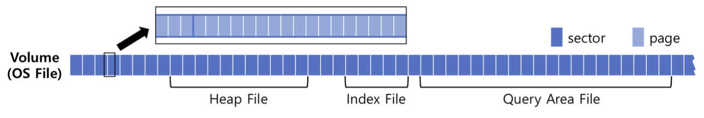
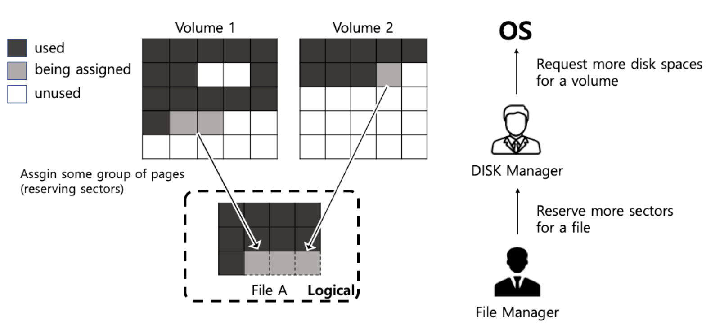
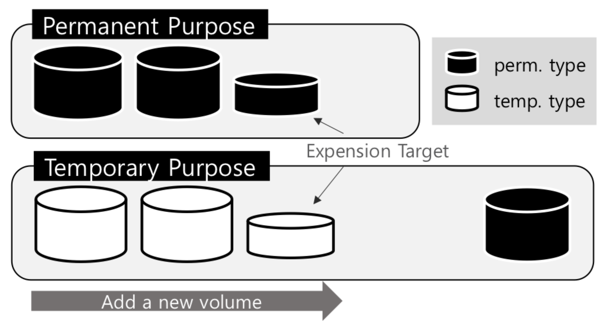
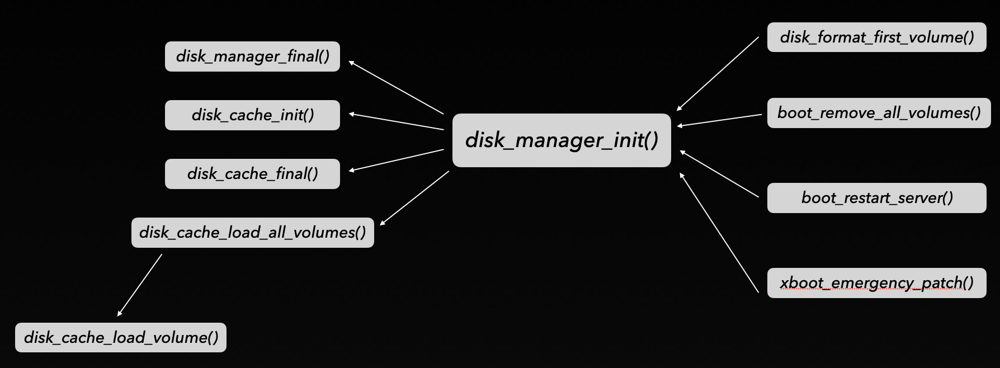

# **Disk Manager**

## 용어 정리

- **볼륨 (Volume)**
: 큐브리드에서 사용하는 OS가 제공하는 파일(open() 시스템콜을 통해 생성하는)을 말한다. 볼륨은 데이터 볼륨, 로그 볼륨, 백업 볼륨 등 여러 종류가 있지만 앞으로 언급하는 볼륨은 모두 Index와 Heap등이 담기는 데이터 볼륨(혹은 디스크 볼륨)을 가리키는 것으로 한다.

- **페이지 (Page)**
: 페이지는 고정된 크기의 연속적인 데이터 블록(block)으로 큐브리드가 스토리지를 관리할 때 사용하는 가장 작은 단위이다. 큐브리드에는 로그페이지와 데이터페이지 두 종류가 있지만 여기서는 데이터페이지만을 가리키는 것으로 한다. 이 페이지는 메모리로 로드되면, Buffer Manager에서 사용되는 Page Buffer와 매핑된다.

- **섹터 (Sector)**
: 큐브리드가 스토리지를 다룰 때 사용하는 또 다른 단위로, 64개의 페이지들의 묶음을 이야기한다. 페이지 단위로 관리하는 것은 자원소모가 심하므로 묶음인 섹터로 일차적인 관리를 한다.

- **파일 (File)**
: 큐브리드에서 이야기하는 파일이란, OS가 제공하는 파일이 아닌 특정 목적을 위해 예약된 섹터들의 묶음을 말한다. 파일은 섹터단위로 볼륨의 공간을 예약하고, 필요에 따라 섹터 내의 페이지를 할당하여 사용한다. 각각의 파일은 하나의 테이블, 하나의 인덱스, 나중에 이야기할 파일 트래커(File Tracker)등의 정보를 담는다.

- **섹터 예약 (Reservation)**
: 볼륨의 섹터를 사용하기로 하는 행위를 말한다. 반대로 사용을 중지하고 반납하는 행위를 섹터 예약 해제(Unreservation)라고 한다.

- **페이지 할당 (Allocation)**
: 파일에서 예약한 섹터중 한 페이지를 사용하기로 하는 행위를 말한다. 반대로 사용을 중지하고 반납하는 행위를 페이지 할당해제(Deallocation)라고 한다.
<br><br>

<div style="display:flex" align="center">
  
</div>

##### *Figure1 : Volume Overview*

<br>

# Disk Manager / File Manager

- **Disk Manager :**<br>
볼륨공간 전체를 관리하며 섹터들의 예약여부를 트래킹한다. 섹터들의 예약관리가 주역할이며, 모든 섹터가 다 예약 되었을 경우 볼륨의 크기(OS파일의 크기)를 늘리거나 볼륨의 수를 늘림으로서 추가적인 섹터를 확보한다. 디스크매니저 관련 함수들은 `disk_*` prefix로 시작한다

- **File Manager :**<br>
큐브리드의 내부 파일들을 관리하며 디스크 매니저로부터 섹터들을 할당받고 파일 내에서의 페이지 할당여부를 트래킹한다. 페이지들의 할당 관리가 주역할이며, 모든 페이지를 할당하여 추가적인 공간이 필요할 경우 디스크 매니저에게 추가적인 섹터를 요청한다. 파일 매니저 관련 함수들은 `file_*` prefix로 시작한다.

<div style="display:flex" align="center">

</div>

##### *Figure2 : Disk / File Manager Overview*

<br>

# Volume & File Type

## **볼륨 (Volume)**

데이터 볼륨은 영구(Permanent)볼륨과 임시(Temporary)볼륨으로 나뉜다.

- **영구 볼륨 (Permanent Volume) :**<br>
테이블, 인덱스, 시스템 데이터 등이 담기는 볼륨으로 한 번 만들어지면 영구히 존재하는 볼륨을 말한다.

- **임시 볼륨 (Temporary Volume) :**<br>
정렬(sorting)과정이나 쿼리결과를 가져오는 과정에서의 임시 데이터들을 담는 볼륨을 말하며, 데이터베이스 종료와 재시작시 모두 삭제된다.

그렇다고해서 영구 볼륨의 데이터는 항상 보존되어야 하는 데이터만(즉, 리커버리의 대상이 되는) 담기는 것은 아니고 `addvoldb`로 임시 목적(purpose)의 영구 볼륨을 만들 경우 임시 데이터가 담길 수도 있다. 볼륨에 대한 개념적인 내용은 [큐브리드 매뉴얼](/module01/README.md#데이터베이스-볼륨)을 참고하자.

### **볼륨은 언제 만들어질까?**

이해를 돕기 위하여 볼륨의 생성이 언제 일어나는지를 알아보자. 영구 볼륨이 생성되는 경우는 다음과 같다.

1. 데이터베이스를 `createdb`명령을 통하여 생성할 때
2. 사용중인 영구 볼륨들이 모두 가득차서 추가적인 공간이 필요할 때
3. `addvoldb`를 통하여 사용자가 직접 볼륨을 추가할 때

데이터가 지속적(durable)으로 보관되기 위해서는 영구 볼륨이 필요하다. 지속성은 데이터베이스의 기본 속성이므로 데이터베이스가 처음 생성될 때 기본적으로 영구 볼륨이 생성된다. 생성된 영구 볼륨을 사용하는 과정에서 데이터가 가득차게 되면 새로운 볼륨이 추가로 생성되는데, 이때는 시스템 파라미터에 있는 정보를 바탕으로 최소한의 크기로 볼륨이 생성되고, 데이터가 채워짐에 따라서 볼륨의 크기가 늘어난다. 그러다가 다시 볼륨의 최대크기까지 데이터가 입력되면 새로운 볼륨이 생성되어 이를 처리한다.

> 영구 볼륨의 제거나 축소는 없고, `deletedb`를 통해서 전체 데이터베이스를 제거할 때만 볼륨들이 모두 함께 제거되는 것으로 보인다.

### **그렇다면 임시 볼륨은?** ###

쿼리 중간결과 등의 임시 데이터는 임시 볼륨에만 담길 수 있는 것은 아니다. 임시 목적의 영구 볼륨이 존재할 경우에는 기본적으로 이 영구 볼륨에 담기게 되며 공간이 부족해질 경우에 임시 볼륨이 만들어져 데이터를 저장한다. 이렇게 생성된 임시 볼륨은 이후에 데이터베이스가 종료되거나 재시작될 때 모두 제거된다.

> 만약 이미 임시 볼륨이 있다면?<br>임시 데이터를 위한 섹터를 할당하려할 때 이미 이전에 만들어진 임시 볼륨이 존재한다고 해도, 먼저 임시 목적의 영구 볼륨에서 섹터 할당을 시도한다.

<br>

## **파일 (File)** ##
앞서 이야기했듯이 큐브리드에서 말하는 파일은 OS에서 제공하는(open등의 시스템콜로 생성하는) OS file이 아니라, 큐브리드만의 독자적인 유닛으로 볼륨 내에서
**하나의 목적으로 할당된 섹터들의 논리적인 집합**이다. 파일을 생성하면 볼륨의 섹터들을 할당받고 파일 내에서는 이를 가장 작은 단위인 페이지로 나누어서 관리하며, 할당받았던 섹터의 페이지를 모두 사용하면 추가적인 섹터들을 추가적으로 할당받는다. 파일도 볼륨과 같이 영구파일과 임시파일 두 가지로 분류할 수 있다.

- **영구 파일 (Permanent File) :**<br>
각각의 파일은 인덱스, 힙데이터, 파일트래커 등의 특정한 목적을 가지고 있으며, 변경이 일어나면 이는 로그로 기록되어 리커버리의 대상이 된다. 영속적으로 보관할 데이터이므로 업데이트 비용이 비싸며 관리 오버헤드가 있다.

- **임시 파일 (Temporary File) :**<br>
쿼리나 정렬의 중간결과들이 일시적으로 쓰여지는 파일로 기본적으로 임시파일을 사용하는 트랜잭션이 종료되면 제거된다. 혹은, 필요에 따라 트랜잭션 종속에서 벗어나 쿼리매니저에서 관리되기도 한다. 임시파일은 사용하는 순간에만 유효하면 되므로 영구파일에 비해 연산자체도 단순하고 관리 오버헤드도 적다.


파일은 위의 두가지 분류 뿐만 아니라 파일의 목적에 따라 heap, btree, catalog 등의 파일 타입으로도 나눌 수 있다.

### **Numerable 속성**

파일은 Numerable 속성을 지닐 수 있다. 기본적으로 파일에 할당되는 페이지는 순서가 없다. 물리적으로 연속적인 페이지만을 할당받는 것은 아니며 여러 섹터에 흩어져 있는 페이지들을 할당받는다. 심지어 할당받은 각 페이지가 속한 섹터들도 연속적이지 않을 수 있으며 여러볼륨에 흩어져 있을 수도 있다. 이러한 페이지들에 논리적인 순서를 부여하는 속성을 numerable이라 한다. 이 속성을 지니면 파일에 할당된 페이지(정확히는 유저 페이지만)들을 할당된 순서대로 인덱스를 통하여 접근할 수 있다. 이는 extensible hash나 external sorting의 경우에 유용하게 사용될 수 있다.

> 이 중 extensible hash는 현재 *deprecated* 되어 있고 호환성을 위해서만 남아있는 것으로 보인다.

# Volume Purpose

## 목적에 따른 볼륨 분류

섹터관리와 볼륨확장 등에서 볼륨을 분류하는 주요한 기준은 볼륨의 목적이다. 이는 어떤 목적으로 섹터를 사용할 것이냐에 따라서 데이터의 관리 방법과 라이프사이클이 달라지기 때문이다.

- **영구 목적 (Permenent Purpose) :**<br>
영구 목적의 데이터는 한번 쓰여지면 영구적으로 보존되어야 하고 데이터베이스가 실행중에 Failure가 발생하더라도 데이터는 durable해야 한다. 이를 위해 WAL정책에 따라 영구 목적 볼륨에 데이터가 쓰여지기 전 로깅되며 commit된 데이터는 항상 보존된다. 영구 타입 볼륨에만 영구 목적 데이터가 담기며, 사용자가 임의로 생성하거나 공간이 부족해질 경우 추가적인 영구 타입 볼륨이 생성된다.

- **임시 목적 (Temporary Purpose) :**<br>
임시 목적의 데이터는 트랜잭션이 실행되는 동안 필요한 일시적인 데이터가 저장되는 곳이다. 리커버리 시 커밋(commit)된 트랜잭션의 데이터는 필요 없고, 커밋되지 않은 트랜잭션은 UNDO될 테니 이러한 데이터는 로깅을 필요로 하지 않는다. 또한, 임시 타입의 볼륨은 데이터베이스가 종료되거나 시작될 때 모두 제거된다. 임시 목적 데이터를 저장하기 위하여 데이터베이스는 기본적으로 임시 타입의 볼륨을 생성해서 사용하고, 만약 사용자가 영구 타입 볼륨으로 임시 목적 데이터를 위한 공간을 미리 확보해 두었다면 그 볼륨을 먼저 사용한다.

<div style="display:flex" align="center">
  
</div>

##### *Figure3 : Volume Purpose Overview*

<br>

석터 예약시 이렇게 목적에 따라 볼륨을 선택하여 섹터를 추가하고, 필요에 따라 볼륨을 추가하기 때문에 디스크 캐시는 영구 목적과 임시 목적의 데이터를 별개의 extend_info로 관리한다.

<br>

영구 목적의 섹터가 부족할 경우 영구 타입의 볼륨을 확장 및 추가하고, 임시 목적의 섹터가 부족할 경우 임시 타입의 볼륨을 확장 및 추가한다. 볼륨 공간확보는 임시/영구 목적 공통적으로 마지막으로 추가한 볼륨을 최대크기까지 확장하고 새로운 볼륨을 추가하는 것을 반복한다. 임시 목적/영구 타입의 볼륨은 사용자가 임의로 생성한 것으로 추가/확장의 대상이 아니다.

# Code Review

## ***disk_manager_init()*** ##

### *src/storage/disk_manager.c* ###

```C
int
disk_manager_init (THREAD_ENTRY * thread_p, bool load_from_disk)
{
  int error_code = NO_ERROR;

  disk_Temp_max_sects = (DKNSECTS) prm_get_integer_value (PRM_ID_BOSR_MAXTMP_PAGES);
  if (disk_Temp_max_sects < 0)
    {
      disk_Temp_max_sects = SECTID_MAX;	/* infinite */
    }
  else
    {
      disk_Temp_max_sects = disk_Temp_max_sects / DISK_SECTOR_NPAGES;
    }

  disk_Logging = prm_get_bool_value (PRM_ID_DISK_LOGGING);

  if (disk_Cache != NULL)
    {
      disk_log ("disk_manager_init", "%s", "reload disk cache");
      disk_cache_final ();
    }
  error_code = disk_cache_init ();
  if (error_code != NO_ERROR)
    {
      ASSERT_ERROR ();
      return error_code;
    }
  assert (disk_Cache != NULL);

  if (load_from_disk && !disk_cache_load_all_volumes (thread_p))
    {
      ASSERT_ERROR_AND_SET (error_code);
      disk_manager_final ();
      return error_code;
    }

#if defined (SERVER_MODE)
  disk_auto_volume_expansion_daemon_init ();
#endif /* SERVER_MODE */

  return NO_ERROR;
}

/*
 * disk_manager_final () - free disk manager resources
 */
void
disk_manager_final (void)
{
#if defined (SERVER_MODE)
  disk_auto_volume_expansion_daemon_destroy ();
#endif /* SERVER_MODE */

  disk_cache_final ();
}
```
<br>

## ***disk_manager_init*** - caller graph ##

<div style="display:flex" align="center">

</div>

##### *Figure4 : disk_manager_init() caller graph*
