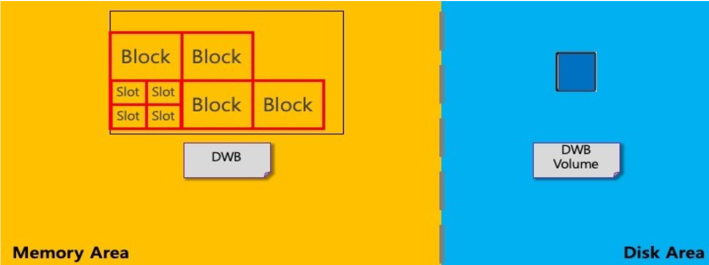
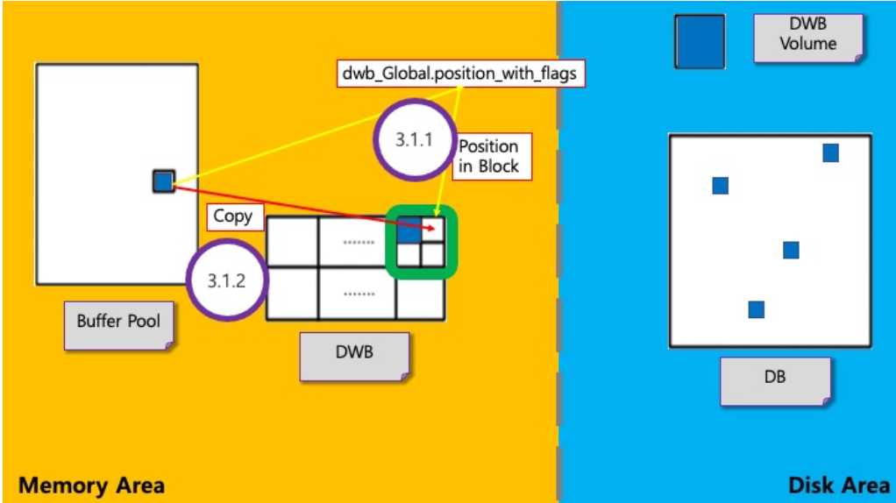

# **DWB (Double Write Buffer)**

## **1. 개요**

DB 시스템은 Page Replacement를 위한 강제적 / 주기적 flush하는 작업을 진행한다.

Flush는 DWB를 사용하지 않고 진행하거나 DWB를 사용하여 진행할 수 있다.
* DWB를 사용하는 경우 system crash가 발생해서 일어난 partial write에 대해 page recovery가 가능
* 예) DWB에서 DWB volumn 혹은 DB로 page를 flush하는 도중 system crash가 발생하면 DB 페이지의 일부분(partial)만 write 일어남

DB 시스템이 DWB를 사용하는 방식
* Page를 저장할 공간 탐색 및 저장
* 특정 개수의 page를 disk로 한번에 flush
* partial write가 일어난 DB 복구

&nbsp;

## **2. DWB 구조**

이 문서에서 DWB라 함은 메모리에 할당되어 있는 DBW block들을 의미하며 block들은 slot들로 구성되어 있다.

DWB volumn은 disk에 저장되어 있는 DWB의 단일 블록이다.

Block은 매크로에서
* 개수 :  1개(`[DWB_MIN_BLOCKS]`) ~ 32개(`[DWB_MAX_BLOCKS`) 제한 (기본 2개)
* 크기 : 0.5M(`[DWB_MIN_SIZE]`) ~ 2M(`[DWB_MAX_SIZE]`) 제한 (기본 2M)

Slot의 총 개수는 기본적으로 256개이다.

**DWB**
* 전역변수
	* position_with_flags : 현재 page를 저장해야 할 block과 slot의 index, 현재 block 혹은 전체 DWB의 상태를 나타냄
	* file_sync_helper_block : daemon이 fsync를 주기적으로 호출할 때 사용하는 단일 block 포인터
* Block
	* 지역변수
		* write_buffer : 블록 내 모든 slot을 참조하여 실제 page 내용이 저장된 포인터
		* wait_queue : slot 탐색 중 대기가 일어나는 thread 저장
	* Slot
		* page를 관리하는 곳으로 page의 VPID, LSA 저장 가능
		* 해당 slot의 index와 몇 번째 block에 속하는지 알 수 있음

DWB volumn은 DB에 flush하려는 DWB block을 Disk에 먼저 flush한 block이다.

&nbsp;

## **3. Slot 탐색 및 Page 저장**

* `dwb_acquire_next_slot()` : Slot의 위치 탐색 및 탐색 대기하는 함수
* `dwb_set_slot_data()` : Data Page를 저장하는 함수

DWB의 전역변수 `position_with_flags`를 비트 연산을 사용해서 block 및 slot의 index 탐색하여 slot의 시작주소 획득 (block의 index는 순환적)

→ 구한 slot의 index에 page 저장 (실제로는 block의 지역변수 write_buffer에 slot 순서대로 저장), VIPD, LSA 정보를 함께 저장

### **3-1. 탐색 및 저장 실패 케이스**

Slot의 index를 찾기 전에 해당 block에 다른 thread가 write 작업을 진행 중일 때 나타나는 현상

> write 작업 : 다른 thread가 해당 block에 대해 slot 탐색 ~ DWB flush 사이의 작업 진행 중

Flush 순서 및 대기
1. Page를 저장해야 할 slot이 첫 번째 slot이고, Block이 다른 thread에 의해 writing 중인 상태
2. 해당 work thread를 대기 상태로 설정하려고 할 때 block의 지역변수에 존재하는 `wait_queue`에 work thread에 저장시키고 대기
3. 해당 block이 writing 상태가 끝날 때까지 work thread는 `dwb_acquire_next_slot()` 함수 내부 "start" goto phase부터 다시 진행
4. 해당 block에 대해 다른 thread가 write 작업을 마쳤다면, 다시 함수 내부에서 처음부터 시작할 때, 현재 thread가 전역변수 `position_with_flags`에서 현재 block의 상태를 writing으로 바꾼 다음 다시 slot의 index 찾기 작업 진행
