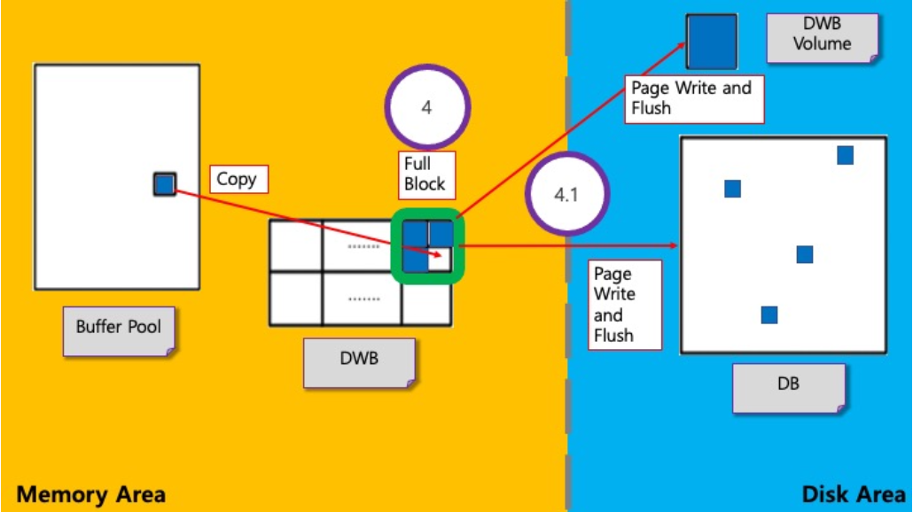
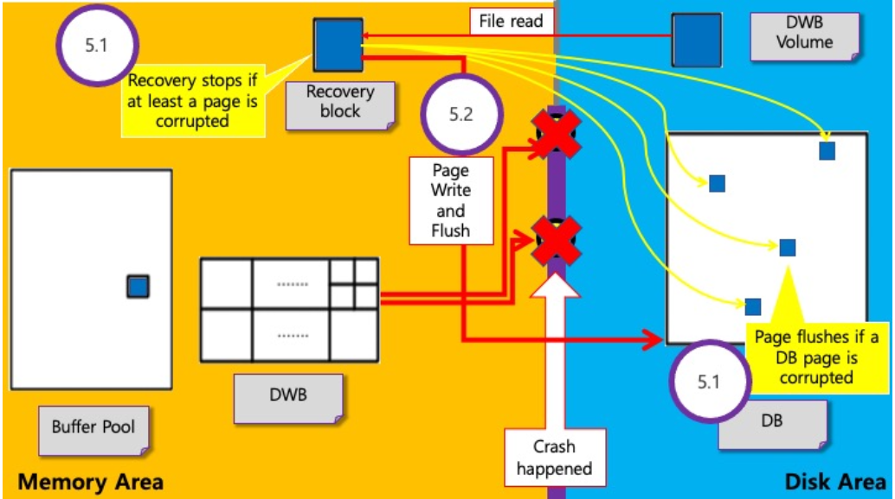

# **DWB (Double Write Buffer)**

## **1. 개요**

DB 시스템은 Page Replacement를 위한 강제적 / 주기적 flush하는 작업을 진행한다.

Flush는 DWB를 사용하지 않고 진행하거나 DWB를 사용하여 진행할 수 있다.
* DWB를 사용하는 경우 system crash가 발생해서 일어난 partial write에 대해 page recovery가 가능
* 예) DWB에서 DWB volumn 혹은 DB로 page를 flush하는 도중 system crash가 발생하면 DB 페이지의 일부분(partial)만 write 일어남

DB 시스템이 DWB를 사용하는 방식
* Page를 저장할 공간 탐색 및 저장
* 특정 개수의 page를 disk로 한번에 flush
* partial write가 일어난 DB 복구

&nbsp;

## **2. DWB 구조**

이 문서에서 DWB라 함은 메모리에 할당되어 있는 DBW block들을 의미하며 block들은 slot들로 구성되어 있다.

DWB volumn은 disk에 저장되어 있는 DWB의 단일 블록이다.

Block은 매크로에서
* 개수 :  1개(`[DWB_MIN_BLOCKS]`) ~ 32개(`[DWB_MAX_BLOCKS`) 제한 (기본 2개)
* 크기 : 0.5M(`[DWB_MIN_SIZE]`) ~ 2M(`[DWB_MAX_SIZE]`) 제한 (기본 2M)

Slot의 총 개수는 기본적으로 256개이다.

### **2-1. DWB**
* 전역변수
	* position_with_flags : 현재 page를 저장해야 할 block과 slot의 index, 현재 block 혹은 전체 DWB의 상태를 나타냄
	* file_sync_helper_block : daemon이 fsync를 주기적으로 호출할 때 사용하는 단일 block 포인터
* Block
	* 지역변수
		* write_buffer : 블록 내 모든 slot을 참조하여 실제 page 내용이 저장된 포인터
		* wait_queue : slot 탐색 중 대기가 일어나는 thread 저장
	* Slot
		* page를 관리하는 곳으로 page의 VPID, LSA 저장 가능
		* 해당 slot의 index와 몇 번째 block에 속하는지 알 수 있음

DWB volumn은 DB에 flush하려는 DWB block을 Disk에 먼저 flush한 block이다.


&nbsp;

## **3. Slot 탐색 및 Page 저장**

* `dwb_acquire_next_slot()` : Slot의 위치 탐색 및 탐색 대기하는 함수
* `dwb_set_slot_data()` : Data Page를 저장하는 함수

DWB의 전역변수 `position_with_flags`를 비트 연산을 사용해서 block 및 slot의 index 탐색하여 slot의 시작주소 획득 (block의 index는 순환적)

→ 구한 slot의 index에 page 저장 (실제로는 block의 지역변수 write_buffer에 slot 순서대로 저장), VIPD, LSA 정보를 함께 저장


### **3-1. 탐색 및 저장 실패 케이스**

Slot의 index를 찾기 전에 해당 block에 다른 thread가 write 작업을 진행 중일 때 나타나는 현상

> write 작업 : 다른 thread가 해당 block에 대해 slot 탐색 ~ DWB flush 사이의 작업 진행 중

Flush 순서 및 대기
1. Page를 저장해야 할 slot이 첫 번째 slot이고, Block이 다른 thread에 의해 writing 중인 상태
2. 해당 work thread를 대기 상태로 설정하려고 할 때 block의 지역변수에 존재하는 `wait_queue`에 work thread에 저장시키고 대기
3. 해당 block이 writing 상태가 끝날 때까지 work thread는 `dwb_acquire_next_slot()` 함수 내부 "start" goto phase부터 다시 진행
4. 해당 block에 대해 다른 thread가 write 작업을 마쳤다면, 다시 함수 내부에서 처음부터 시작할 때, 현재 thread가 전역변수 `position_with_flags`에서 현재 block의 상태를 writing으로 바꾼 다음 다시 slot의 index 찾기 작업 진행

&nbsp;

## **4. DWB Flush**
- 하나의 Block의 slot이 page로 가득차면 Block의 Flush 시작.
1. DBW -> DWB volume
2. DWB -> DB Flush 순서로 진행된다.

### **4-1. DWB -> DWB volume Flush**
- DWB를 사용해서 Disk로 Flush가 일어나는 경우
- System crash가 일어나기전 DWB Block -> DWB volume Flush 를 먼저 수행한다.
- Block의 지역변수 write_buffer을 사용하여 slot의 순서대로 DWB volume에 write를 진행
- Block 전체 Write가 끝나면, fsync()를 호출하여 DWB volume에 Flush 마무리

### **4-2. DWB -> DB Flush**
- Block 내부의 slot들을 정렬 후, DB에 해당하는 Page마다 write() 진행
- 끝난 뒤 전역변수 file_sync_helper_block에 현재 Flush하려는 Block을 참조시킨다.
- Daemon을 호출해도 되는데, 그 이유는 이미 DWB Volume에 flush가 완료되었기 때문에, sysem crash가 발생하여도 recovery가 가능하기 때문.
- 각 Page마다 sync daemon을 호출하거나 불가능 하다면 fsync()를 직접 호출



### **4-3. Slot ordering**
- Slot 정렬의 장점
  - DB에 있는 volume들이 VPID 순서로 정렬되어있다.
  - 같은 Page의 경우 Page LSA를 통해 최신 버전만 Flush 가능.
- Slot 정렬은 Slot행렬을 따로 만들서 Slot들을 복사 -> VPID, LSA 기준으로 정렬 후 이전 시점의 Page LSA를 가진 slot들은 초기화한다.

### **4-4. (Flush, Sync) daemon**
- dwb flush block daemon
  - 주기적으로 Block의 모든 slot에 page가 저장되어있는지 (가득 찼는지) 확인한 후, 가득 찼다면 dwb_flush_block() 호출
- dwb file sync helper daemon
  - dwb flush block daemon이 호출하는 daemon
  - 주기적으로 dwb_file_sync_helper()를 호출하여 DB로 Page를 flush
  - file_sync_helper_block이 참조한 Block을 fsync() 한뒤, NULL로 초기화

&nbsp;

## **5. Corrupted Data Page Recovery**
위 문서에서 `Page Corrupted` 라는 뜻은 DB의 논리적인 Page를 Write 할 때 Partial Write가 일어난 Page를 뜻한다.
Partial Write란 논리적 Page를 디스크 Page로 저장하는 과정에서 일부를 저장하지 못하는 경우를 말한다.
또한 log를 통해 이뤄지는 recovery는 데이터 자체의 recovery이므로 DWB를 통해 이뤄지는 recovery와는 관련 없는 내용을 밝힌다. 정확히는 log recovery를 진행하기 전에 실행한다.
Recovery가 시작되면, corruption test를 진행하여서 recovery를 진행할 Page를 선별하고 recovery가 불가능한 경우에는 recovery를 그대로 종료한다.
Recovery가 시작할 때 recovery block이 만들어지며 DWB volume에 저장된 내용을 메모리에 할당시킨다. 할당된 Block은 slot ordering 을 통해서 정렬시킨 뒤, 같은 Page의 최신 Page LSA(Log Sequence Address)를 가진 Page만 Recovery에 사용된다.
dwb_check_data_page_is_sane() 함수를 통해 corruption test를 진행하고, dwb_load_and_recover_pages() 함수를 통해 전체적인 recovery를 진행한다.

### **5.1 Corruption Test**
같은 volume fd, page id를 가진 recovery block의 Page와, DB의 Page의 corruption test를 각각 진행한다.
LSA(Log Sequence Address)를 통해서 Partial Write이 일어났는지 확인한다.
Recovery block에서 corruption이 발생했다면, recovery를 잘못된 data로 진행하는 것이 되기 때문에 recovery를 중지한다.
Recovery block에서 corruption이 발생하지 않았다면, 해당 page는 recovery에 사용가능하다.
DB Page가 corruption이 발생했다면, 그 다음 Page의 corruption test를 진행한다.
DB Page가 corruption이 발생하지 않았다면, 해당 slot은 NULL로 초기화 시켜서 recovery 속도를 향상시킬 수 있게 한다.

### **5.2 Recovery**
정렬된 Recovery block을 DB에 Flush를 진행한다.
`4.1.2`에서 DWB block을 DB에 write하는 방식처럼 slot을 정렬한 뒤 write을 진행한다. Write을 진행한 다음 곧바로 Page에 대해서 Flush를 진행한다.



&nbsp;

## **6. Appendix**
DWB 자체의 역할보다는 DB 시스템에서 부수적으로 사용되는 DWB의 역할에 대해서 알아보려고 한다.

### **6-1. Slot Hash Entry**
Page replacement에서 Cache 역할을 담당.
Memory에 찾으려는 Page가 없다면, DWB에서 찾는다. (Disk가 아닌 DWB에서 Page를 가져와 I/O cost 감소)
생성 시점 : add_page() 함수에서 block과 slot의 index를 구한 다음 생성
제거 시점 : DB에 Flush 마치고 제거한다.
Key, Value값으로서 저장

### **6-2. Flush**
일반적으로 Memory에 있는 Data를 Disk에 쓰고 동기화 하는 행위

### **6-3. Buffer Pool**
메인 메모리 내에서 데이터와 인덱스 데이터가 접근될 떄, 해당 데이터를 캐시하는 영역이다.   
자주 접근되는 데이터를 메모리에서 바로 흭득 가능하다.   
-> 전체 작업의 수행속도 증가.
대량의 읽기 요청 수행을 위해 Buffer Pool은 데이터를 Page단위로 나누어 관리한다.
한 Page에는 여러 row가 존재할 수 있다.
- Mysql의 경우
Buffer Pool 내부의 Page는 Linked-List로 관리한다.
새로운 페이지를 Buffer Pool에 추가하기 위한 페이지 공간이 필요한 경우, 일종의 LRU 알고리즘 (Least Recently Used)을 사용하여 관리한다.

### **6-4. Double Write Buffer 파일**
- DWB 파일은 Partial Write로 인한 I/O 에러를 방지하기 위한 저장공간이다.
- 모든 데이터 페이지는 DWB에 먼저 쓰여지고 난 후 영구 데이터 볼륨에 있는 데이터 위치에 쓰여진다.
- DB가 재시작할때, 부분적으로 쓰여진 페이지들이 탐지되고, DWB에서 대응되는 페이지로 대체된다.
- DWB 파일 크기는 cubrid.conf의 double_write_buffer_size에 의해 결정. 0으로 설정시 DWB을 사용하지 않고, 파일도 생성되지 않는다.
- `testdb_dwb`

### **6-5. fsync()**
- 프로세스가 파일에 쓰기 작업을 요청하면 운영체제가 요청을 수행한다.
- 시스템에서 효율을 위해 쓰기 요청을 버퍼에 기록해두었다가 처리한다면?
  - 쓰기 요청한 시간 != 실제 디스크에 쓰여지는 시간
- fsync() -> kernel에 저장된 buffer를 무조건 disk에 write 하게 하는 함수이다.
- data, file의 meta data 를 함께 동기화한다.
  ```c
  #include <unistd.h>
  int	fysnc(int fd);
  ```
- fd : file descriptor, 반드시 쓰기(O_WRONLY, O_RDWR)로 열려야 한다.

### **6-6. Vpid LSA**
  - Volume PID ?
  - Page LSA ?


# page

CUBRID도 OS나 다른 DBMS와 같이 성능상의 이유로 페이지(page) 단위 디스크 I/O를 수행한다. 

> **가상 메모리란?**
프로세스는 독립된 메모리 공간(=partition)을 가지고 있고 , 서로의 메모리 공간에 접근할 수 없다. 
운영체제는 사용자가 많은 프로세스로 메모리를 한계 이상 쓰려고 할 때 디스크 공간을 메모리처럼 사용하여 비록 느리지만 돌아는 가게 만들었다.이렇게 운영체제가 디스크에서 메모리처럼 사용하고자 올린 파일을 paging(swap) file이라고 한다. 이 페이징 파일은 디스크에 올라가기 때문에 다른 프로세스들도 사용할 수 있는 특이한 가상메모리가 된다. 
우리의 운영체제는 페이징 파일을 실제 물리 메모리에 올리고 내리면서 여러 프로세스를 운용한다. 
고로 사용자 입장에서는 마치 사용할 수 있는 메모리의 크기가 증가한 것 처럼 보인다. 
**한정된 물리 메모리의 한계를 극복하고자 디스크와 같은 느린 저장장치를 활용해, 애플리케이션들이 더 많은 메모리를 활용할 수 있게 해 주는 것**이 **가상 메모리**이다.

**page란?**
가상 메모리를 사용하는 최소 크기 단위이다.

**페이지가 왜 필요할까?** 
만약, 페이징 파일에서 물리 메모리로 데이터를 로드할 때, 아무 위치에나 필요한 크기 만큼(무작위) 로드한다고 가정을 해 보자.
이런 경우, 로드하고 언로드하는 데이터의 크기가 모두 제각각이므로, 이를 반복하다 보면 메모리 공간에 fragmentation(프로세스가 필요한 양보다 더 큰 메모리가 할당되어서 메모리가 낭비되거나 ****중간중간에 생긴 사용하지 않는 메모리가 많이 존재해서 총 메모리 공간은 충분하지만 실제로 할당할 수 없는 상황)이 발생하게 된다. 이를 막기 위해, 운영체제가 만든 것이 **page**라는 최소 크기 단위인 것이다.

**Demanding-Page란?**
Demanding-page는 실제로 필요한 page만 물리 메모리로 가져오는 방식이다. 이 과정에서 필요 page에 접근하려 하면, 결국 가상 메모리 주소에 대응하는 물리 메모리 주소를 찾아내어, 물리 메모리 주소를 얻어와 하는데, 이 때 필요한 것이 **[페이지 테이블(page table)](http://sweeper.egloos.com/2988646)**이다. 페이지 테이블에 valid bit 라는 것을 두고, 해당 page가 물리 메모리에 있으면 set, 그렇지 않으면 invalid로 설정한다.
> 
> 
> 
> 

**슬랏 페이지(slotted page) 구조**

CUBRID 페이지 크기는 최소 4KB ~ 최대 16KB 이며, 디폴트로 16KB 디스크 페이지 크기를 사용한다.

슬랏 페이지 구조란 이런 페이지에 데이터 저장을 구조화하는 하나의 방식을 말한다.


새로운 값이 삽입되면 레코드는 페이지의 앞 부분부터 차례대로 할당되고, 슬롯(slot)은 페이지의 끝부터 역방향으로 할당된다. 하나의 레코드는 레코드 헤더(header), 고정 길이 컬럼들(Fix Col), 가변 길이 컬럼들(Var Col)로 이루어져 있다.

- page header: 한 페이지 내의 전체 slot에 대한 정보(slot 개수, record 개수, 전체 여유 공간의 크기, 연속된 여유 공간의 크기, 연속 공간의 시작 offset, 트랜잭션 ID 등)를 저장한다.
- heap page header: 시작 레코드 위치, 스키마 정보 위치 등이 저장된다.
- record: 레코드 값이 저장된다.
- slot: 레코드 위치 정보(offset, length)가 저장된다.

레코드에 가변 길이 컬럼이 존재함으로 UPDATE시 레코드의 크기가 달라진다.

UPDATE할 레코드가 기존 크기보다 작으면 해당 위치에 데이터를 UPDATE하면 되지만, 기존 크기보다 크면 같은 페이지 내에서 UPDATE할 레코드를 할당하고, 기존 slot은 UPDATE할 레코드를 가리킨다.

하지만 같은 페이지 내에서 새로운 레코드에 대해 UPDATE할 공간이 없다면 아래 그림처럼 별도의 페이지를 할당하고 기존의 레코드는 새 레코드를 가리킨다.


UPDATE할 레코드의 크기가 한 페이지보다 크면 다음 그림처럼 데이터를 페이지 단위로 나누어 저장하고, 이전 데이터가 저장되었던 페이지는 갱신된 데이터를 저장한 페이지를 가리킨다.


이 경우 데이터를 쓸 때에는 데이터를 페이지 단위로 쪼개야 하고, 읽을 때에는 쪼개진 페이지들을 일련의 메모리 상에 로드해야 하며, 이는 성능을 저하시킬 수 있다.

### 슬랏 페이지를 사용하는 이유

CUBRID 사용자가 INSERT 구문을 사용하여 데이터(레코드)를 입력하게 되면, 여러 처리를 거친 후 결국 디스크 페이지에 입력된 데이터가 쓰여지게 된다.

4개의 INSERT 구문을 수행하게 되면 아래 그림과 같이 쓰여지게 될까?


페이지 내 어느 위치에서 얼마나 읽어야 'bbbbb'를 찾아낼 수 있을까?

정답은 '알 수 없다' 이다. 페이지 내에서 원하는 데이터를 찾기 위해서는 추가적인 정보를 필요로 하며, 이런 정보를 저장하고 있는 것이 **데이터 헤더(data header)** 이다.

아래 그림을 보면 각 데이터의 앞에 데이터 길이 정보를 가지는 데이터 헤더를 포함시켰다.

페이지의 시작에서 '데이터 헤더 크기' + 'aaa 길이(3)' = 'bbbbb 데이터 시작 위치' 이다.


이번에는 데이터 'cc'를 삭제한다 생각해보자.

우선 'cc'를 삭제하기 위해서는 'cc'의 위치를 찾아야 한다. 'cc'의 위치는 데이터 헤더에 기록된 데이터 길이 정보를 이용하여 쉽게 찾을 수 있다.

이제 어떻게 지울까? 'cc'를 '\0'로 덮어쓰면 될까? 데이터 길이 정보를 0으로 바꾸면 될까?

아래 그림은 데이터 삭제 시 'cc'를 '\0'로 덮어 쓴 후 데이터 길이 정보를 0으로 바꾼 경우를 나타낸다.


지웠다면 'dddddd'는 어떻게 찾을까? 'cc'의 길이 정보 2를 이용해야 'dddddd'의 위치를 찾을 수 있었다.

그럼 데이터 길이 정보는 기존 2로 놔두면 해결될까?

SELECT * FROM t1 WHERE c1 != 'cc' 수행 시 우선 데이터 길이가 2이기 때문에 삭제 여부를 알 수 없다.

그럼 데이터 삭제 여부 확인을 위해 데이터를 읽을 때마다 첫 바이트가 '\0' 인지 확인해야 한다.

따라서, 데이터 헤더에 삭제 여부를 나타내는 필드를 추가해서 데이터가 삭제되었다는 표시를 한다. 아래 그림을 보면 삭제 플래그를 두어 'cc'가 삭제되었음을 나타내고 있다.


여기서 우리는 한가지 문제를 더 생각해 보아야 한다. 바로 페이지 내 데이터 찾기 '효율성' 이다. 마지막에 추가된 데이터의 경우 거의 모든 헤더 정보를 다 읽어야만 데이터를 찾을 수 있게 된다. 매우 비효율적이다.

그럼 데이터 헤더에 데이터 위치 정보를 나타내는 **오프셋**을 추가한 후 데이터 헤더를 별도로 분리해보면 어떨까? 보통 쉽게 생각할 수 있는 방법은 페이지 헤더를 만들고 여기에 데이터 헤더를 기록하는 것이다. 아래 그림을 보면 페이지 헤더에 데이터 헤더를 담았고, 각 데이터 헤더에는 오프셋 정보가 추가되었다. 찾을 데이터에 매핑되는 데이터 헤더 배열의 인덱스만 있으면, 오프셋을 이용하여 같은 시간 안에 페이지 내 모든 데이터를 찾을 수 있다.


아래 그림을 보면 데이터 헤더 배열 크기가 6이기 때문에 페이지에 충분한 여유 공간이 남아 있음에도 불구하고 더이상의 데이터를 추가할 수 없음을 알 수 있다. 그럼 데이터 헤더 배열 크기를 늘이면 해결될까?

정답은 '아니다' 이다. 페이지에 버려진 여유 공간의 크기는 쓰여지는 데이터의 크기에 따라 달라질 것이다. 따라서, 모든 데이터 헤더를 사용한 후에도 페이지 내 공간이 남는다거나 반대로, 데이터 헤더 배열을 100% 사용하지 못하는 경우가 발생할 수 있다. 이는 곧 페이지 공간 낭비에 해당한다. 우리는 디스크 I/O 효율성을 위해 페이지 단위로 I/O를 수행하지만, 페이지 공간을 효율적으로 사용하지 못할 경우 이는 곧 불필요한 I/O를 발생시키는 원인이 될 것이다.


그래서 슬랏 페이지 구조를 이용한다. 여기서 **슬랏(slot) 이란 곧 데이터 헤더이다**. 아래 그림은 슬랏 페이지 구조를 나타낸다. 페이지 헤더에 위치하던 데이터 헤더가 페이지 끝으로 이동했다. 페이지 헤더에는 현재 페이지에 몇 개의 데이터 헤더가 있는지를 나타내는 정보 등이 기록된다. 이 페이지 구조에서 데이터는 기존처럼 페이지 시작에서 끝 방향으로 추가된다. 반면 데이터 헤더는 페이지 끝에서 페이지 시작 방향으로 추가된다. 새로운 데이터 추가 시 데이터 길이에 따라 발생하던 페이지 공간 사용 효율성 문제는 더이상 발생하지 않는다.


### 큐브리드 페이지 관리 정책

### LRU(Least-Recently Used)

한정된 크기의 버퍼를 효율적으로 사용하기 위해, 가장 최근에 사용한 데이터만 유지하고 오랫동안 사용하지 않은 데이터는 디스크에서 내린 후 그 공간을 해제(free)한다. STEAL 정책에서 사용하는 메모리 관리 방식이다.

STEAL 정책 : 수정된 페이지를 언제든지 디스크에 쓸 수 있는 정책, STEAL 정책은 수정된 페이지가 어떠한 시점에도 디스크에 써질 수 있기 때문에 필연적으로 UNDO 로깅과 복구를 수반하는데, 거의 모든 DBMS가 채택하는 버퍼 관리 정책이다.
