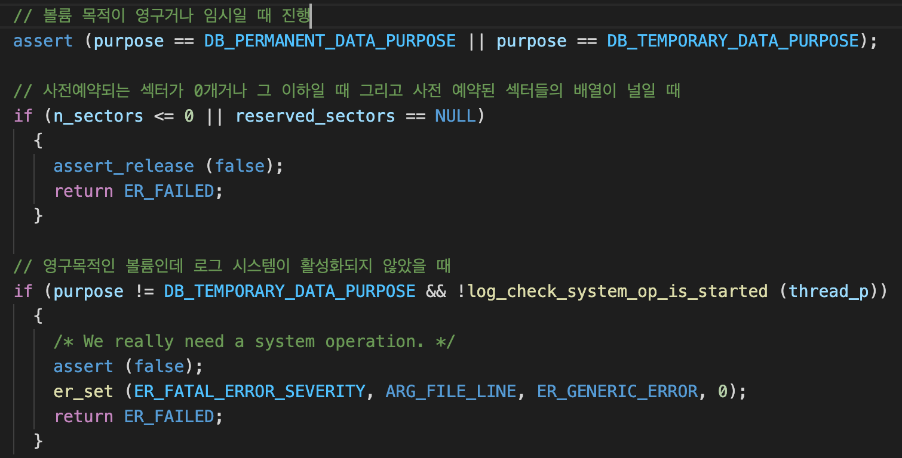
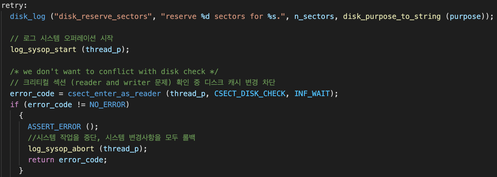
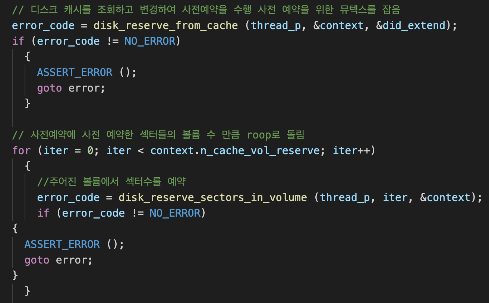
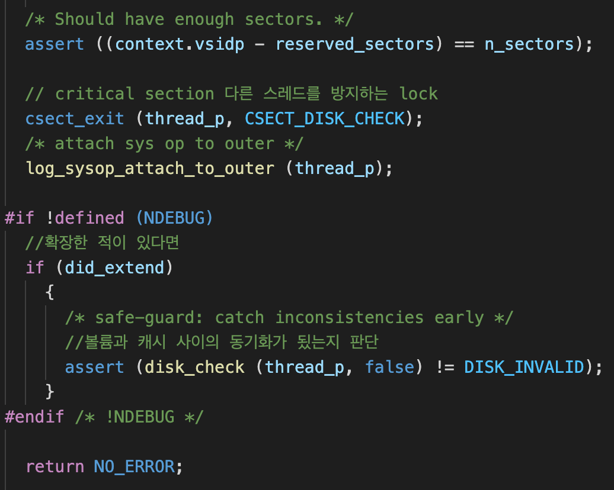
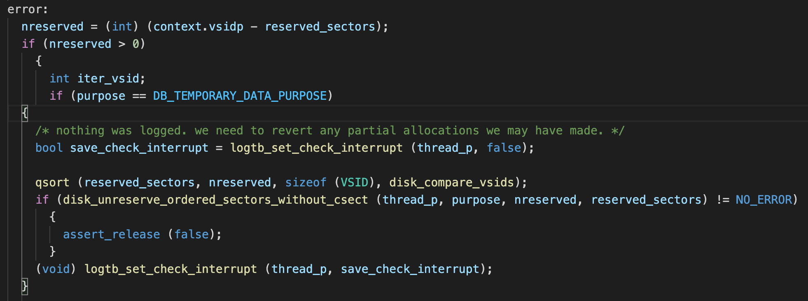
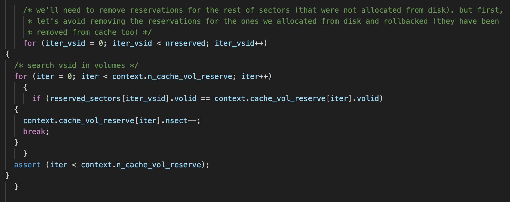
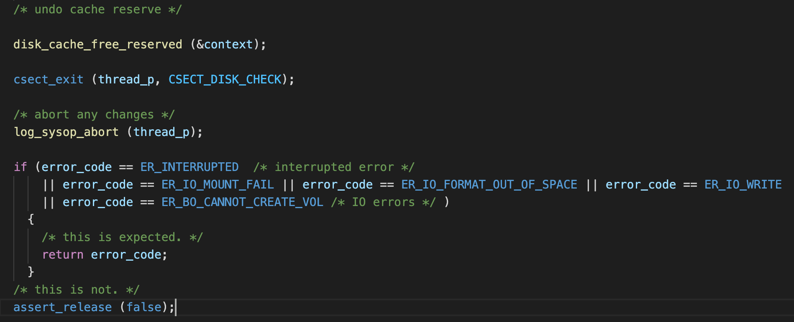
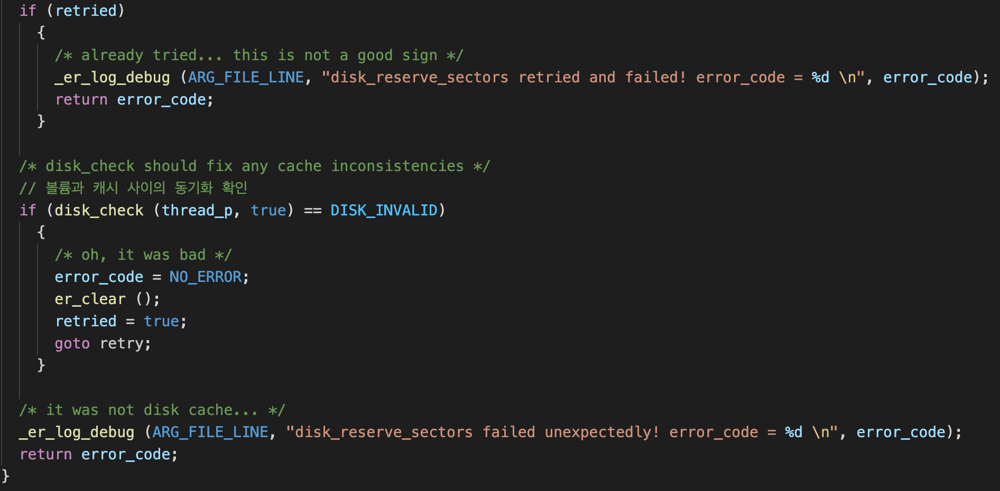

# Disk_reserve_sectors

 

## 섹터 예약 함수 호출 

- 파일 생성될때
- 새섹터를 예약하여 영구 파일을 확장할 때
- 임시파일에 새 페이지를 할당할 때

 

------

## 섹터의 예약 단계

 

----

 

## 섹터 예약 함수의 전반적인 흐름

- disk_reserve_sectors()
    - 임의의 볼륨들에서 n개의 섹터 예약을 요청
- disk_reserve_from_cache()
    - 디스크 캐시를 조회하고 변경하여 사전예약을 수행 (disk_cache의 값을 초기화)
- disk_reserve_from_cache_vols()
    - 요청된 n개의 섹터를 예약하기 위해 디스크 캐시의 볼륨들을 순회하며 각 볼륨에 사전예약을 요청
- disk_reserve_from_cache_volume()
    - 특정 볼륨에 요청받은 섹터 수만큼 사전예약을 시도
- disk_expand()
    - 디스크캐시를 참고하여 가용섹터가 부족하다면 사전예약 전에 먼저 추가적인 공간을 확보
- disk_volume_expand()
    - 볼륨을 확장 (이떄 확장하는 볼륨은 최근 추가한 마지막 볼륨)
- disk_add_volume()
    - 볼륨을 최대 크기로 확장했음에도 가용 섹터가 부족하다면 새로운 볼륨을 추가
- disk_reserve_sectors_in_volume()
    - 섹터테이블을 수정

 

---

 

## 함수 헤더

1. Thread entry

2. 볼륨의 목적 (영구 / 임시)
3. 확장에 사용된 마지막 볼륨 ID
4. 예약에 필요한 섹터의 수
5. 볼륨 별로 예약되어진 섹터의 ID 배열

 

----

 

## 함수의 지역 변수

 

---

 

## 사전예약 구조체

 

---

 

# Code

 

- 제대로 매개변수가 들어오지 않을 경우의 유효성 검사 코드

 

 

1. 파일의 필요한 섹터수와 목적을 log의 기록

2. 로그 오퍼레이션 시스템 시작
3. 로그 시스템을 순차적으로 실행하기 위하여 Reader Lock 획득
4. 제대로 Lock을 획득하지 못 하면 시스템을 중단하고 변경사항을 모두 롤백 

 

 

- 사전예약 구조체를 초기화

 

 

1. 디스크 캐시의 정보를 바탕으로 사전예약이 가능한지 조회 및 변경을 진헹
    - 볼륨 별로 가용섹터수를 구하여 만약에 지금 현재 가진 볼륨에 모자라면 확장 및 추가

2. Disk_stab에 예약 비트를 set

* 예약 도중에 에러가 나는 경우는 error 레이블로 이동

 

 

1. 예약이 제대로된 경우 진행
    - 파일에서 원하는 섹터 수 만큼 할당이되면 assert를 통과

2. 순차적인 로그 기록을 위하여 잡은 락을 언락해줌
3. 여태까지 기록된 로그를 attach
4. 막약에 볼륨을 확장했으면 디스크 캐시와 OS파일에 동기화를 확인

 

 

- 만약에 사전예약 및 disk_stab에 기록 중 error가 발생할 경우

1. 초기의 파일에 필요한 sectorID 배열과 예약 중에 예약을 완료한 배열을 서로 빼주어 에러 도중 예약된 섹터의 수를 초기화

2. 막약에 임시 목적 데이터의 경우
3. 로그를 기록하지 않기 위하여 interrupt
4. 임시 목적 데이터의 볼륨ID를 오름차순으로 정렬
5. 정렬한 볼륨을 가지고 nsect를 구하고 disk_stab에 예약비트를 수정 

 

 

- 에러 도중 사전예약된 섹터의 수만큼 사전예약 구조체에 볼륨 별로 nsect를 감소

 

 

1. 위의 로직으로 사전예약 구조체의 볼륨 별 nsect의 값을 Disk_cache에 동기화

2. 순차적인 로그 기록을 위한 Lock을 풀어줌
3. 인터럽트 에러와 입출력 에러가 났을 경우는 바로 에러를 반환하여 함수를 탈출

 

 

1. disk_check 함수가 먼저 동작하여 디스크 캐시와 디스크 볼륨의 동기화를 강제적으로 진행 

2. disk_check 함수를 실행하는 도중에 디스크 볼륨 헤더의 값이 잘못 됬을 경우 (볼륨의 갯수와 볼륨의 인덱스의 값이 서로 다를 경우 등등)
    - 확장과 추가가 제대로 안됬을 경우에 다시 한번 retry 레이블을 통하여 확장과 추가를 진행
3. 에러를 로그에 기록하고 에러 코드를 return