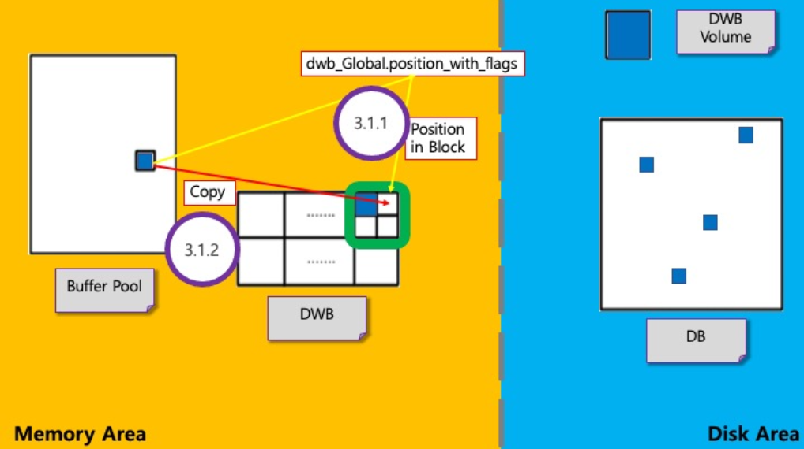

# **Slot 탐색 및 Page 저장**

## **1. 분석 문서**

Slot 탐색 및 Page 저장은 Slot 탐색을 진행하고, Page를 해당 순서의 Slot에 저장하는 메커니즘이다.

### **1-1. Block 및 Slot 의 위치 탐색**

* DWB의 전역변수 ‘position_with_flags‘를 비트 연산을 사용해서 Block 및 Slot의 index 탐색한다.
* 이를 사용하여서 Slot의 시작주소를 획득한다.
> Block의 index는 순환적이다.

### **1-2. Page 저장**

* 구한 Slot의 index에 Page 저장(memory copy)한다.
	* 실제로는 Block의 지역변수 write_buffer에 slot순서대로 저장
* Vpid, LSA정보를 함께 저장한다.



### **1-3. 탐색 및 저장 실패 케이스**

> 해당 케이스는 slot의 index를 찾기 전에 해당 block에 다른 thread가 write 작업을 진행 중일 때 나타나는 현상이다.  
> 여기서 write 작업이란 다른 thread가 해당 block에 대해 slot 탐색 ~ DWB flush 사이의 작업이 진행중임을 의미한다.

**Flush 순서 및 대기**

1. Page를 저장해야 할 slot이 첫 번째 slot이고, block이 다른 thread에 의해 writing 중인 상태
2. 해당 work thread를 대기 상태로 설정하려고 할 때, block의 지역변수에 존재하는 `wait_queue`에 work thread를 저장시키고 대기
3. 해당 block이 writing 상태가 끝날 때까지 work thread는 `dwb_aquire_next_slot()` 함수 내부 `start` goto phase부터 다시 진행
4. 해당 block에 대해 다른 thread가 write 작업 마쳤다면, 다시 함수 내부에서 처음부터 시작할 때, 현재 thread가 전역변수 `position_with_flags`에서 현재 block의 상태를 writing으로 바꾼 다음 다시 slot의 index 찾기 작업 진행

&nbsp;

## **2. 코드 분석**

### **`dwb_add_page`**

```c
/*
* dwb_add_page ()		: DWB에 페이지 컨텐츠 추가
*
* 반환					: Error code
* thread_p (인자)		: Thread entry
* io_page_p(인자)		: 페이지의 현재 내용이 있는 메모리 내 주소
* vpid (인자)			: 페이지 식별자
* p_dwb_slot (인자)		: 페이지 콘텐츠를 추가해야 하는 DWB slot
*
* ※ Flush thread를 사용할 수 없거나 독립 실행형(stand alone)인 경우 thread가 block을 flush할 수 있다.
*/
int dwb_add_page(THREAD_ENTRY *thread_p, FILEIO_PAGE *io_page_p, VPID *vpid, DWB_SLOT **p_dwb_slot)
{
	unsigned int count_wb_pages;	// write buffer에 추가된 페이지 수
	int error_code = NO_ERROR;		// #define NO_ERROR 0
	bool inserted = false;			// DWB에 slot이 잘 추가되었는지 확인하는 bool 타입 변수
	DWB_BLOCK *block = NULL;		// block 포인터
	DWB_SLOT *dwb_slot = NULL;		// slot 포인터
	bool needs_flush;				// flush가 필요한지 확인하는 bool 타입 변수 (count_wb_pages >= DWB 각 block의 page 수 → flush)

	assert(p_dwb_slot != NULL && (io_page_p != NULL || (*p_dwb_slot)->io_page != NULL) && vpid != NULL);
	// 위 조건에 만족하지 않으면 crash

	if (thread_p == NULL)
	{
		thread_p = thread_get_thread_entry_info();
		// 인자로 thread_p가 제대로 들어오지 않았다면 위 함수를 통해 자체적으로 thread entry 구함
	}

	if (*p_dwb_slot == NULL)	// *p_dwb_slot이 NULL이라면
	{
		error_code = dwb_set_data_on_next_slot(thread_p, io_page_p, true, p_dwb_slot);
		// 가능한 경우, next DWB slot에 데이터 set / error code 설정
		// dwb_acquire_next_slot()에서 position_with_flags에서 현재 block num, 다음 slot의 위치를 구함
		// 현재 block의 slot pointer + 구한 slot의 index로 slot의 pointer를 구하고 p_dwb_slot에 대입
		// dwb_set_slot_data()에서 p_dwb_slot에 io_page_p를 입력
		if (error_code != NO_ERROR)
		{
			return error_code;
			// 위 함수 안에서 에러 발생 시 add_page 중단 / error_code 반환
		}

		if (*p_dwb_slot == NULL)
		{
			return NO_ERROR;
			// 위 함수를 거치고도 아직 *p_dwb_slot이 NULL이라면 add_page 중단 / NO_ERROR 반환
		}
	}

	dwb_slot = *p_dwb_slot;
	함수 내에서 선언한 dwb_slot 포인터 변수에 *p_dwb_slot 대입

	assert(VPID_EQ(vpid, &dwb_slot->vpid));
	// #define VPID_EQ(vpid_ptr1, vpid_ptr2) ((vpid_ptr1) == (vpid_ptr2) || ((vpid_ptr1)->pageid == (vpid_ptr2)->pageid && (vpid_ptr1)->volid == (vpid_ptr2)->volid))
	// vipd와 slot->vpid를 비교하는 이유는 dwb_set_slot_data() 함수에서 입력 과정에서 error가 발생됐는지 check하기 위함으로 추측됨
	// vpid와 &dwb_slot->vpid가 일치하지 않으면 crash

	if (!VPID_ISNULL(vpid))		// vpid가 NULL이 아니면
	{
		error_code = dwb_slots_hash_insert(thread_p, vpid, dwb_slot, &inserted);
		// slots hash에 삽입 진행 / error code 설정
		if (error_code != NO_ERROR)
		{
			return error_code;
			// 위 함수 안에서 에러 발생 시 add_page 중단 / error_code 반환
		}

		if (!inserted)			// 삽입 진행 후에도 inserted 변수가 아직 false라면
		{
			VPID_SET_NULL(&dwb_slot->vpid);
			// 동일한 데이터를 두 번 flush하지 않도록 slot을 NULL로 세팅해 무효화 시킴
			fileio_initialize_res(thread_p, dwb_slot->io_page, IO_PAGESIZE);
			// LSA를 NULL로 세팅 / io_page 구조체 내의 변수들 default값으로 초기화
		}
	}

	dwb_log("dwb_add_page: added page = (%d,%d) on block (%d) position (%d)\n", vpid->volid, vpid->pageid,
			dwb_slot->block_no, dwb_slot->position_in_block);
	/*
	*	#define dwb_log(...) \
	*		if (dwb_Log)     \
	*		_er_log_debug(ARG_FILE_LINE, "DWB: " __VA_ARGS__)
	*/
	// dwb_Log가 설정되어있으면 error log file에 인자로 넘긴 메세지 출력

	block = &dwb_Global.blocks[dwb_slot->block_no];
	// 함수 내에서 선언한 block 포인터 변수에 DWB 전역 구조체 내의 블록 배열의 slot의 block 번호 주소 대입
	count_wb_pages = ATOMIC_INC_32(&block->count_wb_pages, 1);
	// 함수 내에서 선언한 count_wb_pages에 ATOMIC_INC_32로 &block->count_wb_pages 대입
	// write_buffer의 page가 1개 추가되었으므로 +1 해서 대입
	assert_release(count_wb_pages <= DWB_BLOCK_NUM_PAGES);
	// count_wb_pages가 DWB 각 block의 page 수보다 크면 crash
	// assert()와 assert_release()의 차이는..?

	if (count_wb_pages < DWB_BLOCK_NUM_PAGES)	// count_wb_pages가 DWB 각 block의 page 수보다 작으면
	{
		needs_flush = false;
		// flush 불필요
	}
	else
	{
		needs_flush = true;
		// flush 필요
	}

	if (needs_flush == false)
	{
		return NO_ERROR;
		// flush 할 필요 없으면 add_page 중단 / NO_ERROR 반환
	}
	/*
	* 궁금한점
	* 위의 과정을 진행하는 이유는 block이 가득찼을 경우에만 flush하는 것인데 왜 needs_flush를 사용해야 할까?
	* 그냥 첫 if문에서 page 수보다 작으면 return (NO_ERROR)로 빠져나오면 될텐데 굳이 needs_flush 변수를 사용해야 할까?
	* needs_flush가 다른 부분에서 사용되면 모르겠는데 여기서만 사용됨
	*/


	/*
	* Block은 일관된 데이터를 갖기 위해 채워진 순서대로 flush 되어야 한다.
	* Flush block thread는 채워진 순서대로 block을 flush하는 방법을 알고 있다.
	* 따라서 여기에선 flushing 순서에 대해 더 이상 신경 쓰지 않는다.
	* 최초에는 이전 block이 flush되지 않은 경우 여기에서 기다렸었다. 이러한 접근 방식으로 인해 지연이 발생됐었다.
	*/


// SEVER_MODE로 실행됐을 경우에만 진행
#if defined(SERVER_MODE)
	/*
	* 현재 block을 flush하기 위해 flush block thread를 깨운다.
	* 현재 block은 이전 block을 flush한 후 flush된다.
	*/
	if (dwb_is_flush_block_daemon_available())		// flush block daemon이 가능한 상태이면
	{
		dwb_flush_block_daemon->wakeup();
		// block을 flush할 thread를 깨움

		return NO_ERROR;
	}
#endif /* SERVER_MODE */


	error_code = dwb_flush_block(thread_p, block, false, NULL);
	// 현재 block에서 모든 pages flush / error code 설정
	if (error_code != NO_ERROR)
	{
		dwb_log_error("Can't flush block = %d having version %lld\n", block->block_no, block->version);
		
		return error_code;
		// flush 실패 시 log에 에러 메세지 남기고 error code 반환
	}

	dwb_log("Successfully flushed DWB block = %d having version %lld\n", block->block_no, block->version);

	return NO_ERROR;
	// flush 성공 시 해당 메세지를 log에 성공 메세지 남기고 함수 종료
}
```

### **`thread_get_thread_entry_info`**

```cpp
inline cubthread::entry *
thread_get_thread_entry_info (void)
{
  cubthread::entry &te = cubthread::get_entry ();
  return &te;
}
```
