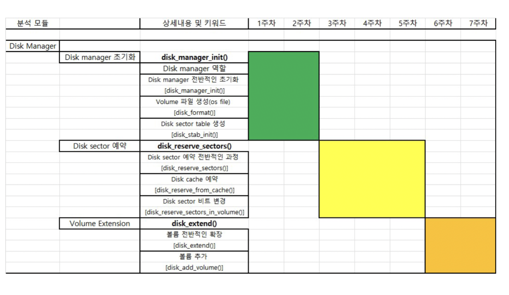
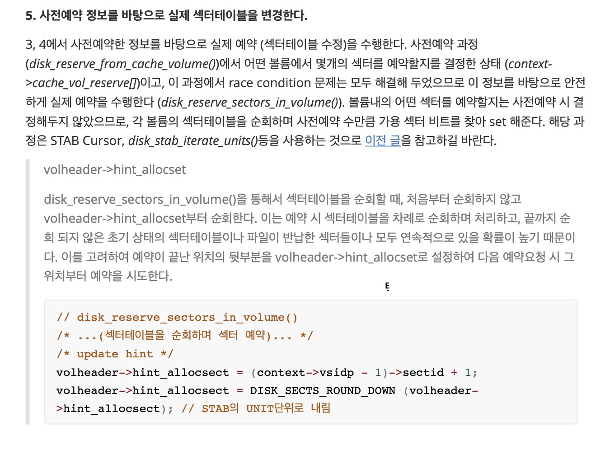

# 11. Disk Manager (5th Week)



<br>

___

## 1. 구조체

<details>
<summary> 구조체 </summary>

```c
struct disk_cache
{
  int nvols_perm;                               /* number of permanent type volumes */
  int nvols_temp;                               /* number of temporary type volumes */
  ✅ DISK_CACHE_VOLINFO vols[LOG_MAX_DBVOLID + 1]; /* volume info array */

  DISK_PERM_PURPOSE_INFO perm_purpose_info; /* info for permanent purpose */
  DISK_TEMP_PURPOSE_INFO temp_purpose_info; /* info for temporary purpose */

  pthread_mutex_t mutex_extend; /* note: never get expand mutex while keeping reserve mutexes */
#if !defined(NDEBUG)
  volatile int owner_extend;
#endif /* !NDEBUG */
};
```

```c
struct disk_stab_cursor
{
  const DISK_VOLUME_HEADER *volheader; /* Volume header */

  PAGEID pageid;      /* Current page ID */
  int offset_to_unit; /* Offset to current unit in page. */
  int offset_to_bit;  /* Offset to current bit in unit. */

  SECTID sectid; /* Sector ID */

  PAGE_PTR page;        /* Fixed table page. */
  DISK_STAB_UNIT *unit; /* Unit pointer in current page. */
};
```

```c
struct vsid
{
  int32_t sectid;	/* Sector identifier */
  short volid;	/* Volume identifier where the sector resides */
};
```

```c
struct disk_cache_vol_reserve
{
  VOLID volid; // Volume identifier
  DKNSECTS nsect; // 예약할 섹터 수
};
```

```c
struct disk_reserve_context
{
  int nsect_total; //예약 요청된 섹터 수
  ✅ VSID *vsidp; // 섹터의 배열, 예약과정에서 산출된 최종 섹터들의 위치

  ✅ DISK_CACHE_VOL_RESERVE cache_vol_reserve[VOLID_MAX]; // 볼륨별 사전예약 섹터 수의 배열
  int n_cache_vol_reserve; // 사전예약한 섹터들이 포함된 볼륨들의 수, cache_vol_reserve의 길이
  int n_cache_reserve_remaining; // 아직 사전예약 되지 못한 섹터들의 수, nsect_total - n_cache_vol_reserve = nsect_reserve

  ✅ DKNSECTS nsects_lastvol_remaining; //실제 예약 처리시에 해당 볼륨에서 남은 섹터 예약량

  DB_VOLPURPOSE purpose; // 예약 목적
};
```

</details>

<br>

___

## 2. 함수 구조

<details>
<summary> disk_reserve_sectors () </summary>

```c
disk_reserve_sectors ()
│
├── disk_reserve_from_cache ()
│   ├── disk_reserve_from_cache_vols ()
│   │	└── disk_reserve_from_cache_volume ()
│   │
│   └── disk_extend ()
│		├── disk_volume_expand ()
│		├── disk_reserve_from_cache_volume ()
│		├── disk_add_volume ()
│		└── disk_reserve_from_cache_volume ()
│
└── 🤔 disk_reserve_sectors_in_volume () 🤔
```

```c
disk_reserve_sectors_in_volume ()
│
├── disk_get_volheader ()
├── disk_log ()
└── disk_stab_iterator_unit ()
	└── disk_stab_unit_reserve ()
```


</details>

<br>



___

## 3. 함수 분석

<details>
<summary> 1. initial </summary>

```c

/*
 * disk_reserve_sectors_in_volume () - Reserve a number of sectors in the given volume.
 *
 * return	    : Error code.
 * thread_p (in)    : Thread entry.
 * vol_index (in)   : The index of volume in reserve context
 * context (in/out) : Reserve context
 */

static int
disk_reserve_sectors_in_volume(THREAD_ENTRY *thread_p, int vol_index, DISK_RESERVE_CONTEXT *context)
{
  VOLID volid; // volume id
  PAGE_PTR page_volheader = NULL; // Volume header page
  DISK_VOLUME_HEADER *volheader = NULL; // Volume header
  DISK_STAB_CURSOR start_cursor = DISK_STAB_CURSOR_INITIALIZER; // {NULL, 0, 0, 0, 0, NULL, NULL}
  DISK_STAB_CURSOR end_cursor = DISK_STAB_CURSOR_INITIALIZER; // {NULL, 0, 0, 0, 0, NULL, NULL}
  int error_code = NO_ERROR;

  volid = context->cache_vol_reserve[vol_index].volid; // volume id
  if (volid == NULL_VOLID)
  {
    assert_release(false);
    return ER_FAILED;
  }
    // number of sectors to reserve
  context->nsects_lastvol_remaining = context->cache_vol_reserve[vol_index].nsect;
  assert(context->nsects_lastvol_remaining > 0);

  //... ellipsis

```

</details>

<details>
<summary> 2. disk_get_volheader (), disk_log () </summary>

```c
	//... ellipsis

  /* fix volume header */
  error_code = disk_get_volheader(thread_p, volid, PGBUF_LATCH_WRITE, &page_volheader, &volheader);
  if (error_code != NO_ERROR)
  {
    ASSERT_ERROR();
    return error_code;
  }
	// disk_log ()
  disk_log("disk_reserve_sectors_in_volume", "reserve %d sectors in volume %d.", context->nsects_lastvol_remaining,
           volid);

	//... ellipsis

```

<details>
<summary> disk_get_volheader_internal () </summary>

```c
/*
 * disk_get_volheader_internal () - get volume header page and header
 *
 * return                   : error code
 * thread_p (in)            : thread entry
 * volid (in)               : volume id
 * latch_mode (in)          : latch mode for volume header page
 * page_volheader_out (out) : output volume header page
 * volheader_out (out)      : output volume header
 * file (in)                : (debug only) caller file
 * line (in)                : (debug only) caller line
 */
STATIC_INLINE int
disk_get_volheader_internal(THREAD_ENTRY *thread_p, VOLID volid, PGBUF_LATCH_MODE latch_mode,
                            PAGE_PTR *page_volheader_out, DISK_VOLUME_HEADER **volheader_out
#if !defined(NDEBUG)
                            ,
                            const char *file, int line
#endif /* !NDEBUG */
)
{
  VPID vpid_volheader;
  int error_code = NO_ERROR;

  vpid_volheader.volid = volid;
  vpid_volheader.pageid = DISK_VOLHEADER_PAGE;

  *page_volheader_out = ✅ pgbuf_fix(thread_p, &vpid_volheader, OLD_PAGE, latch_mode, PGBUF_UNCONDITIONAL_LATCH);
  if (*page_volheader_out == NULL)
  {
    ASSERT_ERROR_AND_SET(error_code);
    return error_code;
  }

  disk_verify_volume_header(thread_p, *page_volheader_out);
  *volheader_out = (DISK_VOLUME_HEADER *)(*page_volheader_out);

  return NO_ERROR;
}
```

</details>

</details>

<details>
<summary> 3. reserve all possible sectors. (✅ disk_stab_iterate_units () ) </summary>

- <details>
  <summary> if have hint </summary>

  ```c
  // ... ellipsis

    /* reserve all possible sectors. */
    if (volheader->hint_allocsect > 0 && volheader->hint_allocsect < volheader->nsect_total)
    {
      /* start with hinted sector */
      DISK_SECTS_ASSERT_ROUNDED(volheader->hint_allocsect);
      disk_stab_cursor_set_at_sectid(volheader, ✅ volheader->hint_allocsect, &start_cursor); // at hint
      disk_stab_cursor_set_at_end(volheader, &end_cursor);

      /* reserve sectors after hint */
      error_code = disk_stab_iterate_units(thread_p, volheader, PGBUF_LATCH_WRITE, &start_cursor, &end_cursor,
                                          disk_stab_unit_reserve, context);
      if (error_code != NO_ERROR)
      {
        ASSERT_ERROR();
        goto exit;
      }
      if (context->nsects_lastvol_remaining > 0) // 가용섹터가 힌트 앞에 있을 경우.
      {
        /* we need to reserve more. reserve sectors before hint */
        end_cursor = start_cursor;
        ✅ disk_stab_cursor_set_at_start(volheader, &start_cursor); // 처음부터 이터레이팅
        error_code = disk_stab_iterate_units(thread_p, volheader, PGBUF_LATCH_WRITE, &start_cursor, &end_cursor,
                                            disk_stab_unit_reserve, context);
        if (error_code != NO_ERROR)
        {
          ASSERT_ERROR();
          goto exit;
        }
      }
    }

  ```

  </details>

- <details>
  <summary> if not </summary>

  ```c

  else // 처음부터 이터레이팅
  {
    /* search the entire sector table */
    disk_stab_cursor_set_at_start(volheader, &start_cursor);
    disk_stab_cursor_set_at_end(volheader, &end_cursor);
    error_code = disk_stab_iterate_units(thread_p, volheader, PGBUF_LATCH_WRITE, &start_cursor, &end_cursor,
                                         disk_stab_unit_reserve, context);
    if (error_code != NO_ERROR)
    {
      ASSERT_ERROR();
      goto exit;
    }
  }

  // ... ellipsis

  ```

  </details>

- <details>
  <summary> disk_stab_iterate_units () </summary>

  ```c

  /*
  * disk_stab_iterate_units () - iterate through units between start and end and call argument function. start and end
  *                              cursor should be aligned.
  *
  * return           : error code
  * thread_p (in)    : thread entry
  * volheader (in)   : volume header
  * mode (in)        : page latch mode
  * start (in)       : start cursor
  * end (in)         : end cursor
  * f_unit (in)      : function called on each unit
  * f_unit_args (in) : argument for unit function
  */
  static int
  disk_stab_iterate_units(THREAD_ENTRY *thread_p, const DISK_VOLUME_HEADER *volheader, PGBUF_LATCH_MODE mode,
                          DISK_STAB_CURSOR *start, DISK_STAB_CURSOR *end, DISK_STAB_UNIT_FUNC f_unit,
                          void *f_unit_args)
  {
    DISK_STAB_CURSOR cursor;
    DISK_STAB_UNIT *end_unit;
    bool stop = false;
    int error_code = NO_ERROR;

    assert(volheader != NULL);
    assert(start->offset_to_bit == 0);
    assert(end->offset_to_bit == 0);
    assert(disk_stab_cursor_compare(start, end) < 0);

    /* iterate through pages */
    for (cursor = *start; cursor.pageid <= end->pageid; cursor.pageid++, cursor.offset_to_unit = 0)
    {
      assert(cursor.page == NULL);
      disk_stab_cursor_check_valid(&cursor);

      error_code = disk_stab_cursor_fix(thread_p, &cursor, mode);
      if (error_code != NO_ERROR)
      {
        ASSERT_ERROR();
        return error_code;
      }

      /* iterate through units */

      /* set end_unit */
      end_unit = ((DISK_STAB_UNIT *)cursor.page) + (cursor.pageid == end->pageid ? end->offset_to_unit : DISK_STAB_PAGE_UNITS_COUNT);

      /* iterate */
      for (; cursor.unit < end_unit;
          cursor.unit++, cursor.offset_to_unit++, ✅ cursor.sectid += (DISK_STAB_UNIT_BIT_COUNT - cursor.offset_to_bit),
          cursor.offset_to_bit = 0) // unit 단위로 이터레이팅 하려고 안에서 오프셋을 건드려도 일정하게 해주려고
      {
        disk_stab_cursor_check_valid(&cursor);

        /* call unit function */
        error_code = ✅ f_unit(thread_p, &cursor, &stop, f_unit_args);
        if (error_code != NO_ERROR)
        {
          ASSERT_ERROR();
          disk_stab_cursor_unfix(thread_p, &cursor);
          return error_code;
        }
        if (stop)
        {
          /* stop */
          disk_stab_cursor_unfix(thread_p, &cursor);
          return NO_ERROR;
        }
      }

      disk_stab_cursor_unfix(thread_p, &cursor);
    }

    return NO_ERROR;
  }


  ```

  </details>

- <details>
  <summary> disk_stab_unit_reserve () </summary>

  ```c

  /*
  * disk_stab_unit_reserve () - DISK_STAB_UNIT_FUNC function used to lookup and reserve free sectors
  *
  * return        : NO_ERROR
  * thread_p (in) : thread entry
  * cursor (in)   : disk sector table cursor
  * stop (out)    : output true when all required sectors are reserved
  * args (in/out) : reserve context
  */
  static int
  disk_stab_unit_reserve(THREAD_ENTRY *thread_p, DISK_STAB_CURSOR *cursor, bool *stop, void *args)
  {
    DISK_RESERVE_CONTEXT *context;
    DISK_STAB_UNIT log_unit;
    SECTID sectid;

    /* how it works
    * look for unset bits and reserve the required number of sectors.
    * we have two special cases, which can be very usual:
    * 1. full unit - nothing can be reserved, so we early out
    * 2. empty unit - we can consume it all (if we need it all) or just trailing bits.
    * otherwise, we iterate bit by bit and reserve free sectors.
    */

    if (*cursor->unit == BIT64_FULL)
    {
      /* nothing free */
      return NO_ERROR;
    }

    context = (DISK_RESERVE_CONTEXT *)args;
    assert(context->nsects_lastvol_remaining > 0);

    // *cursor->unit == bit64 of free sectors
    if (*cursor->unit == 0)
    {
      /* empty unit. set all required bits */
      int bits_to_set = MIN(context->nsects_lastvol_remaining, DISK_STAB_UNIT_BIT_COUNT);
      int i;

      if (bits_to_set == DISK_STAB_UNIT_BIT_COUNT) // full unit
      {
        /* Consume all unit */
        *cursor->unit = BIT64_FULL;
      }
      else // partial unit
      {
        /* consume only part of unit */
        *cursor->unit = bit64_set_trailing_bits(*cursor->unit, bits_to_set);
      }
      /* what we log */
      log_unit = *cursor->unit;

      /* update reserve context */
      context->nsects_lastvol_remaining -= bits_to_set;

      /* save sector ids */
      for (i = 0, sectid = disk_stab_cursor_get_sectid(cursor); i < bits_to_set; i++, sectid++)
      {
        context->vsidp->volid = cursor->volheader->volid;
        context->vsidp->sectid = sectid;
        context->vsidp++;

        disk_log("disk_stab_unit_reserve", "reserved sectid %d in volume %d.", sectid, cursor->volheader->volid);
      }
    }
    else // already be set
    {
      /* iterate through unit bits */ // one by one
      log_unit = 0;
      for (cursor->offset_to_bit = bit64_count_trailing_ones(*cursor->unit), cursor->sectid += cursor->offset_to_bit;
          cursor->offset_to_bit < DISK_STAB_UNIT_BIT_COUNT && context->nsects_lastvol_remaining > 0;
          cursor->offset_to_bit++, cursor->sectid++)
      {
        disk_stab_cursor_check_valid(cursor);

        if (!disk_stab_cursor_is_bit_set(cursor)) // check offset_to_bit is set
        {
          /* reserve this sector */
          disk_stab_cursor_set_bit(cursor); // set offset_to_bit

          /* update what we log */
          log_unit = bit64_set(log_unit, cursor->offset_to_bit);

          /* update context */
          context->nsects_lastvol_remaining--;

          /* save vsid */
          context->vsidp->volid = cursor->volheader->volid;
          context->vsidp->sectid = cursor->sectid;
          context->vsidp++;

          disk_log("disk_stab_unit_reserve", "reserved sectid %d in volume %d.", cursor->sectid,
                  cursor->volheader->volid);
        }
      }
    }

    /* safe guard: we must have done something, so log_unit cannot be 0 */
    assert(log_unit != 0);
    /* safe guard: all bits in log_unit must be set */
    assert((log_unit & *cursor->unit) == log_unit);
    if (context->purpose == DB_PERMANENT_DATA_PURPOSE)
    {
      /* log changes */
      log_append_undoredo_data2(thread_p, RVDK_RESERVE_SECTORS, NULL, cursor->page, cursor->offset_to_unit,
                                sizeof(log_unit), sizeof(log_unit), &log_unit, &log_unit);
    }
    /* page was modified */
    pgbuf_set_dirty(thread_p, cursor->page, DONT_FREE);

    if (context->nsects_lastvol_remaining <= 0)
    {
      /* all required sectors are reserved, we can stop now */
      assert(context->nsects_lastvol_remaining == 0);
      *stop = true;
    }
    return NO_ERROR;
  }

  ```

  </details>

</details>

<details>
<summary> 4. assert, update hint and exit </summary>

```c

// ... ellipsis

  if (context->nsects_lastvol_remaining != 0)
  {
    /* our logic must be flawed... the sectors are reserved ahead so we should have found enough free sectors */
    assert_release(false);
    error_code = ER_FAILED;
    goto exit;
  }

  /* update hint */
  volheader->hint_allocsect = (context->vsidp - 1)->sectid + 1;  // next sector to be allocated
  volheader->hint_allocsect = DISK_SECTS_ROUND_DOWN(volheader->hint_allocsect); // round down to sector boundary, bit단위로는 하지 못해용
  /* we don't really need to set the page dirty or log the hint change. */

exit:
  if (page_volheader != NULL)
  {
    pgbuf_unfix(thread_p, page_volheader);
  }
  return error_code;
}

```

</details>


## 궁금
1. log_append_undoredo_data이 뭐하는 함수인가. 1,2 둘다
