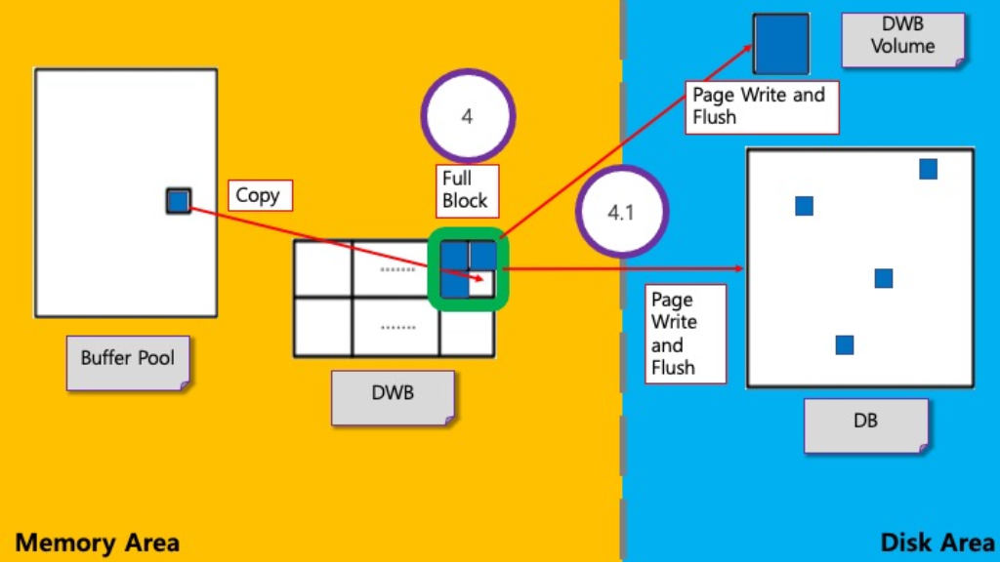

# **DWB Flush**

## **1. 분석 문서**

### **Flush 과정**

* 하나의 Block의 slot이 page로 가득 찼을 때 해당 Block의 Flush를 시작한다.
* 그렇게 되면 DWB에서 DWB volume으로 그 다음에는 DWB에서 DB로 Flush 하는 과정을 거친다.
* `dwb_add_page()`함수에서 Block의 slot이 page로 가득찼다고 판별이 되면, `dwb_flush_block()` 함수를 실행해서 DWB flush를 실행한다.
* Flush는 flush daemon을 통하여 Flush하거나 수동으로 직접 `dwb_flush_block()`을 호출하여서 진행할 수 있다.
* Flush가 끝나면 Block의 상태 및 다음 순서의 Flush Block을 수정한다.

### **Daemon**

* `dwb_flush_block_daemon`은 주기적으로 Block의 모든 slot에 page가 저장되어 있는지 확인해서, 꽉 차있으면 `dwb_flush_block()`을 호출한다.
* `dwb_file_sync_helper_daemon`은 `dwb_flush_block_daemon`이 호출하는 daemon으로서, 주기적으로 `dwb_file_sync_helper()`을 호출해서 DB로 page를 Flush한다.
	* `file_sync_helper_block`이 참조한 Block을 fsync한 뒤, NULL로 초기화

### **DWB Volume으로 Flush**

* System crash가 일어나기 전에 DWB volume으로 먼저 DWB Block을 Flush
* Block의 지역변수 `write_buffer`를 사용하여 slot의 순서대로 DWB volume에 write
* Block 전체의 write 작업이 끝나면, `fsync()`를 호출하여 DWB volume에 Flush 마무리

### **DB로 Flush**

* Block 내부의 slot들을 정렬 후, DB에 해당하는 page마다 `write()` 함수를 호출하여 write 진행
	* slot 정렬은 다음과 같은 이유의 장점 때문에 진행함 :
		* DB에 있는 volume들이 VPID 순서로 정렬되어 있음
		* 같은 page의 경우 page LSA를 통해서 최신 버전만 Flush할 수 있음
	* slot ordering은 slot행렬을 따로 만들어서 slot들을 복사함
	* 그 다음 VPID, LSA 기준으로 정렬 후 이전 시점의 page LSA를 가진 slot들을 초기화
* write가 끝난 뒤, sync daemon을 사용할 수 있다는 전제하에, 전역변수 `file_sync_helper_block`에 현재 Flush하려는 Block을 참조시킴
	* Daemon을 호출해도 되는 이유는 이미 DWB volume에 Flush가 되었기 때문에 해당 Flush가 급한 작업이 아니기 때문 (system crash가 발생해도 recovery 가능)
* 각 page마다 sync daemon을 호출하거나 불가능할 경우 `fsync()`를 직접 호출



## **2. 코드 분석**

### **`dwb_flush_block()`**

```c
/*
 * dwb_flush_block()			: 지정된 block에서 page들을 flush
 *
 * return				: Error code
 * thread_p(in)				: Thread entry
 * block(in)				: flush가 필요한 block
 * file_sync_helper_can_flush(in)	: file sync helper thread가 flush 가능하면, true
 * current_position_with_flags(out)	: 최신화된 position with flags
 *
 *  Note					: 해당 block page들은 flush 중에 다른 사람에 의해 수정될 수 없음
 */
STATIC_INLINE int
dwb_flush_block(THREAD_ENTRY *thread_p, DWB_BLOCK *block, bool file_sync_helper_can_flush, UINT64 *current_position_with_flags)
{
	UINT64 local_current_position_with_flags, new_position_with_flags;	// reset_bit_position 문에서 쓰이는 변수
	int error_code = NO_ERROR;			// #define NO_ERROR 0
	DWB_SLOT *p_dwb_ordered_slots = NULL;			// 정렬된 slot들을 담을 구조체 변수
	unsigned int i, ordered_slots_length;			// index, 정렬된 slot들의 길이
	PERF_UTIME_TRACKER time_track;			// 시간 기록용 구조체 변수
	int num_pages;			// page 수
	unsigned int current_block_to_flush, next_block_to_flush;		// 현재 flush되는 block, 그 다음 flush되는 block
	int max_pages_to_sync;			// sync될 수 있는 최대 page 수
#if defined(SERVER_MODE)			// SERVER MODE로 실행됐을 경우
	bool flush = false;			// flush 유무
	PERF_UTIME_TRACKER time_track_file_sync_helper;			// 시간 기록용 구조체 변수
#endif
#if !defined(NDEBUG)					// DEBUG MODE로 실행됐을 경우
	DWB_BLOCK *saved_file_sync_helper_block = NULL;			// helper thread에 의해 동기화될 block이 저장될 DWB_BLOCK 포인터
	LOG_LSA nxio_lsa;			// log 주소 식별자
#endif

	assert(block != NULL && block->count_wb_pages > 0 && dwb_is_created());
	// flush될 block이 NULL이거나 write buffer page 수가 0이하이거나 dwb가 생성되지 않았으면 crash

	PERF_UTIME_TRACKER_START(thread_p, &time_track);
	// 시간 기록 시작

	/* 하나의 block만 flush 허용 */
	ATOMIC_INC_32(&dwb_Global.blocks_flush_counter, 1);
	// &dwb_Global.blocks_flush_counter++;
	assert(dwb_Global.blocks_flush_counter <= 1);
	// flush counter가 1보다 크면 crash (한번에 하나의 블록만 flush 가능하므로 1보다 크면 crash)

	/* 빠른 flush를 위해 slot들을 VPID순으로 정렬 */
	error_code = dwb_block_create_ordered_slots(block, &p_dwb_ordered_slots, &ordered_slots_length);
	// slot ordering 함수 block의 slot수 + 1 만큼 메모리 할당하고 memcpy 마지막 슬롯은 빈 slot 으로 초기화
	// qsort 로 오래된 것 부터 순서대로 정렬 p_dwb_ordered_slots에 정렬한 slot 배열을 받는다. slots_length = count_wb_pages + 1;
	// 정렬 기준 순서 vol 식별자, page, log page, log offset 순
	if (error_code != NO_ERROR)
	{
		error_code = ER_FAILED;		// #define ER_FAILED -1
		goto end;
	}

	/* 같은 page를 중복 flush 하지 않기 위해서 중복되는 slot 제거 */
	for (i = 0; i < block->count_wb_pages - 1; i++)
	{
		DWB_SLOT *s1, *s2;

		s1 = &p_dwb_ordered_slots[i];
		s2 = &p_dwb_ordered_slots[i + 1];

		assert(s1->io_page->prv.p_reserve_2 == 0);

		if (!VPID_ISNULL(&s1->vpid) && VPID_EQ(&s1->vpid, &s2->vpid))
		// s1->vpid의 pageid가 NULL_PAGEID가 아니고, s1과 s2의 요소들이 모두 같다면
		{
			assert(LSA_LE(&s1->lsa, &s2->lsa));

			VPID_SET_NULL(&s1->vpid);
			// s2의 slot에 동일한 page가 포함되어 있고, 더 최신이므로 s1을 버림

			assert(s1->position_in_block < DWB_BLOCK_NUM_PAGES);
			VPID_SET_NULL(&(block->slots[s1->position_in_block].vpid));
			// 같은 page를 flush하지 않기 위해 s1의 VPID 무효화

			fileio_initialize_res(thread_p, s1->io_page, IO_PAGESIZE);
			// s1->io_page의 모든 요소를 초기화
		}

		/* Check for WAL protocol */
		/* WAL(write-ahead logging, 로그 선행 기입)을 사용하는 시스템에서 모든 수정은 적용 이전에 로그에 기록된다. */
#if !defined(NDEBUG)				// DEBUG MODE로 실행됐을 경우
		if (s1->io_page->prv.pageid != NULL_PAGEID && logpb_need_wal(&s1->io_page->prv.lsa))
		// 로그 선행 기입이 되지 않아서 기입이 필요하다면
		{
			/* WAL 필요함, log buffer pool이 파괴되었는지 확인 */
			nxio_lsa = log_Gl.append.get_nxio_lsa();
			assert(LSA_ISNULL(&nxio_lsa));
		}
#endif
	}

	PERF_UTIME_TRACKER_TIME(thread_p, &time_track, PSTAT_DWB_FLUSH_BLOCK_SORT_TIME_COUNTERS);
	// slot 정렬에 걸린 시간 기록

#if !defined(NDEBUG)				// DEBUG MODE로 실행됐을 경우
	saved_file_sync_helper_block = (DWB_BLOCK *)dwb_Global.file_sync_helper_block;
#endif

#if defined(SERVER_MODE)			// SERVER MODE로 실행됐을 경우
	PERF_UTIME_TRACKER_START(thread_p, &time_track_file_sync_helper);
	// file sync helper 시간 기록 시작

	while (dwb_Global.file_sync_helper_block != NULL)
	// 선언 : DWB_BLOCK *volatile file_sync_helper_block; /* The block that will be sync by helper thread. */
	{
		flush = true;

		/* 현재 block을 쓰기 전에 이전 block이 disk에 기록되었는지 확인해야함 */
		if (dwb_is_file_sync_helper_daemon_available())
		{
			thread_sleep(1);
			// file sync helper를 기다림
		}
		else
		{
			/* helper 사용이 불가능하다면, 이전 block에서 volume을 flush */
			for (i = 0; i < dwb_Global.file_sync_helper_block->count_flush_volumes_info; i++)
			{
				assert(dwb_Global.file_sync_helper_block->flush_volumes_info[i].vdes != NULL_VOLDES);
				// flush_volumes_info의 vdes가 -1이면 crash
				// #define NULL_VOLDES   (-1)

				if (ATOMIC_INC_32(&(dwb_Global.file_sync_helper_block->flush_volumes_info[i].num_pages), 0) >= 0)
				// flush_volumes_info의 num_pages가 0 이상이면
				{
					(void)fileio_synchronize(thread_p,
											 dwb_Global.file_sync_helper_block->flush_volumes_info[i].vdes, NULL,
											 FILEIO_SYNC_ONLY);
					// Database volume의 상태를 disk의 상태와 동기화

					dwb_log("dwb_flush_block: Synchronized volume %d\n",
							dwb_Global.file_sync_helper_block->flush_volumes_info[i].vdes);
					// 동기화 했다는 로그 남김
				}
			}
			(void)ATOMIC_TAS_ADDR(&dwb_Global.file_sync_helper_block, (DWB_BLOCK *)NULL);
			// &dwb_Global.file_sync_helper_block = (DWB_BLOCK *)NULL;
		}
	}

#if !defined(NDEBUG)			// DEBUG MODE로 실행됐을 경우
	if (saved_file_sync_helper_block)
	// 위에서 (DWB_BLOCK *)dwb_Global.file_sync_helper_block을 대입한 바 있음
	{
		for (i = 0; i < saved_file_sync_helper_block->count_flush_volumes_info; i++)
		{
			assert(saved_file_sync_helper_block->flush_volumes_info[i].all_pages_written == true && saved_file_sync_helper_block->flush_volumes_info[i].num_pages == 0);
			// 위 조건에 만족하지 않으면 crash
		}
	}
#endif

	if (flush == true)
	{
		PERF_UTIME_TRACKER_TIME(thread_p, &time_track_file_sync_helper, PSTAT_DWB_WAIT_FILE_SYNC_HELPER_TIME_COUNTERS);
		// file sync helper 걸린 시간 기록
	}
#endif /* SERVER_MODE */

	ATOMIC_TAS_32(&block->count_flush_volumes_info, 0);
	// count_flush_volumes_info = 0;
	block->all_pages_written = false;

	/* 먼저 DWB volume에 write, flush */
	if (fileio_write_pages(thread_p, dwb_Global.vdes, block->write_buffer, 0, block->count_wb_pages,
						   IO_PAGESIZE, FILEIO_WRITE_NO_COMPENSATE_WRITE) == NULL)
	// offset = 0, nbytes_to_be_written = IO_PAGESIZE * count_wb_pages nbytes_to_be_written 만큼 write() 시도
	// write 된 만큼 offset, *io_pages_p + 하고 nbytes_to_be_written - 하고 0이 될때까지 반복
	{
		// 함수가 NULL을 반환했을 시 오류 감지
		assert(false);
		error_code = ER_FAILED;
		goto end;
	}

	/* double write volume에 write 작업 후 통계 증가 */
	perfmon_add_stat(thread_p, PSTAT_PB_NUM_IOWRITES, block->count_wb_pages);
	// 통계량 축적 (Accumulate amount to statistic)

	if (fileio_synchronize(thread_p, dwb_Global.vdes, dwb_Volume_name, FILEIO_SYNC_ONLY) != dwb_Global.vdes)
	// Database volume의 상태를 disk의 상태와 동기화
	{
		// 함수 반환값이 dwb_Global.ves와 일치하지 않을 시 오류 감지
		assert(false);
		error_code = ER_FAILED;
		goto end;
	}
	dwb_log("dwb_flush_block: DWB synchronized\n");
	// 동기화 했다는 로그 남김

	/* 이제 정렬된 slot들을 DB에다가 write, flush */
	error_code =
		dwb_write_block(thread_p, block, p_dwb_ordered_slots, ordered_slots_length, file_sync_helper_can_flush, true);
	// 지정된 순서로 block page들을 write
	if (error_code != NO_ERROR)
	{
		// 오류 감지
		assert(false);
		goto end;
	}

	max_pages_to_sync = prm_get_integer_value(PRM_ID_PB_SYNC_ON_NFLUSH) / 2;
	// (enum param_id)PRM_ID_PB_SYNC_ON_NFLUSH = 74

	/* 이제 현재 block에 page가 있는 volume만 flush */
	for (i = 0; i < block->count_flush_volumes_info; i++)
	{
		assert(block->flush_volumes_info[i].vdes != NULL_VOLDES);
		// flush_volumes_info의 vdes가 -1이면 crash
		// #define NULL_VOLDES   (-1)

		num_pages = ATOMIC_INC_32(&block->flush_volumes_info[i].num_pages, 0);
		// num_pages에 &block->flush_volumes_info[i].num_pages 대입
		if (num_pages == 0)
		{
			/* helper에 의해 flush 완료됨 */
			continue;
		}

#if defined(SERVER_MODE)				// SERVER MODE로 실행됐을 경우
		if (file_sync_helper_can_flush == true)
		{
			if ((num_pages > max_pages_to_sync) && dwb_is_file_sync_helper_daemon_available())
			// page 수가 최대 동기화 page 수보다 크고 daemon이 사용가능하다면
			{
				/* helper thread가 많은 page를 가진 volume을 flush하도록 해줌 */
				assert(dwb_Global.file_sync_helper_block != NULL);
				// file_sync_helper_block이 NULL이면 crash
				continue;
			}
		}
		else
		{
			assert(dwb_Global.file_sync_helper_block == NULL);
			// file_sync_helper_block이 NULL이 아니면 crash
		}
#endif

		if (!ATOMIC_CAS_32(&block->flush_volumes_info[i].flushed_status, VOLUME_NOT_FLUSHED,
						   VOLUME_FLUSHED_BY_DWB_FLUSH_THREAD))
		// flush할 때 각 볼륨에 flush, 그 다음 동기화
		// CAS하는 이유는 flush한 볼륨만 동기화를 해주면 되기 때문
		// compare and swap은 첫번째, 두번째 인자가 같으면 세번째 인자를 첫번째 포인터에 대입하고 true 반환, 다르면 false 반환
		// (enum <unnamed>)VOLUME_NOT_FLUSHED = 0
		// (enum <unnamed>)VOLUME_FLUSHED_BY_DWB_FLUSH_THREAD = 2
		{
			/* helper에 의해 flush 완료됨 */
			continue;
		}

		num_pages = ATOMIC_TAS_32(&block->flush_volumes_info[i].num_pages, 0);
		// flush_volumes_info[i].num_pages에 0 대입하고 그 값을 num_pages에 대입
		assert(num_pages != 0);
		// num_pages가 0이면 crash

		(void)fileio_synchronize(thread_p, block->flush_volumes_info[i].vdes, NULL, FILEIO_SYNC_ONLY);
		// Database volume의 상태를 disk의 상태와 동기화

		dwb_log("dwb_flush_block: Synchronized volume %d\n", block->flush_volumes_info[i].vdes);
		// 동기화 했다는 로그 남김
	}

	/* file sync helper thread가 완료되도록 허용 */
	block->all_pages_written = true;
	
	/* 이 부분은 그냥 통계를 위한 tracking 용도 */
	if (perfmon_is_perf_tracking_and_active(PERFMON_ACTIVATION_FLAG_FLUSHED_BLOCK_VOLUMES))
	// active thread가 있고 expanded statistic의 activation_flag가 active된 경우 true 반환
	// (enum <unnamed>)PERFMON_ACTIVATION_FLAG_FLUSHED_BLOCK_VOLUMES = 128
	{
		perfmon_db_flushed_block_volumes(thread_p, block->count_flush_volumes_info);
	}

	/* block이 가득 찼거나 DWB에 접근하는 thread가 하나만 있음 */
	assert(block->count_wb_pages == DWB_BLOCK_NUM_PAGES || DWB_IS_MODIFYING_STRUCTURE(ATOMIC_INC_64(&dwb_Global.position_with_flags, 0LL)));

	ATOMIC_TAS_32(&block->count_wb_pages, 0);
	// &block->count_wb_pages = 0
	ATOMIC_INC_64(&block->version, 1ULL);
	// &block->version++;

	/* block이 flush되었으므로 block bit 리셋*/
reset_bit_position:
	local_current_position_with_flags = ATOMIC_INC_64(&dwb_Global.position_with_flags, 0LL);
	// local_current_position_with_flags = &dwb_Global.position_with_flags
	new_position_with_flags = DWB_ENDS_BLOCK_WRITING(local_current_position_with_flags, block->block_no);
	/*
	*	Ends DWB block writing
	*	#define DWB_ENDS_BLOCK_WRITING(position_with_flags, block_no)           \
	*		(assert(DWB_IS_BLOCK_WRITE_STARTED(position_with_flags, block_no)), \
	*		(position_with_flags) & ~(1ULL << (63 - (block_no))))
	*/

	if (!ATOMIC_CAS_64(&dwb_Global.position_with_flags, local_current_position_with_flags, new_position_with_flags))
	// compare결과 다르면
	{
		/* 다른 사용자가 위치를 변경했으니 다시 시도. */
		goto reset_bit_position;
	}

	/* flush 대상을 다음 block으로 */
	current_block_to_flush = dwb_Global.next_block_to_flush;
	next_block_to_flush = DWB_GET_NEXT_BLOCK_NO(current_block_to_flush);
	// 다음 DWB block num 구함

	if (!ATOMIC_CAS_32(&dwb_Global.next_block_to_flush, current_block_to_flush, next_block_to_flush))
	// compare and swap 결과가 0이면
	{
		/* 지금 진행하고 있는 thread가 flush할 다음 블록을 지정할 수 있는 유일한 thread */
		assert_release(false);
	}

	/* 잠긴 thread가 있는 경우 해제 */
	dwb_signal_block_completion(thread_p, block);
	// Signal double write buffer block completion
	// 잠긴 thread가 있는 경우 wait queue를 파괴하고 잠긴 thread 해제
	if (current_position_with_flags)
	{
		*current_position_with_flags = new_position_with_flags;
	}

end:
	ATOMIC_INC_32(&dwb_Global.blocks_flush_counter, -1);
	// &dwb_Global.blocks_flush_counter--;

	if (p_dwb_ordered_slots != NULL)
	{
		free_and_init(p_dwb_ordered_slots);
		/*
		*	#define free_and_init(ptr) \
		*			do { \
		*				free ((void*) (ptr)); \
		*				(ptr) = NULL; \
		*			} while (0)
		*/
	}

	PERF_UTIME_TRACKER_TIME(thread_p, &time_track, PSTAT_DWB_FLUSH_BLOCK_TIME_COUNTERS);
	// flush 걸린 시간 기록

	return error_code;
}
```
